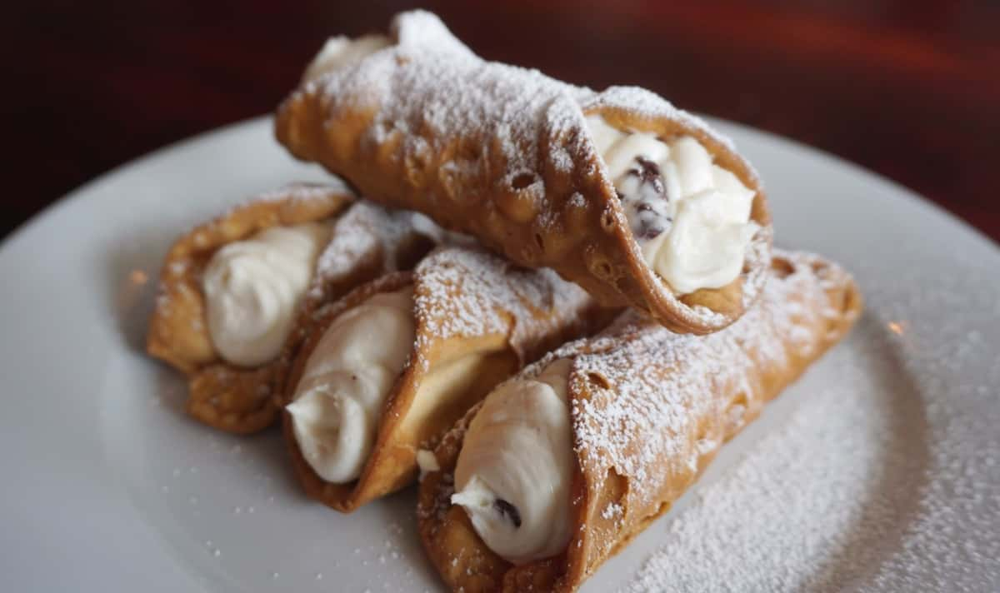

# New York Italian-American Cannoli

*New York Italian-American's iconic Sicilian-import dessert: crispy fried pastry tubes filled with sweetened ricotta cream studded with mini chocolate chips and candied orange peel, dipped at each end in chopped pistachios and dusted with icing sugar. The Little Italy bakery (Ferrara, Veniero's, Mike's Pastry) classic; the dessert that defines NY Italian-American sweets.*

**Serves:** Makes 12 cannoli

**Prep Time:** 1 hour (plus 30 min dough chill, and 4 hour ricotta drain)

**Cook Time:** 25 minutes (frying shells)

## Overview
Cannoli (the singular is cannolo; cannoli is the plural; though Italian-Americans often use cannoli for either) are originally Sicilian pastries that came to New York with Italian immigration around the turn of the 20th century and were perfected in the Italian-American bakeries of Little Italy (Ferrara on Grand Street since 1892), Brooklyn (Mike's Pastry actually Boston but similar tradition), and the Bronx: crispy fried pastry tubes (a thin dough of flour, sugar, cocoa, cinnamon, marsala wine, lard or butter, white wine vinegar, salt, rolled flat, cut into ovals, wrapped around metal cannoli moulds, deep-fried till deep golden and blistered), filled with a sweetened ricotta cream (drained ricotta + icing sugar + cinnamon + vanilla + zest of orange, with optional mini chocolate chips and candied orange peel stirred in), dipped at each end in chopped pistachios or chocolate chips, and dusted generously with icing sugar.

## Ingredients

### Shells
- 250 g plain flour
- 2 tablespoons caster sugar
- 1 tablespoon cocoa powder
- 1 teaspoon ground cinnamon
- ½ teaspoon fine sea salt
- 40 g lard or butter (cubed)
- 1 large egg (beaten)
- 80 ml dry marsala wine (or sweet white wine; or substitute with 60 ml white wine + 20 ml brandy)
- 1 tablespoon white wine vinegar
- 1 large egg white (for sealing)

### Frying
- Vegetable oil for deep-frying (about 1.5 litres)

### Equipment
- 6-8 metal cannoli moulds (5 cm long, 2 cm diameter)

### Ricotta filling
- 600 g whole-milk ricotta (drained 4 hours through cheesecloth)
- 200 g icing sugar
- 1 teaspoon ground cinnamon
- 1 teaspoon vanilla extract
- Zest of 1 orange
- 100 g mini dark chocolate chips
- 60 g candied orange peel (chopped; optional)
- Pinch of fine sea salt

### Decoration
- 100 g unsalted pistachios (finely chopped)
- 100 g mini dark chocolate chips
- Icing sugar for dusting
- Candied cherries (optional)

## Method

### Stage 1 - Drain ricotta
1. Line a sieve with cheesecloth.
2. Place ricotta in the sieve over a bowl.
3. Refrigerate 4 hours (or overnight) to drain.

### Stage 2 - Make shell dough
1. Whisk flour, sugar, cocoa, cinnamon, salt.
2. Rub in lard or butter to fine crumbs.
3. Add egg, marsala wine, vinegar.
4. Knead 8 min till smooth.
5. Wrap; chill 30 min.

### Stage 3 - Make filling
1. In a bowl, whisk drained ricotta with icing sugar, cinnamon, vanilla, orange zest, salt till smooth.
2. Fold in mini chocolate chips and candied orange peel.
3. Refrigerate till serving.

### Stage 4 - Roll and cut shells
1. Roll dough to 2 mm thick (very thin).
2. Cut oval shapes about 10 cm long, 8 cm wide (or roll into squares).

### Stage 5 - Wrap around moulds
1. Place a metal cannoli mould diagonally across each oval.
2. Wrap the dough around the mould.
3. Brush the overlap with egg white to seal firmly.
4. Press to seal.

### Stage 6 - Heat oil
1. Heat oil to 175°C (350°F).

### Stage 7 - Fry shells
1. Lower 2-3 shells at a time into hot oil (still on the moulds).
2. Fry 2-3 min till deep golden and blistered.
3. Drain on paper towels.
4. Cool 5 min.
5. Carefully slide shells off the moulds (use a tea towel to handle hot moulds).
6. Reuse moulds for the rest.

### Stage 8 - Fill
1. Just before serving (cannoli shells go soggy if filled in advance), spoon filling into a piping bag.
2. Pipe into both ends of each shell.
3. Press to make filling level with shell edge.

### Stage 9 - Decorate
1. Dip each filled end in chopped pistachios (traditional) or chocolate chips.
2. Dust the whole cannolo with icing sugar.
3. Optional: a candied cherry on top.

### Stage 10 - Serve immediately
1. Within 1 hour of filling.
2. With espresso or strong coffee.

## Notes
- **Drain ricotta thoroughly:** essential for filling consistency.
- **Roll shell dough very thin:** for crispy result.
- **Fill JUST before serving:** else they go soggy.
- **Pistachios at ends traditional.**

## Variations
**Mini cannoli:** small bite-size for parties.
**Cannoli cream cake:** layer with sponge.
**Sicilian style:** with chocolate-coated end caps.
**With candied citron:** classic Sicilian addition.

## Serving
At Italian-American bakeries, weddings, family celebrations. With espresso.

## Storage
- Unfilled shells in sealed tin 1 week.
- Filling refrigerated 3 days.
- Don't store filled (1 hour max).
- Shells freeze 1 month.
