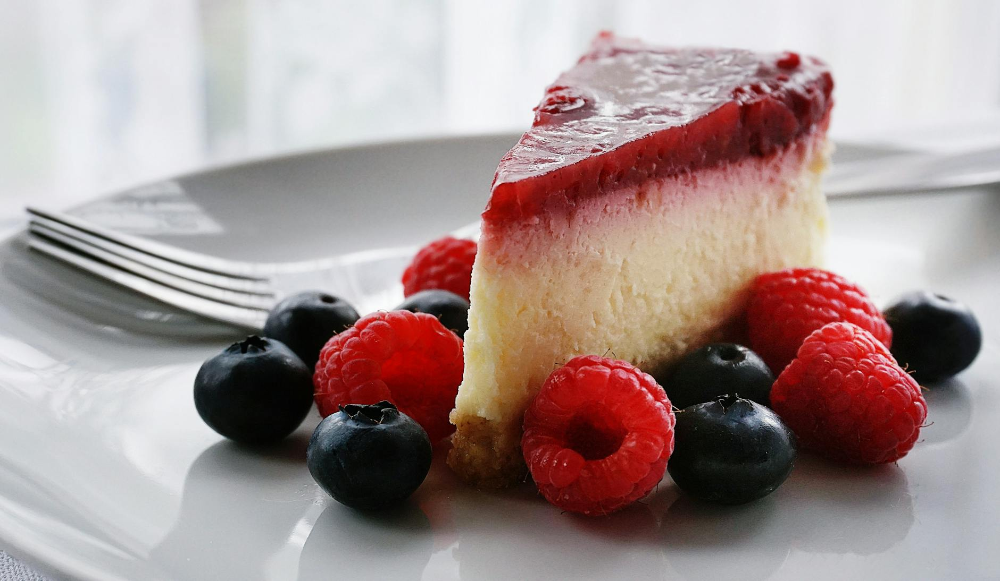

# New York Cheesecake

*New York's iconic dessert: a dense rich cheesecake made entirely from cream cheese, sugar, eggs, vanilla and a touch of sour cream, baked on a graham cracker (digestive biscuit) crust in a water bath till just-set, cooled slowly to room temperature and refrigerated overnight. The Junior's, Carnegie Deli, Lindy's classic; the dense tall slice that defines NY dessert.*

**Serves:** 12

**Prep Time:** 30 minutes

**Cook Time:** 1 hour 15 minutes (plus 4 hours cooling and overnight chill)

## Overview
New York cheesecake is the most iconic American cheesecake and the canonical Manhattan dessert (Junior's in Brooklyn, S&S Cheesecake in the Bronx, Lindy's in Midtown, Eileen's Special Cheesecake in SoHo all sell millions of slices): distinct from European cheesecakes by being made entirely from cream cheese (Philadelphia is canonical; soft full-fat) rather than ricotta or quark, with no flour or cornflour as thickener, just relying on the eggs (lots of them) to set the dense custard. A typical NY cheesecake recipe uses 1.5 kg of cream cheese, 300 g sugar, 6 eggs, 150 ml sour cream, vanilla, and a touch of lemon zest. Baked in a springform pan on a graham cracker (digestive biscuit) crust, baked in a water bath at low temperature for 60-75 minutes till just-set with a slight wobble in the centre, cooled slowly to room temperature, then refrigerated overnight for the canonical dense slice-with-a-fork texture.

## Ingredients

### Crust
- 250 g digestive biscuits (or graham crackers; the closest US substitute)
- 80 g caster sugar
- 100 g melted butter
- ¼ teaspoon fine sea salt
- 1 teaspoon ground cinnamon

### Cheesecake filling
- 1.2 kg full-fat cream cheese (room temp; Philadelphia preferred)
- 300 g caster sugar
- 6 large eggs
- 200 ml sour cream
- 2 tablespoons plain flour
- 2 tablespoons vanilla extract
- Zest of 1 lemon
- 1 tablespoon lemon juice
- ¼ teaspoon fine sea salt

### Optional topping
- Fresh strawberries or other berries
- Strawberry coulis (300 g strawberries + 80 g sugar + lemon juice; cooked 5 min and blended)

## Method

### Stage 1 - Make crust
1. Blitz digestive biscuits to crumbs.
2. Mix with sugar, cinnamon, salt, melted butter.
3. Press firmly into the bottom of a 23cm springform tin (lined with baking parchment for easy removal).
4. Bake at 175°C (350°F) for 10 min.
5. Cool.

### Stage 2 - Make filling
1. Beat cream cheese in a stand mixer (paddle attachment) on medium speed 3 min till completely smooth.
2. Add sugar; beat 2 min.
3. Add eggs one at a time, beating between (scrape down sides).
4. Mix in sour cream, flour, vanilla, lemon zest, lemon juice, salt.
5. Mix gently till smooth (don't overbeat or it'll have too much air and crack).

### Stage 3 - Pour
1. Pour batter onto cooled crust in springform tin.
2. Wrap the outside of the tin tightly in heavy foil (to prevent water leaking in during the water bath).

### Stage 4 - Water bath bake
1. Preheat oven to 165°C (325°F).
2. Place foil-wrapped cheesecake in a larger roasting tin.
3. Pour boiling water into the roasting tin to come halfway up the sides.
4. Bake 60-75 min till the cheesecake is set around the edges but still wobbles slightly in the centre (about 5cm diameter wobble).

### Stage 5 - Slow cool
1. Turn off oven.
2. Crack the door open.
3. Leave cheesecake in for 1 hour to cool slowly.

### Stage 6 - Cool to room temp
1. Remove from oven and water bath.
2. Cool at room temp 2 hours.

### Stage 7 - Overnight chill
1. Refrigerate overnight (12 hours minimum).
2. This is essential for the canonical NY texture.

### Stage 8 - Serve
1. Run knife around edge; release springform.
2. Slice into 12 wedges with a hot wet knife (clean between slices).
3. Optional: strawberry coulis or fresh berries on top.
4. Serve cold.

## Notes
- **Full-fat Philadelphia cream cheese:** the canonical NY ingredient.
- **Room temp ingredients:** for smooth batter.
- **Water bath:** prevents cracks.
- **Slow cool:** prevents cracks.
- **Overnight chill:** essential.

## Variations
**Junior's style:** with sponge cake bottom instead of biscuit crust.
**With strawberry topping:** classic.
**With chocolate ganache:** chocolate NY.
**With lemon curd:** lemon NY.
**Mini cheesecakes:** in muffin tins.

## Serving
At Manhattan delis, family celebrations, holidays. Cold from the fridge.

## Storage
- Refrigerated 5 days.
- Freezes 2 months (wrap tightly).
- Don't leave at room temp more than 2 hours.
