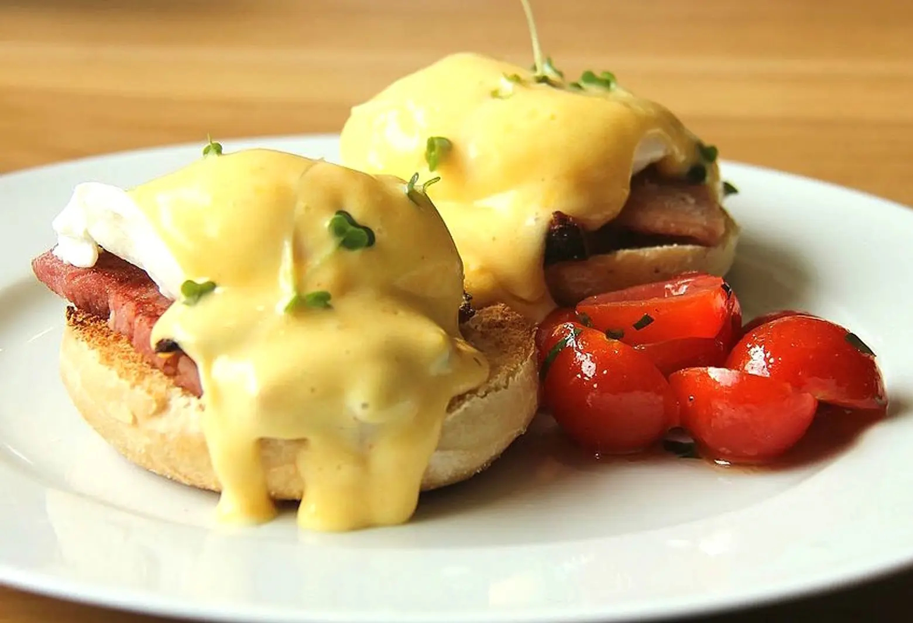

# Eggs Benedict

*New York's iconic brunch dish: a toasted English muffin half topped with Canadian bacon (or ham), a perfectly poached egg, and a generous ladle of buttery hollandaise sauce. Invented in New York around 1894 at Delmonico's or the Waldorf Astoria; the Manhattan brunch institution.*

**Serves:** 4

**Prep Time:** 25 minutes

**Cook Time:** 20 minutes

## Overview
Eggs Benedict is one of the most iconic brunch dishes and a New York invention from around 1894, claimed by both Delmonico's (the legendary Wall Street restaurant) and the Waldorf Astoria hotel (Lemuel Benedict supposedly ordered the components for a hangover cure): a toasted English muffin half topped with a slice of Canadian bacon (or back bacon, or ham; some versions use crispy streaky bacon), a poached egg with a runny yolk, and a generous ladle of hollandaise sauce. The hollandaise is the most challenging component (egg yolks whisked over a bain-marie with melted butter, finished with lemon juice, salt and cayenne; needs gentle heat and a steady hand).

## Ingredients

### Hollandaise sauce
- 3 large egg yolks
- 1 tablespoon white wine vinegar
- 1 tablespoon water
- 200 g unsalted butter (melted)
- Juice of ½ lemon
- ¼ teaspoon fine sea salt
- ¼ teaspoon cayenne
- Pinch of white pepper

### Poached eggs
- 8 large eggs (very fresh; the fresher, the better the poach)
- 2 litres water
- 4 tablespoons white wine vinegar
- 1 teaspoon salt

### Base
- 4 English muffins (split)
- 8 slices Canadian bacon (back bacon)
- 4 tablespoons butter (for muffins)

### To finish
- 1 small bunch fresh chives (chopped)
- Sweet paprika (for dusting)
- Fresh ground black pepper

### To serve
- Hash brown potatoes (optional)
- Fresh fruit
- Coffee or mimosa

## Method

### Stage 1 - Make hollandaise
1. In a heatproof bowl (set over a saucepan of barely simmering water; bowl shouldn't touch water), whisk egg yolks with vinegar and water.
2. Whisk constantly 3-4 min till pale and frothy.
3. Slowly drizzle in melted butter, whisking constantly.
4. Add lemon juice, salt, cayenne, white pepper.
5. Keep warm over very low heat or in a warm spot (don't reheat; will break).

### Stage 2 - Toast muffins
1. Split English muffins.
2. Butter both sides.
3. Toast cut-side-down till deeply golden.

### Stage 3 - Warm bacon
1. Heat 1 tablespoon butter in a pan.
2. Warm Canadian bacon 60 sec per side.

### Stage 4 - Poach eggs
1. Bring water to gentle simmer in a wide pan.
2. Add vinegar and salt.
3. Crack each egg into a small ramekin first.
4. Create a gentle swirl in the water with a spoon.
5. Slip the egg into the centre of the swirl.
6. Poach 3-4 min for runny yolk.
7. Remove with slotted spoon; drain on paper towel.

### Stage 5 - Build
1. Place 2 English muffin halves on each plate.
2. Top each with a slice of Canadian bacon.
3. Place a poached egg on top.

### Stage 6 - Hollandaise and finish
1. Spoon generous hollandaise over each egg.
2. Sprinkle with paprika and chives.
3. Ground black pepper.

### Stage 7 - Serve immediately
1. Hash browns alongside (optional).
2. Coffee, mimosa.

## Notes
- **Fresh eggs essential:** for proper poach.
- **Vinegar in poaching water:** helps whites hold.
- **Hollandaise needs gentle heat:** never let yolks scramble.
- **Toast muffins properly.**

## Variations
- **Eggs Florentine:** swap bacon for spinach (traditional vegetarian version).
- **Eggs Royale:** swap bacon for smoked salmon.
- **Eggs Sardou:** with creamed spinach and artichoke (New Orleans variation).
- **Crab cake Benedict:** swap bacon for a crab cake.

## Serving
- At Sunday brunch with coffee, mimosa. Manhattan brunch institution.

## Storage
- Best immediately.
- Hollandaise can't be reheated (will break).
- Don't store assembled.
- Components separately keep briefly.
