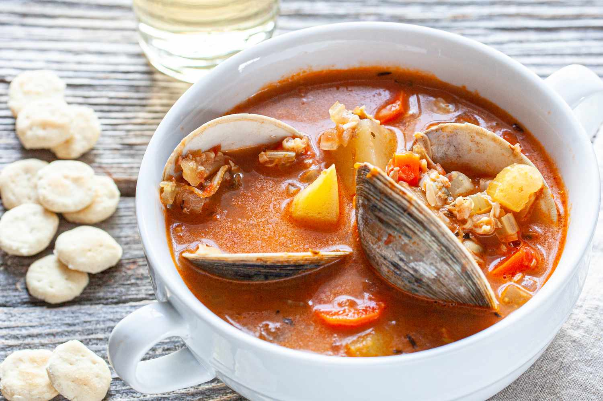

# Manhattan Clam Chowder

*New York's red clam chowder: a tomato-based broth (distinct from the white cream-based New England version) loaded with fresh clams, the trinity, potato, herbs and a touch of bacon. The Manhattan and Coney Island Italian-American adaptation; spicier and tomato-forward.*

**Serves:** 6

**Prep Time:** 25 minutes

**Cook Time:** 50 minutes

## Overview
Manhattan clam chowder is the New York version of clam chowder and the subject of a long-standing East Coast rivalry with New England clam chowder (the cream-based white version): a tomato-based clear broth (created by Italian-American immigrants in Manhattan in the 1890s as an adaptation of the cream-based New England version, partly because cream was perishable and tomato was readily available) loaded with fresh clams, the trinity (onion, celery, green pepper), cubed potato, garlic, fresh herbs, and a touch of diced bacon for richness. Spicier than New England; tomato-forward. Served with oyster crackers and a slice of bread. Three details: tomato base (the NY signature), fresh clams (or quality tinned), no cream.

## Ingredients

- 2 kg fresh clams (cherrystone or littleneck; scrubbed)
- 200 g thick-cut bacon (diced)
- 1 large onion (chopped)
- 4 sticks celery (chopped)
- 1 green bell pepper (chopped)
- 8 garlic cloves (crushed)
- 1 large tin (800 g) chopped tomatoes
- 2 tablespoons tomato paste
- 600 g potatoes (cubed)
- 1.5 litres clam juice or seafood stock (plus the clam-cooking liquid)
- 2 bay leaves
- 1 tablespoon dried thyme
- 1 tablespoon paprika
- 1 teaspoon cayenne (or to taste)
- 1 ½ teaspoons fine sea salt
- 1 teaspoon ground black pepper
- 1 tablespoon Worcestershire sauce
- 1 small bunch fresh parsley (chopped)
- 1 tablespoon fresh thyme (chopped)

### To serve
- Oyster crackers
- Sliced rustic bread
- Lemon wedges
- Hot sauce
- Fresh parsley

## Method

### Stage 1 - Cook clams
1. Place scrubbed clams in a large pot with 250 ml water.
2. Cover; steam over medium-high heat 5-8 min till clams open.
3. Strain through a fine sieve lined with cheesecloth (the cooking liquid is essential; reserve).
4. Remove meat from shells; chop coarsely.

### Stage 2 - Render bacon
1. In a heavy pot, cook bacon over medium heat 8 min till crispy.
2. Remove some bacon for garnish; leave most.

### Stage 3 - Sauté trinity
1. In bacon fat, add onion, celery, green pepper.
2. Cook 8 min.
3. Add garlic; cook 30 sec.

### Stage 4 - Build base
1. Stir in tomato paste; cook 2 min.
2. Add chopped tomatoes, paprika, cayenne, salt, pepper, Worcestershire.

### Stage 5 - Add potatoes and liquid
1. Add cubed potatoes.
2. Pour in reserved clam cooking liquid + seafood stock to cover.
3. Add bay leaves and dried thyme.
4. Simmer 25 min till potatoes tender.

### Stage 6 - Add clams
1. Stir in chopped clams.
2. Heat through 4 min (don't overcook).

### Stage 7 - Finish
1. Stir in fresh thyme and parsley.
2. Adjust seasoning.

### Stage 8 - Serve
1. Ladle into bowls.
2. Scatter reserved bacon and extra parsley.
3. With oyster crackers and bread.
4. Hot sauce alongside.

## Notes
- **Tomato base:** the Manhattan signature.
- **Fresh clams ideal.**
- **Don't overcook clams:** rubbery.
- **Reserve clam cooking liquid:** essential.

## Variations
**With Italian sausage:** add 200 g crumbled cooked Italian sausage.
**With seafood mix:** add shrimp, scallops.
**Spicier:** double cayenne; add chilli flakes.
**Quicker (with tinned clams):** use 4 tins (200 g each) chopped clams; skip the clam-steaming step.

## Serving
At Manhattan diners; Italian-American family lunches.

## Storage
- Refrigerated 4 days; flavour deepens.
- Freezes 2 months.
- Reheat gently.
