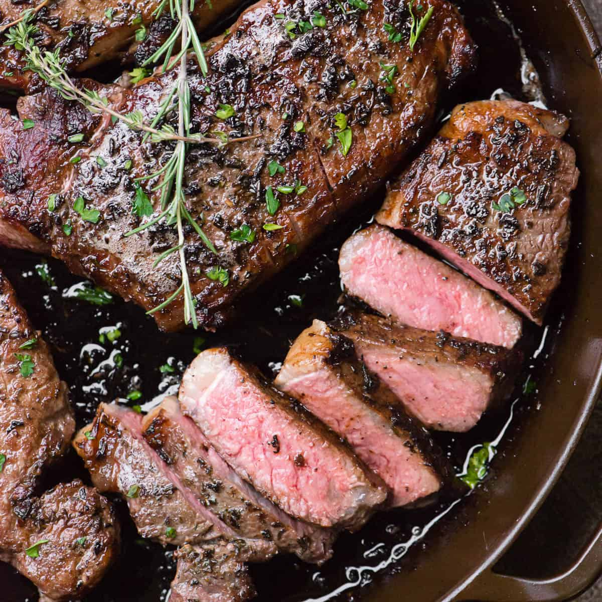

# New York Strip Steak

*New York's classic steakhouse cut: a thick-cut Kansas City or New York strip steak (the boneless short loin cut) seared in a screaming-hot cast-iron pan with butter, garlic and rosemary, basted till deeply crusted outside and rosy-pink inside. The Peter Luger, Keens, Old Homestead Manhattan steakhouse signature.*

**Serves:** 4

**Prep Time:** 15 minutes (plus 1 hour temperature)

**Cook Time:** 12 minutes

## Overview
The New York strip steak is the traditional NY steakhouse cut and one of America's most prized steak cuts: the boneless short loin steak (the bone-in version is called Kansas City strip), a well-marbled tender cut with great beefy flavour. The classic NY steakhouse preparation (as served at Peter Luger in Brooklyn, Keens in Midtown, Old Homestead in the Meatpacking District, all of which have been serving steak for over a century): bring the steak to room temperature, season generously with salt and pepper, sear in a screaming-hot cast-iron pan with neutral oil till deeply crusted on both sides, baste continuously with melted butter, smashed garlic and rosemary for the last 2 minutes, then rest 8-10 minutes before slicing. Served sliced against the grain with hash brown potatoes (Peter Luger style), creamed spinach, or just on its own with the pan butter spooned over.

## Ingredients

### Steaks
- 4 NY strip steaks (about 350 g each; 3-4 cm thick)
- 2 tablespoons fine sea salt (for seasoning; or kosher salt)
- 2 teaspoons coarse ground black pepper

### For searing
- 4 tablespoons neutral oil (vegetable or grapeseed)

### For basting
- 100 g butter
- 8 garlic cloves (smashed; skin on)
- 4 sprigs fresh rosemary
- 4 sprigs fresh thyme

### To finish
- Maldon sea salt for finishing
- Fresh ground black pepper

### To serve (NY steakhouse classics)
- Hash brown potatoes
- Creamed spinach
- Onion rings
- Béarnaise sauce (optional)
- Red wine

## Method

### Stage 1 - Temp the steaks
1. Take steaks from fridge 1 hour before cooking.
2. Pat very dry with paper towels.

### Stage 2 - Season
1. Season both sides generously with salt and pepper.
2. Let rest 30 min (the salt draws moisture then re-absorbs, dry-brining the meat).

### Stage 3 - Heat pan
1. Heat a heavy cast-iron pan over high heat 5 min till smoking.

### Stage 4 - Sear
1. Add oil; swirl.
2. Lay steaks in (away from you).
3. DON'T MOVE for 3 min.
4. Flip; sear other side 3 min.
5. Sear the fat-cap edge briefly (60 sec).

### Stage 5 - Add butter and aromatics
1. Reduce heat to medium.
2. Add butter, smashed garlic, rosemary, thyme.
3. Tilt pan; spoon melted butter and aromatics over the steaks.
4. Baste continuously 2 min.
5. Internal temp for medium-rare: 52°C (125°F); for medium: 57°C (135°F).

### Stage 6 - Rest
1. Remove steaks to warm plate.
2. Rest 8-10 min (essential for juicy steak).
3. Pour some pan butter over.

### Stage 7 - Slice and serve
1. Slice against the grain into 1cm slices.
2. Sprinkle with Maldon salt and pepper.
3. With hash browns, spinach, onion rings, red wine.

## Notes
- **Thick steak essential:** 3-4 cm minimum.
- **Screaming-hot pan:** the crust depends on it.
- **Baste with butter at the end:** for flavour.
- **Rest 8-10 min:** for juicy steak.

## Variations
**With Béarnaise:** classic French sauce alongside.
**Steak au poivre:** crust with crushed peppercorns; cream sauce.
**With shallot-red wine sauce:** classic bistro.
**Pittsburgh rare:** very dark outside, very rare inside.

## Serving
At the NY steakhouse table. With red wine, classic sides.

## Storage
- Best fresh.
- Cooked refrigerate 2 days; reheat briefly (don't dry out).
- Don't freeze cooked steak.
