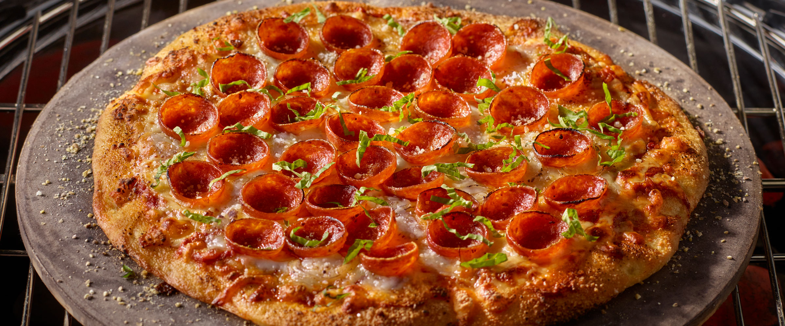

# New York Style Pizza

*New York's iconic pizza: a thin foldable crust with a slight chewy bite, topped with crushed tomato sauce, generous low-moisture mozzarella, finished with grated Parmesan, dried oregano, chilli flakes and a drizzle of olive oil. The slice you fold in half on the street and eat walking.*

**Serves:** Makes 2 pizzas (16 inch / 40 cm); serves 4-6

**Prep Time:** 25 minutes (plus 24 hours cold dough proof)

**Cook Time:** 12 minutes per pizza

## Overview
New York style pizza is one of the world's great regional pizza styles and the traditional New York street food: a thin foldable crust (3-4 mm thick after stretching; thinner than Detroit, Sicilian or Neapolitan) with a slight chewy bite from a high-protein bread flour and 24-72 hour cold fermentation in the refrigerator. Topped with a simple uncooked crushed-tomato sauce (San Marzano traditional, blended only briefly with garlic, salt, dried oregano and olive oil), a generous heap of low-moisture whole-milk mozzarella (the traditional NY pizza cheese; the wet fresh kind makes everything soggy), and baked at 250-290°C on a baking steel or pizza stone for 8-12 minutes till the crust is deep golden and the cheese has melted and the spots have charred slightly. Finished with grated Parmesan, dried oregano, chilli flakes and a drizzle of olive oil.

## Ingredients

### Dough (makes 2 pizzas)
- 500 g strong bread flour (high protein 13%+)
- 8 g fine sea salt
- 3 g instant yeast
- 320 ml lukewarm water
- 2 tablespoons olive oil
- 1 teaspoon caster sugar

### Sauce
- 1 large tin (800 g) San Marzano tomatoes (or good quality whole peeled tomatoes)
- 4 garlic cloves (crushed)
- 2 tablespoons olive oil
- 1 ½ teaspoons fine sea salt
- 1 tablespoon dried oregano
- 1 teaspoon caster sugar
- ¼ teaspoon ground black pepper

### Cheese
- 600 g low-moisture whole-milk mozzarella (shredded; NOT fresh mozzarella)
- 80 g grated Parmesan (Parmigiano-Reggiano or Pecorino)

### Toppings (optional)
- Pepperoni
- Sliced fresh basil
- Anchovies
- Sliced mushrooms

### Finishing
- Dried oregano
- Chilli flakes
- Olive oil for drizzling

## Method

### Stage 1 - Make dough
1. In a bowl, combine flour, salt, yeast, sugar.
2. Add water and olive oil.
3. Mix to a shaggy dough.
4. Knead 10 min by hand (or 6 min with stand mixer dough hook) till smooth and elastic.

### Stage 2 - Divide and cold-proof
1. Divide dough into 2 equal balls.
2. Place each in lightly oiled containers.
3. Cover; refrigerate 24-72 hours.

### Stage 3 - Make sauce
1. Crush tomatoes with hands (don't blend; keeps it chunky-rustic).
2. Mix with garlic, olive oil, salt, oregano, sugar, pepper.
3. Don't cook the sauce; it cooks on the pizza.

### Stage 4 - Heat oven
1. Place a baking steel or pizza stone on the middle oven rack.
2. Heat oven to 250-290°C (480-560°F) max; as hot as your oven will go.
3. Heat 45-60 min minimum to fully heat the steel.

### Stage 5 - Stretch dough
1. Bring dough balls to room temp 1 hour before baking.
2. On a floured surface, stretch each dough into a 40cm round.
3. The centre should be thin; the edges slightly thicker (the cornicione).
4. Don't roll with a rolling pin; press and stretch by hand.

### Stage 6 - Transfer
1. Place stretched dough on a floured pizza peel (or upside-down baking sheet).
2. Top quickly: 4-5 tablespoons sauce spread thin (leave 2cm border), 300 g mozzarella, 40 g Parmesan, any other toppings.

### Stage 7 - Bake
1. Slide pizza onto hot baking steel.
2. Bake 8-12 min till the crust is deep golden brown and the cheese is bubbly with golden spots.
3. The bottom should be charred-spotty.

### Stage 8 - Finish and serve
1. Slide onto board.
2. Drizzle with olive oil.
3. Sprinkle oregano and chilli flakes.
4. Slice into 8 large triangular slices.
5. Fold in half lengthwise to eat NY-style.

## Notes
- **Cold-proof 24 hours minimum:** essential for flavour.
- **Low-moisture mozzarella:** not fresh.
- **Bake screaming hot:** 250-290°C.
- **Fold to eat:** NY style.

## Variations
**Pepperoni:** add 200 g sliced pepperoni before baking.
**White pizza:** skip sauce; use ricotta + mozzarella + garlic.
**Margherita-style:** add fresh basil at the end.
**Sicilian-style:** thicker square crust; baked in a pan.

## Serving
By the slice; on the street; family dinner. Cold beer.

## Storage
- Dough keeps refrigerated 3 days; freeze 1 month.
- Sauce keeps refrigerated 5 days.
- Cooked pizza: room temp at most 2 hours; reheat in oven at 200°C 5 min (never microwave).
