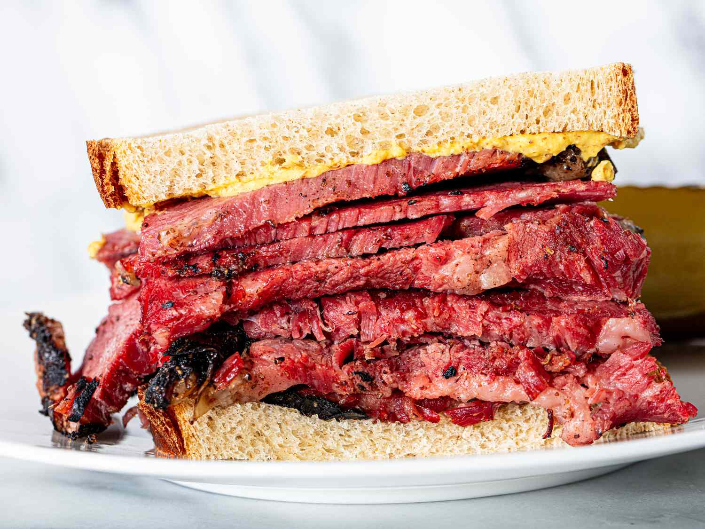

# Pastrami on Rye

*New York's iconic Jewish deli sandwich: thick-sliced pastrami (smoked, peppery, deeply cured brisket) piled high on rye bread with yellow mustard and dill pickles. The Katz's Delicatessen classic; the Manhattan lunch you can't fit your mouth around.*

**Serves:** 4

**Prep Time:** 15 minutes (assumes pre-made pastrami; or 5 days for full cure + smoke)

**Cook Time:** 10 minutes (warming)

## Overview
Pastrami on rye is the iconic Jewish-American deli sandwich of New York and the canonical lunch at Katz's Delicatessen on Houston Street (in operation since 1888; the deli where Meg Ryan filmed "I'll have what she's having" in When Harry Met Sally): thick-sliced pastrami (brisket that's been brined for 5-7 days in salt + sugar + curing salt + pickling spices, rubbed with crushed black pepper and coriander seeds, smoked low-and-slow over hickory or beech wood for 5-6 hours, then steamed for 2 hours till incredibly tender), piled at least 6 inches high on rye bread (the canonical NYC seeded Jewish rye) with yellow mustard (NEVER ketchup; that's a sin in NY deli world) and a dill pickle on the side.

## Ingredients

### Pastrami
- 1 kg pre-made pastrami (or make from cured + smoked brisket; see below for the long version)
- 250 ml water (for steaming)

### Bread
- 8 thick slices NY seeded Jewish rye bread

### Condiments
- Plenty of yellow mustard (Gulden's spicy or French's; NO Dijon, no honey mustard)

### Sides
- 8 whole sour dill pickle spears
- Cole slaw

### To drink
- Dr Brown's Cel-Ray (the canonical NY deli drink) or root beer

## Method

### Stage 1 - Steam pastrami
1. Place pastrami in a large pot fitted with a steamer basket.
2. Add water to the bottom (not touching pastrami).
3. Cover; steam over medium heat 25-30 min till heated through and very tender.

### Stage 2 - Slice
1. Transfer warm pastrami to a board.
2. Slice across the grain very thinly with a sharp slicing knife.
3. (Some delis use thick slices; thin is more traditional NY.)
4. Slice on a slight bias.

### Stage 3 - Pile sandwich
1. Stack 1.5-2 cm of warm pastrami slices on a slice of rye.
2. Don't be modest; the canonical NY pastrami sandwich has at least 250 g meat.

### Stage 4 - Add mustard
1. Spread generous yellow mustard on the top slice of rye.
2. Close the sandwich firmly.

### Stage 5 - Serve
1. Cut diagonally with a sharp knife.
2. Place pickle spear next to sandwich.
3. Cole slaw on the side.
4. Cel-Ray alongside.

## Notes
- **Yellow mustard only:** no Dijon, no honey mustard.
- **Seeded Jewish rye canonical.**
- **Thick pile of meat:** not modest.
- **Pickle on the side:** essential.

## Variations
**Reuben:** add sauerkraut + Russian dressing + Swiss cheese; grilled (see reuben recipe).
**Cuban-style:** mustard + Swiss + ham; pressed.
**Pastrami burger:** pile on burger patty.
**Open-face:** with melted Swiss on top.

## Serving
At lunch with Cel-Ray, pickle, slaw. NY deli classic.

## Storage
- Pastrami refrigerates 5 days; warm to serve.
- Don't make sandwich in advance.
- Pastrami freezes 3 months.
