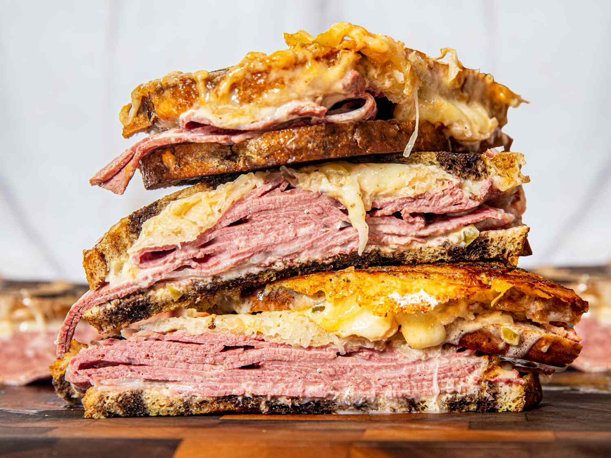

# Reuben Sandwich

*New York's grilled deli classic: corned beef (or pastrami) piled with Swiss cheese, sauerkraut and Russian dressing on rye bread, grilled in butter till the bread is deeply golden and the cheese has melted. The Jewish deli and steakhouse classic; the sandwich Reuben Kulakofsky reportedly invented in 1925.*

**Serves:** 4

**Prep Time:** 15 minutes

**Cook Time:** 10 minutes

## Overview
The Reuben sandwich is a New York Jewish-deli classic, allegedly invented in 1925 by Reuben Kulakofsky (a Lithuanian-Jewish grocer in Omaha, though most NY delis claim invention by Arnold Reuben Sr.): thick slices of warm corned beef (or pastrami) piled with shredded sauerkraut, slices of Swiss cheese (or Emmenthaler), and Russian dressing (mayonnaise + ketchup + relish + horseradish), assembled on rye bread, grilled in butter on a flat-top griddle or in a pan till the bread is deeply golden-buttery and the cheese has melted into the meat and kraut. Served with a dill pickle on the side. Three details: drained sauerkraut (or it makes the sandwich soggy), Russian dressing (not Thousand Island), grill in butter.

## Ingredients

### Sandwich
- 600 g warm sliced corned beef (or pastrami)
- 8 slices NY seeded rye bread
- 8 slices Swiss cheese (or Emmenthaler)
- 400 g sauerkraut (drained well; squeezed of excess liquid)
- 4 tablespoons butter (softened)

### Russian dressing
- 6 tablespoons mayonnaise
- 4 tablespoons ketchup
- 2 tablespoons sweet pickle relish (or chopped sweet pickles)
- 1 tablespoon prepared horseradish
- 1 tablespoon Worcestershire sauce
- 1 teaspoon hot sauce
- 1 teaspoon paprika
- ¼ teaspoon ground black pepper

### To serve
- Dill pickle spears
- Kettle chips or coleslaw
- Cold beer

## Method

### Stage 1 - Make Russian dressing
1. Whisk all dressing ingredients.
2. Chill 15 min.

### Stage 2 - Warm corned beef
1. Steam or pan-warm corned beef briefly.
2. Slice if needed.

### Stage 3 - Drain sauerkraut
1. Drain sauerkraut in a sieve.
2. Squeeze excess liquid with hands (very important; wet sauerkraut ruins the sandwich).

### Stage 4 - Build sandwiches
1. Spread softened butter on the outside of each slice of bread.
2. On the unbuttered inside of one bottom slice, spread Russian dressing.
3. Layer: cheese slice, generous corned beef, sauerkraut, more dressing on the inside of the top slice.
4. Top with another cheese slice.
5. Close.

### Stage 5 - Grill
1. Heat a wide pan or griddle over medium heat.
2. Place sandwiches butter-side-down.
3. Cook 3-4 min till deeply golden on the bottom.
4. Flip; press down with a heavy pan.
5. Cook 3-4 min more till the other side is golden and the cheese has melted.

### Stage 6 - Serve immediately
1. Cut diagonally with a sharp knife.
2. Dill pickle on the side.
3. Chips or slaw.
4. Cold beer.

## Notes
- **Drain sauerkraut thoroughly:** essential.
- **Russian dressing not Thousand Island.**
- **Grill in butter:** for the canonical crust.
- **Cheese on both sides:** holds everything together.

## Variations
**Pastrami Reuben:** swap corned beef for pastrami.
**Rachel:** swap sauerkraut for coleslaw; swap corned beef for turkey or pastrami.
**Vegetarian Reuben:** swap meat for marinated portobello mushrooms or seitan.
**With pickled vegetables:** add pickled carrot, daikon for crunch.

## Serving
At lunch with pickle and beer. NY deli classic.

## Storage
- Best immediately.
- Components separately keep.
- Don't assemble in advance.
- Don't refrigerate cooked.
