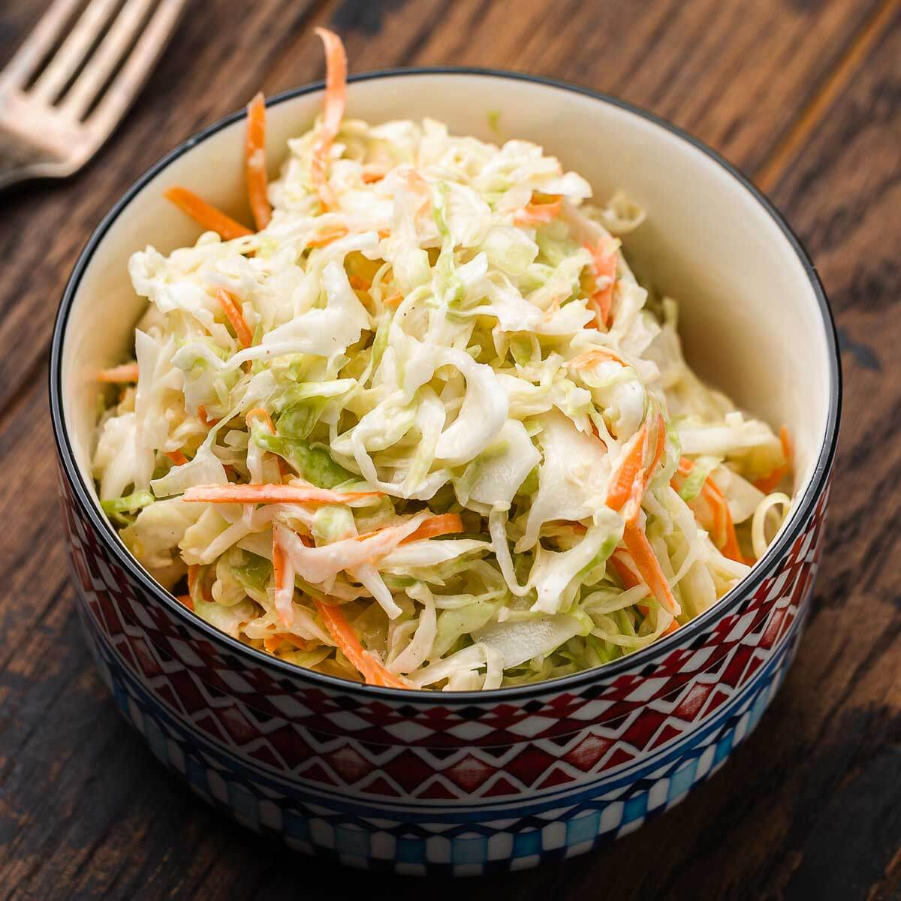

# NY Deli Coleslaw

*New York's deli-counter coleslaw: shredded green cabbage and carrot tossed with a tangy mayo-vinegar dressing flavoured with mustard, sugar, celery seed, salt and pepper. The traditional Jewish-deli side; the slaw that goes alongside pastrami sandwiches and matzo ball soup.*

**Serves:** 8

**Prep Time:** 20 minutes (plus 1 hour chilling)

**Cook Time:** None

## Overview
NY deli coleslaw is the traditional Jewish-American deli-counter slaw and the side that turns up alongside every pastrami sandwich, corned beef on rye, and matzo ball soup at the great New York delis (Katz's, Carnegie, 2nd Avenue Deli, Russ & Daughters all serve their slightly different versions): shredded green cabbage (and a touch of carrot for colour) tossed with a tangy mayo-vinegar dressing flavoured with white vinegar (more vinegar than most American coleslaws; the NY deli style is brighter and more vinegar-forward), Dijon mustard, sugar, celery seed, salt, white pepper and a touch of grated onion or onion powder. Chilled 1 hour for flavours to meld.

## Ingredients

### Slaw
- 1 large head green cabbage (about 1.5 kg; finely shredded)
- 2 large carrots (grated)
- ½ small white onion (very finely grated)

### Dressing
- 200 ml mayonnaise
- 6 tablespoons white wine vinegar
- 2 tablespoons Dijon mustard
- 50 g caster sugar
- 1 tablespoon celery seed
- 1 ½ teaspoons fine sea salt
- 1 teaspoon ground white pepper (or black)
- 1 teaspoon onion powder

### Optional add-ins
- 1 tablespoon poppy seeds
- 1 chopped pickle
- Chopped fresh dill

## Method

### Stage 1 - Salt cabbage
1. Toss shredded cabbage with 1 teaspoon salt in a colander.
2. Rest 30 min over a bowl.
3. Squeeze out excess water (this prevents soggy slaw).

### Stage 2 - Make dressing
1. Whisk mayonnaise, vinegar, mustard, sugar, celery seed, salt, white pepper, onion powder.

### Stage 3 - Combine
1. In a large bowl, toss salted-and-drained cabbage with grated carrot, onion.
2. Add poppy seeds, pickle, or dill if using.
3. Pour dressing over.
4. Toss thoroughly.

### Stage 4 - Chill
1. Cover; refrigerate 1 hour minimum (or up to 8 hours).

### Stage 5 - Toss and serve
1. Toss again before serving.
2. Alongside deli sandwiches.

## Notes
- **Salt and drain cabbage:** prevents soggy slaw.
- **More vinegar than typical:** NY deli signature.
- **Celery seed essential.**
- **Chill 1 hour minimum.**

## Variations
**With apple:** add 1 grated tart apple.
**With raisins:** add 80 g raisins.
**Spicier:** add chopped jalapeño + horseradish.
**Lighter (no mayo):** swap mayo for Greek yogurt.

## Serving
At NY delis; alongside pastrami, corned beef, brisket sandwiches.

## Storage
- Keeps refrigerated 4 days; gets better.
- Don't freeze.
