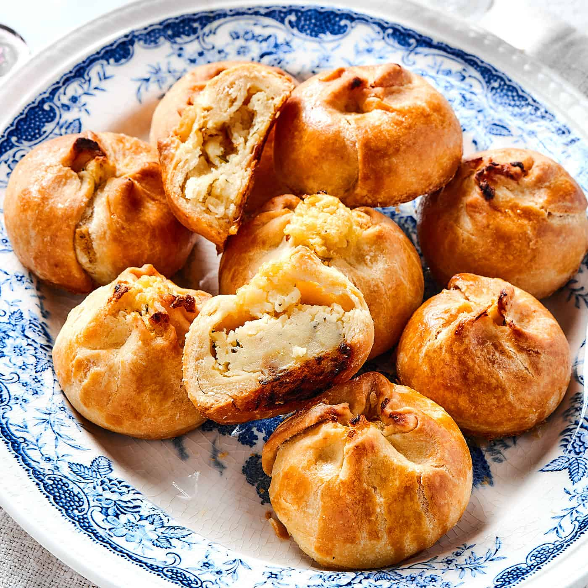

# Potato Knish

*New York's Jewish-deli baked dumpling: a soft enriched dough wrapped around a mashed potato filling flavoured with caramelised onion, salt and pepper, baked till the pastry is golden and crispy. The NYC street-cart and Jewish-deli classic; a Russian-Yiddish import perfected in New York.*

**Serves:** Makes 12 knishes

**Prep Time:** 1 hour (plus 30 min dough chill)

**Cook Time:** 35 minutes

## Overview
The knish (pronounced "kuh-nish") is one of the most iconic Jewish-American street foods and a fixture of New York Jewish delis (Yonah Schimmel's Knish Bakery on Houston Street has been making them since 1910) and street vendors: a soft enriched dough (flour, oil or schmaltz, egg, water, salt) wrapped tightly around a generous filling of mashed potato (canonical; though kasha, sauerkraut, sweet potato, spinach and cheese versions also exist) flavoured with deeply caramelised onion (the key flavour), salt, black pepper, and a touch of garlic; the dough sealed into either a round (Brooklyn-style square corners pinched to make a round) or a long rectangle (Lower East Side style), brushed with egg, and baked till the pastry is golden and crispy outside and the filling is hot and savoury inside. Served warm with yellow mustard.

## Ingredients

### Dough
- 400 g plain flour
- 1 large egg
- 80 ml vegetable oil (or schmaltz)
- 120 ml warm water
- 1 tablespoon white wine vinegar
- 1 ½ teaspoons fine sea salt
- 1 teaspoon caster sugar

### Filling
- 1 kg potatoes (peeled, cubed)
- 4 large onions (chopped)
- 4 tablespoons schmaltz (chicken fat) or butter (or vegetable oil)
- 6 garlic cloves (crushed)
- 2 teaspoons fine sea salt
- 1 ½ teaspoons ground black pepper
- 1 teaspoon onion powder
- 1 teaspoon paprika
- 2 tablespoons fresh chopped parsley

### Egg wash
- 1 egg (beaten with 1 tablespoon milk)

### To serve
- Yellow mustard
- Dill pickles

## Method

### Stage 1 - Make dough
1. Whisk flour and salt.
2. In another bowl, whisk egg, oil, water, vinegar, sugar.
3. Combine; knead 6 min till smooth.
4. Wrap; rest 30 min.

### Stage 2 - Caramelise onions
1. Heat schmaltz or butter in pan.
2. Add chopped onions; cook 25-30 min stirring occasionally till deeply golden brown.
3. Don't rush; the caramelisation is the key flavour.

### Stage 3 - Cook potatoes
1. Boil cubed potatoes in salted water 15 min till tender.
2. Drain well.
3. Mash with garlic, salt, pepper, onion powder, paprika.

### Stage 4 - Combine filling
1. Stir caramelised onions into mashed potato.
2. Mix thoroughly.
3. Stir in chopped parsley.

### Stage 5 - Roll dough
1. Divide dough in half.
2. Roll each half into a rectangle 30 x 50 cm; very thin (2-3 mm).

### Stage 6 - Form long log
1. Spread filling along the long edge of the rolled dough (about half the filling per rectangle).
2. Roll up tightly into a long log.

### Stage 7 - Cut and shape
1. Cut the log into 6 pieces (each about 5 cm wide).
2. Pinch the ends of each to seal, creating a roundish square knish.
3. Or leave as rectangles for Lower East Side style.

### Stage 8 - Egg wash and bake
1. Preheat oven to 200°C (400°F).
2. Place knishes on parchment-lined sheet.
3. Brush with egg wash.
4. Bake 30-35 min till deep golden.

### Stage 9 - Serve warm
1. With yellow mustard.

## Notes
- **Caramelise onions properly:** 25-30 min, the key flavour.
- **Schmaltz canonical:** but butter or oil work.
- **Roll dough thin.**
- **Bake till deep golden.**

## Variations
**Kasha (buckwheat) knish:** swap potato for cooked kasha + onions + egg.
**Sweet potato knish:** swap white potato for sweet potato.
**Spinach and cheese:** spinach + ricotta + Parmesan filling.
**Mushroom knish:** sautéed mushroom + onion + potato.

## Serving
At NY Jewish delis; from street carts; alongside sandwiches.

## Storage
- Cooked refrigerate 4 days.
- Reheat in oven at 180°C 10 min.
- Uncooked freeze 1 month; bake from frozen + 10 min.
