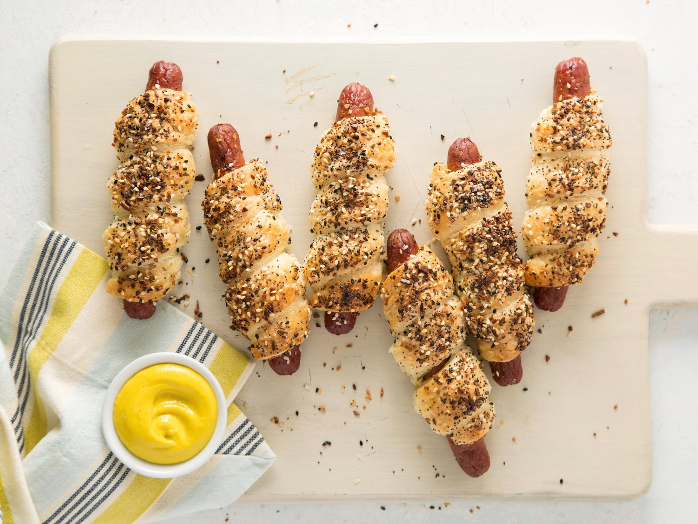

# Bagel Dog

*New York's bagel-wrapped hot dog: an all-beef frankfurter wrapped in everything-bagel dough, boiled briefly then baked till the dough is deep golden and the everything seasoning crisps on top. Served with yellow mustard for dipping. The NYC bodega-and-bagel-shop fusion treat; pretzel-dog energy with a Jewish-deli accent.*

**Serves:** Makes 8 bagel dogs

**Prep Time:** 30 minutes (plus 1.5 hours dough rise)

**Cook Time:** 25 minutes

## Overview
The bagel dog is a New York City fusion creation that bridges the city's two most iconic carbs (the NY-style bagel and the street-cart hot dog) and shows up in delis, bagel shops and bodegas across the city: an all-beef frankfurter (Vienna or Sabrett brand; the canonical NY street-cart dog) tightly wrapped in a strip of yeasted bagel dough (the proper New York bagel formula — high-protein bread flour, malt syrup, sugar, salt, yeast, water — kneaded firm and rested overnight for the chew), briefly boiled in water sweetened with malt syrup (the canonical bagel poach that gives the shiny crust), then topped with a generous coat of everything-bagel seasoning (sesame seeds + poppy seeds + dried garlic + dried onion + sea salt) and baked till the dough turns deep mahogany golden and the seasoning crisps. Served warm with yellow mustard for dipping. The dish demonstrates the New York fusion sensibility: take two perfect things, smash them together, serve as street food. Three details: proper bagel dough (yeasted, malt-rich, overnight rest if possible), brief boil before bake (the canonical NY bagel technique), generous everything seasoning.

## Ingredients

### Bagel dough
- 500 g strong bread flour (high protein 13%+)
- 1 ½ teaspoons fine sea salt
- 1 tablespoon brown sugar
- 1 tablespoon malt syrup (or honey)
- 1 sachet (7 g) instant yeast
- 280 ml warm water
- 1 tablespoon olive oil

### Hot dogs
- 8 all-beef frankfurters (Vienna Beef or Sabrett; or any quality natural-casing dog)

### Boil water
- 2 litres water
- 2 tablespoons malt syrup (or sugar)
- 1 teaspoon baking soda

### Everything seasoning
- 2 tablespoons sesame seeds (white)
- 2 tablespoons black sesame seeds
- 2 tablespoons poppy seeds
- 1 tablespoon dried minced garlic
- 1 tablespoon dried minced onion
- 1 tablespoon coarse sea salt or kosher salt

### Egg wash
- 1 egg (beaten with 1 tablespoon milk)

### To serve
- Yellow mustard (Gulden's spicy or French's; not Dijon)
- Spicy brown mustard
- Dill pickle spears

## Method

### Stage 1 - Make bagel dough
1. In a stand mixer with the dough hook, combine flour, salt, brown sugar.
2. In a separate jug, whisk warm water, malt syrup, yeast and olive oil.
3. Add wet to dry; knead 8-10 minutes till smooth and elastic (the dough should be firm — bagel dough is much firmer than bread dough).

### Stage 2 - First rise
1. Place dough in a lightly oiled bowl; cover; rise 1-1.5 hours in a warm spot till doubled.

### Stage 3 - Divide and shape
1. Punch dough down; divide into 8 equal pieces.
2. Roll each piece into a long thin rope about 25 cm long.
3. Wrap each rope around a frankfurter in a tight spiral, tucking the ends underneath.
4. Place wrapped dogs on a parchment-lined tray; cover loosely; rest 20 minutes.

### Stage 4 - Boil water
1. Bring 2 litres of water to a rolling boil in a wide pot.
2. Add malt syrup and baking soda.

### Stage 5 - Boil the bagel dogs
1. Drop 2-3 bagel dogs into the boiling water (don't crowd).
2. Boil 45 seconds per side (90 seconds total).
3. Lift out with a slotted spoon; drain on a wire rack.
4. Repeat for all dogs.

### Stage 6 - Mix everything seasoning
1. In a small bowl, combine sesame seeds, black sesame, poppy seeds, dried garlic, dried onion, salt.

### Stage 7 - Egg wash and seed
1. Preheat oven to 220°C (425°F).
2. Brush each boiled bagel dog generously with egg wash.
3. Sprinkle a heavy coat of everything seasoning all over (press gently to adhere).

### Stage 8 - Bake
1. Place bagel dogs on a parchment-lined baking sheet.
2. Bake 18-22 minutes till deep mahogany golden brown and the dough is fully cooked through.

### Stage 9 - Cool slightly and serve
1. Rest 5 minutes (the inside is screaming hot fresh from the oven).
2. Serve warm with yellow mustard and dill pickles.

## Notes
- **Firm bagel dough:** bagel dough is much stiffer than bread dough; the kneading is harder work.
- **Boil before bake:** the canonical NY bagel step. Skipping gives an inferior soft bread dog.
- **Everything seasoning in generous coat:** the crusty seeded top is the signature.
- **220°C oven:** high heat for proper bagel crust.

## Variations
**Sesame-only bagel dog:** swap everything for sesame seeds only.
**Cinnamon-raisin bagel dog (sweet-savoury):** swap dough for sweetened bagel dough with cinnamon and raisins. Sounds weird; works at brunch.
**Cheese-stuffed:** add a strip of cheddar tucked between the dog and the dough before wrapping.
**Pretzel dog version:** swap the bagel dough for soft pretzel dough; alkaline-bath in baking-soda water instead of malt water.

## Serving
At a NYC bagel shop. At a deli counter. At a brunch table. With mustard, pickle, and coffee.

## Storage
- Best fresh; the everything seasoning loses crunch as they sit.
- Room temp covered 1 day; reheat in 180°C oven 8 minutes.
- Freeze cooked 1 month; reheat from frozen in 180°C oven 12 minutes.
- Dough (unrisen) refrigerates 2 days for a deeper-flavour overnight rise.
