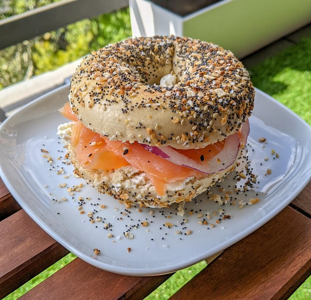

# Everything Bagel with Lox and Cream Cheese

*New York's iconic Jewish-deli breakfast: a fresh everything bagel split and toasted, smeared with cream cheese, topped with cold-cured lox (smoked salmon), thinly sliced red onion, tomato, capers and fresh dill. The Russ & Daughters Sunday classic; the Manhattan brunch institution.*

**Serves:** 4

**Prep Time:** 15 minutes

**Cook Time:** 5 minutes (toasting bagels)

## Overview
The bagel with lox and cream cheese is one of the most iconic New York Jewish-American foods and the canonical Sunday-morning breakfast in Manhattan and Brooklyn (Russ & Daughters on Houston Street, in operation since 1914, is the most famous purveyor; H&H Bagels and Ess-a-Bagel are equally iconic for the bagels): a fresh New York-style bagel (everything seasoning is canonical: sesame, poppy, dried onion, dried garlic, sea salt; though plain, sesame, poppy, pumpernickel and other varieties work too), split and toasted lightly, smeared with a generous schmear of cream cheese (Philadelphia or local equivalent; the cream cheese isn't optional), topped with cold-cured lox (the canonical NY cured salmon, cold-smoked and silky, distinct from hot-smoked salmon), thinly sliced raw red onion, tomato slices, capers, and fresh dill.

## Ingredients

### Bagels
- 4 fresh everything bagels (or sesame, poppy, plain, pumpernickel)

### Cream cheese
- 250 g full-fat cream cheese (Philadelphia or local; brought to room temp)

### Toppings
- 300 g cold-cured lox (smoked salmon; thinly sliced)
- 1 small red onion (sliced paper-thin)
- 2 medium tomatoes (sliced thin)
- 4 tablespoons capers (drained)
- 1 small bunch fresh dill
- Lemon wedges (optional)
- Fresh ground black pepper

### Optional add-ons
- Sliced cucumber
- Sliced avocado
- Pickled red onion

## Method

### Stage 1 - Toast bagels
1. Slice bagels in half through the middle.
2. Toast cut-side-up under hot grill or in toaster till golden.
3. Don't over-toast; should be golden, not dark.

### Stage 2 - Schmear cream cheese
1. Generously spread cream cheese on both halves of the toasted bagel.
2. Be generous; the schmear should be thick.

### Stage 3 - Layer lox
1. Lay 75 g of lox folded over each bagel half.
2. Don't fold flat; create some lift.

### Stage 4 - Add toppings
1. Top with paper-thin red onion slices.
2. Add tomato slices.
3. Scatter capers.
4. Fresh dill sprigs.

### Stage 5 - Finish
1. Squeeze of lemon (optional).
2. Fresh ground black pepper.

### Stage 6 - Serve
1. Eat open-face (canonical) or close into a sandwich.
2. With coffee or a mimosa.

## Notes
- **Fresh proper NY bagel:** boiled-then-baked, dense and chewy.
- **Generous cream cheese schmear.**
- **Cold-cured lox:** silky, not hot-smoked.
- **Paper-thin red onion:** not chunky.

## Variations
**With chive cream cheese:** instead of plain.
**With sable (smoked black cod):** Russ & Daughters specialty.
**With whitefish salad:** classic deli variation.
**With pickled herring:** for full deli platter.

## Serving
At Sunday brunch with coffee, mimosa. Russ & Daughters classic.

## Storage
- Lox keeps refrigerated 5 days.
- Cream cheese keeps refrigerated 2 weeks.
- Bagels best fresh; freeze 1 month.
- Don't assemble in advance.
