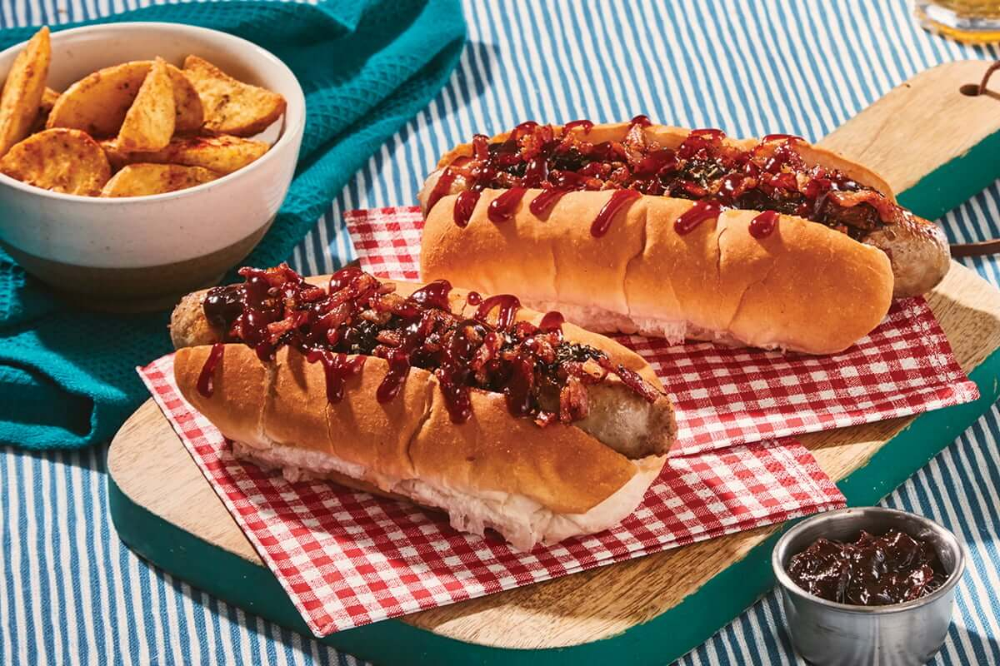

# New York Hot Dog

*New York's iconic street-cart hot dog: a steamed all-beef "dirty water dog" hot dog tucked into a soft white bun, topped with tangy sauerkraut and the canonical NY onion sauce (chopped onions in tomato-paprika-cumin sauce), and yellow mustard. The Sabrett vendor cart classic.*

**Serves:** 4

**Prep Time:** 15 minutes

**Cook Time:** 20 minutes

## Overview
The New York hot dog is one of America's most iconic street foods and the symbol of NYC street-cart vending: an all-beef hot dog (canonical brand: Sabrett, made in the Bronx; or Nathan's from Coney Island) cooked in simmering water (the canonical "dirty water dog" street-cart method; the hot dogs sit in slowly simmering broth for hours till plumped and tender), placed in a soft white bun, and topped with the two canonical NY toppings: sauerkraut (drained, sometimes warmed) and the famous NY onion sauce (chopped onions cooked down in tomato paste, paprika, cumin, salt and water into a brick-red savoury-sweet onion compote). Finished with yellow mustard (NEVER ketchup on a NY dog; that's a sin). Three details: all-beef hot dogs, simmer (don't grill), the onion sauce is canonical NY.

## Ingredients

### Hot dogs
- 8 all-beef hot dogs (Sabrett or Nathan's preferred)
- 8 soft hot dog buns (the soft white kind, not artisan)
- 2 litres water (for simmering)

### NY onion sauce (canonical)
- 4 large onions (chopped)
- 3 tablespoons tomato paste
- 2 tablespoons vegetable oil
- 1 tablespoon paprika
- 1 teaspoon ground cumin
- 1 teaspoon caster sugar
- ½ teaspoon cayenne
- 1 teaspoon fine sea salt
- ½ teaspoon ground black pepper
- 1 tablespoon apple cider vinegar
- 400 ml water

### Sauerkraut
- 600 g sauerkraut (drained; warmed briefly)

### Mustard
- Plenty of yellow mustard (Gulden's or French's)
- Spicy brown mustard (optional)

### Optional (less canonical)
- Sweet pickle relish
- Chopped raw onion
- Hot sauce

## Method

### Stage 1 - Make NY onion sauce
1. Heat oil in a saucepan.
2. Add chopped onions; cook 10 min till soft.
3. Stir in tomato paste, paprika, cumin, sugar, cayenne, salt, pepper.
4. Cook 3 min.
5. Pour in water and vinegar.
6. Simmer 25-30 min till onions are very soft and the sauce is thick and brick-red.
7. Taste; adjust.

### Stage 2 - Simmer hot dogs
1. Bring water to gentle simmer in a pot.
2. Add hot dogs.
3. Simmer 8-10 min till plumped and heated through.
4. Keep warm in the water till ready to serve.

### Stage 3 - Warm sauerkraut
1. Warm sauerkraut briefly in a pan with a tablespoon of butter (optional).

### Stage 4 - Build
1. Place a hot dog in each bun.
2. Top with a generous mound of sauerkraut.
3. Spoon onion sauce over.
4. Drizzle with yellow mustard.

### Stage 5 - Serve immediately
1. Eat upright; carefully.
2. With cold beer.

## Notes
- **All-beef hot dogs:** Sabrett or Nathan's.
- **Simmer not grill:** the dirty-water-dog method.
- **NY onion sauce canonical:** the signature.
- **NO ketchup:** that's a sin.

## Variations
**Coney Island style:** add chili (no beans), chopped onions, yellow mustard.
**Chicago style:** poppy seed bun, sport peppers, neon green relish, tomato, pickle (Chicago, not NY).
**Bagel dog:** wrap in bagel dough; bake.
**Chili dog:** with chili instead of onion sauce.

## Serving
From street carts in Manhattan, Times Square, Brooklyn Bridge area. With a cold soda. Year-round.

## Storage
- Onion sauce keeps refrigerated 1 week; freezes 3 months.
- Best immediately.
- Don't assemble in advance.
