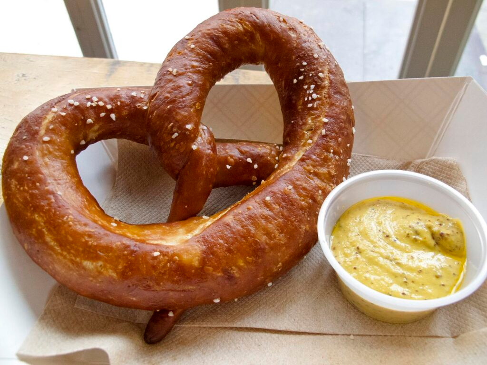

# New York Soft Pretzel

*New York's classic street-cart snack: a soft yeasted pretzel dough shaped into the traditional twisted-loop pretzel shape, briefly dipped in baking-soda water bath for the deep brown crust, sprinkled with coarse salt, and baked till deeply golden. The Midtown street-vendor classic; eaten with yellow mustard.*

**Serves:** Makes 8 pretzels

**Prep Time:** 30 minutes (plus 1 hour dough rise)

**Cook Time:** 15 minutes

## Overview
The New York soft pretzel is a fixture of Manhattan street vendors (along with the hot dog cart and the chestnut roaster), particularly around Midtown, Times Square, Central Park and the Theatre District: a soft yeasted bread dough (flour, water, yeast, salt, brown sugar, a touch of butter) shaped into the traditional twisted-loop pretzel shape, briefly dipped or boiled in a baking-soda-water bath (the alkaline bath gives the traditional mahogany-brown crust and distinctive pretzel flavour; food-grade lye gives even more authentic but is dangerous to work with, so baking soda is safer), sprinkled generously with coarse pretzel salt or sea salt, and baked till deeply golden brown. Served warm with yellow mustard for dipping.

## Ingredients

### Dough
- 600 g strong bread flour
- 1 sachet (7 g) instant yeast
- 2 tablespoons brown sugar
- 2 teaspoons fine sea salt
- 350 ml warm water
- 40 g melted butter

### Alkaline bath
- 2 litres water
- 80 g bicarbonate of soda

### Topping
- Coarse pretzel salt or coarse sea salt
- 4 tablespoons melted butter (for brushing)

### To serve
- Yellow mustard
- Spicy brown mustard
- Cheese sauce (optional)

## Method

### Stage 1 - Make dough
1. Combine flour, yeast, brown sugar, salt.
2. Add warm water and melted butter.
3. Mix to a soft dough.
4. Knead 8 min.

### Stage 2 - Rise
1. Place in oiled bowl.
2. Cover; rise 60 min till doubled.

### Stage 3 - Shape pretzels
1. Punch down dough.
2. Divide into 8 pieces.
3. Roll each into a long rope (about 50 cm long).
4. Shape into pretzel: form a U; cross the ends once at the top; fold down to the bottom of the U; press to attach.

### Stage 4 - Boil bath
1. Bring water to boil; add bicarbonate of soda carefully (it foams).

### Stage 5 - Dip
1. One at a time, drop pretzel into boiling baking soda water.
2. Boil 30 sec.
3. Lift out with slotted spoon.
4. Place on parchment-lined sheet.

### Stage 6 - Salt
1. Sprinkle generously with coarse salt while still wet.

### Stage 7 - Bake
1. Preheat oven to 230°C (450°F).
2. Bake pretzels 12-15 min till deeply mahogany brown.

### Stage 8 - Brush and serve warm
1. Brush with melted butter immediately while hot.
2. Serve warm with mustard.

## Notes
- **Alkaline bath gives the crust:** essential.
- **Coarse salt:** not fine.
- **Eat warm:** lose their fluff quickly.
- **Brush with butter for shine.**

## Variations
- **Cinnamon-sugar:** brush with butter; sprinkle with cinnamon-sugar instead of salt.
- **Garlic-herb:** brush with garlic butter; sprinkle with parsley.
- **Cheddar-stuffed:** wrap dough around a strip of cheese before shaping.
- **Pretzel bites:** cut into bite-size pieces; boil and bake same way.

## Serving
- From street carts in Manhattan; at ball games; with mustard.

## Storage
- Best warm.
- Room temp 1 day; reheat in oven.
- Freeze 1 month; reheat from frozen.
