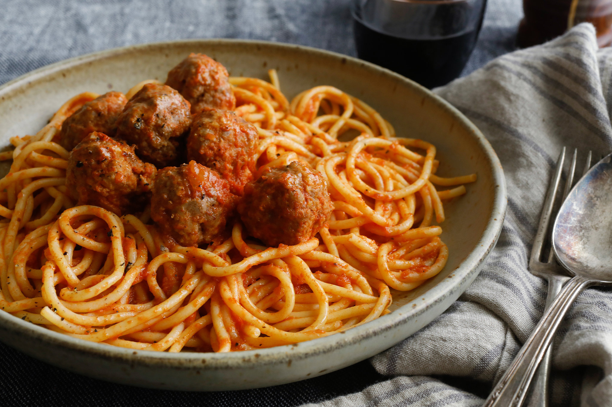

# Spaghetti and Meatballs (NY Italian-American)

*New York's iconic Italian-American Sunday dinner: large hand-rolled meatballs of beef, pork and veal pan-fried then simmered in a long-cooked marinara sauce, served over spaghetti with grated Parmesan and torn basil. The Italian-American red-sauce Sunday classic; the New York invention that Italy doesn't quite recognise.*

**Serves:** 6

**Prep Time:** 35 minutes

**Cook Time:** 2 hours

## Overview
Spaghetti and meatballs is one of the most iconic Italian-American dishes and a New York Sunday-dinner staple; a dish invented in New York's Italian neighbourhoods (particularly Little Italy and Brooklyn) in the late 19th century by Italian immigrants who had access to far more meat in America than they did in southern Italy, combining the southern Italian polpette (meatballs, traditionally eaten as a separate course, not on pasta) with spaghetti and red sauce. The Italian-American Sunday version: large meatballs (about 60-80 g each) made from a 50/30/20 ratio of beef chuck, pork shoulder, and veal (or just beef + pork if veal is unavailable), bound with milk-soaked breadcrumbs, eggs, garlic, parsley, grated Parmesan, salt and pepper, pan-fried till crusted, then simmered for 90 minutes in a long-cooked marinara sauce till the meatballs absorb the flavours and the sauce reduces. Served over spaghetti with extra sauce, plenty of grated Parmesan, and torn fresh basil.

## Ingredients

### Meatballs
- 500 g ground beef chuck (80/20)
- 300 g ground pork shoulder
- 200 g ground veal (or extra beef and pork)
- 200 ml whole milk
- 200 g panko breadcrumbs (or fresh white breadcrumbs)
- 100 g grated Parmesan
- 2 large eggs
- 8 garlic cloves (crushed)
- 1 small bunch fresh parsley (chopped)
- 2 tablespoons dried oregano
- 1 tablespoon fennel seeds (lightly crushed; optional but very Italian-American)
- 2 teaspoons fine sea salt
- 1 teaspoon ground black pepper
- ½ teaspoon red chilli flakes
- 4 tablespoons olive oil (for frying)

### Marinara sauce
- 2 large tins (800 g each) crushed tomatoes
- 2 tins (400 g each) tomato passata
- 1 small tin (200 g) tomato paste
- 1 large onion (chopped)
- 12 garlic cloves (crushed)
- 6 tablespoons olive oil
- 4 bay leaves
- 2 tablespoons dried oregano
- 2 tablespoons dried basil
- 1 tablespoon caster sugar
- 1 tablespoon fine sea salt
- 1 teaspoon ground black pepper
- 1 teaspoon red chilli flakes
- 1 small bunch fresh basil (chopped)
- 100 ml red wine (optional)

### To serve
- 600 g spaghetti
- Extra grated Parmesan
- Fresh basil leaves
- Crusty bread or garlic bread
- Mixed leaf salad
- Red wine

## Method

### Stage 1 - Soak breadcrumbs
1. Soak breadcrumbs in milk 5 min till absorbed.

### Stage 2 - Mix meatballs
1. In a large bowl, combine all three meats with the soaked breadcrumbs, Parmesan, eggs, garlic, parsley, oregano, fennel seeds (if using), salt, pepper, chilli flakes.
2. Mix gently with hands; don't overwork.

### Stage 3 - Form meatballs
1. Form into 18 large meatballs (about 80 g each).
2. Refrigerate 15 min.

### Stage 4 - Brown meatballs
1. Heat olive oil in a large wide pot.
2. Brown meatballs in batches 5 min on each side (don't fully cook; just crust).
3. Remove.

### Stage 5 - Make sauce
1. In the same pot, sauté onion 8 min.
2. Add garlic; cook 30 sec.
3. Add tomato paste; cook 2 min.
4. Add red wine (if using); reduce 3 min.
5. Add crushed tomatoes, passata.
6. Stir in bay leaves, oregano, dried basil, sugar, salt, pepper, chilli flakes.
7. Bring to simmer.

### Stage 6 - Return meatballs and simmer
1. Return browned meatballs to sauce.
2. Cover slightly ajar; simmer 90 min, stirring occasionally.
3. Don't break the meatballs.

### Stage 7 - Cook pasta
1. In last 12 min, bring large pot of salted water to boil.
2. Cook spaghetti to package directions (al dente).
3. Drain; reserve some pasta water.

### Stage 8 - Serve
1. Stir fresh basil into the sauce.
2. Toss spaghetti with some sauce in a bowl.
3. Top with meatballs and more sauce.
4. Plenty of grated Parmesan, fresh basil leaves.
5. Crusty bread, salad, red wine alongside.

## Notes
- **3-meat mix essential:** beef + pork + veal.
- **Milk-soaked breadcrumbs:** for tender meatballs.
- **Don't overwork meat:** keeps tender.
- **Simmer in sauce:** flavour exchange.
- **Don't break meatballs.**

## Variations
- **With ricotta in meatballs:** for tenderness.
- **Italian sausage meatballs:** crumble sweet Italian sausage with the meats.
- **Sunday gravy:** add pork ribs, sausage to the sauce.
- **Smaller meatballs:** for spaghetti and tiny meatballs.

## Serving
- Italian-American Sunday dinner with bread, salad, red wine.

## Storage
- Sauce + meatballs keep refrigerated 5 days; flavour deepens.
- Freezes 3 months.
- Pasta best fresh.
