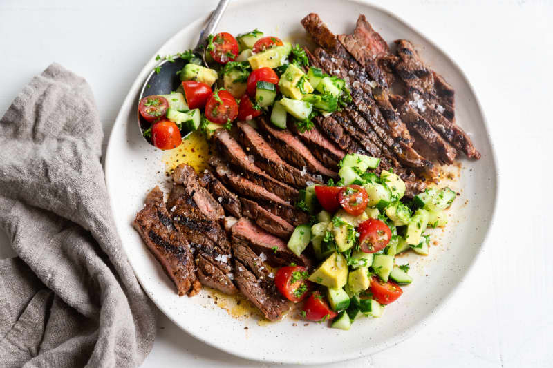

# BBQ Steak and Salad

*The Kiwi summer evening meal: a grass-fed sirloin steak grilled over high heat, sliced against the grain, served with a feijoa-and-rocket salad and a smear of garlic butter. Simple and unsentimental.*

**Serves:** 4

**Prep Time:** 15 minutes

**Cook Time:** 12 minutes

## Overview
New Zealand farming produces some of the world's best grass-fed beef, and the Kiwi summer dinner habit is the BBQ steak - a thick sirloin or scotch fillet (ribeye) cooked over high heat outdoors, rested, sliced and served with whatever's growing in the garden. The classic side is a green salad with feijoa - the small green New Zealand fruit (Acca sellowiana) with a pineapple-guava flavour that turns up in any Kiwi garden between March and June. Outside the feijoa season, sub avocado, pear or fresh figs. Garlic-and-herb butter melted over the warm steak slices is the only sauce required.

## Ingredients

### Steak
- 4 sirloin or ribeye steaks, 250 g each, about 2.5 cm thick
- 2 tbsp olive oil
- Sea salt and freshly ground black pepper

### Garlic-herb butter
- 80 g unsalted butter, softened
- 3 cloves garlic, minced
- 2 tbsp finely chopped flat-leaf parsley
- 1 tbsp finely chopped chives
- A pinch of salt
- A few drops of Worcestershire sauce

### Salad
- 2 large handfuls of rocket (about 100 g)
- A small handful of fresh mint leaves
- 4 ripe feijoas, halved and flesh scooped out into wedges (or 2 ripe pears, sliced; or 2 ripe avocados)
- 80 g walnuts, toasted and roughly chopped
- 80 g feta or blue cheese, crumbled

### Dressing
- 3 tbsp extra virgin olive oil
- 1 tbsp lemon juice
- 1 tsp honey
- 1 tsp Dijon mustard
- Salt and pepper

## Method

### Stage 1 - Steaks to room temperature
1. Take the steaks out of the fridge 30-45 minutes before cooking.
2. Pat dry with kitchen paper.
3. Rub with olive oil; season generously with salt and pepper on both sides.

### Stage 2 - Garlic butter
1. In a small bowl, mash the butter with the garlic, parsley, chives, salt and Worcestershire.
2. Scoop onto a sheet of cling film; roll into a log; refrigerate to firm up.

### Stage 3 - Dressing
1. In a small bowl, whisk the olive oil, lemon juice, honey, mustard, salt and pepper into an emulsion.

### Stage 4 - Hot BBQ or pan
1. Light a BBQ or heat a heavy ridged grill pan over high heat until smoking.
2. Place the steaks on the grill; don't move them.
3. Cook 3-4 minutes one side (you want dark grill marks and a crust).
4. Flip; cook 3-4 minutes the other side for medium-rare (internal temperature 55°C).
5. Adjust: 2 minutes a side for rare, 5 minutes a side for medium-well.

### Stage 5 - Rest
1. Lift the steaks to a board.
2. Lay a slice of the garlic butter on each (about 10 g).
3. Cover loosely with foil; rest 8 minutes (essential for juicy steak).

### Stage 6 - Salad
1. Toss the rocket, mint, feijoa wedges and walnuts in a large bowl.
2. Drizzle the dressing over; toss gently.
3. Scatter the crumbled cheese on top.

### Stage 7 - Slice and serve
1. Slice the rested steaks against the grain into 1 cm slices.
2. Plate with the salad alongside.
3. Spoon any board juices over the slices.

## Notes
- **Grass-fed beef cooks faster than grain-fed:** It has less marbling, so it dries out if overcooked. Aim for medium-rare; pull off the heat early and let it rest.
- **Feijoa season is short:** March-June in New Zealand, autumn in the southern hemisphere. Outside this, pear, avocado, fig or stone fruit all work. The point is sweet fruit against peppery rocket.
- **Don't poke the steak:** Use a timer. The "press with your finger" test is unreliable; the only honest way is time + thickness or a meat thermometer (55°C medium-rare, 60°C medium).

## Serving
- The Kiwi summer evening: steak, salad, a bowl of new potatoes or sourdough, a glass of Hawke's Bay Syrah or a cold Pilsener. Eat outside if the weather allows.

## Storage
- Leftover steak refrigerates 3 days; slice and eat cold in a sandwich.
- Garlic butter refrigerates 2 weeks, or freezes 3 months.
- Dressed salad doesn't keep - dress per serving.
