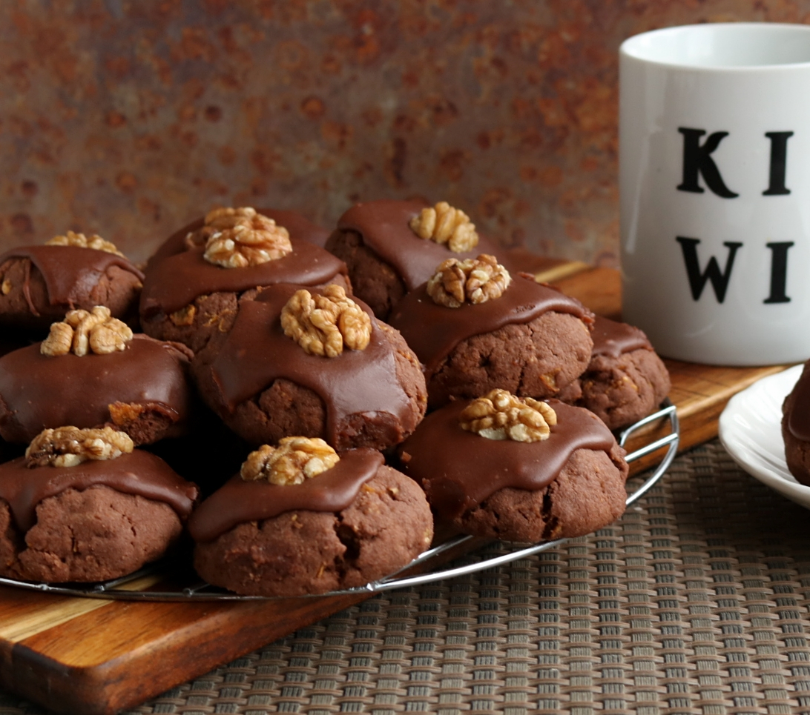

# Afghan Biscuits

*A New Zealand baking classic of obscure origin: dense chocolate cornflake biscuits topped with chocolate icing and a walnut half. The biscuit every Kiwi grew up with.*

**Serves:** Makes about 24 biscuits

**Prep Time:** 20 minutes

**Cook Time:** 20 minutes (plus 30 minutes cool + ice)

## Overview
Afghan biscuits are a New Zealand baking classic whose name has nothing to do with Afghanistan - the etymology is lost to history; the dish is purely a Kiwi invention. They appeared in the Edmonds Cookery Book (the NZ kitchen bible) by the 1930s and have been baked in home ovens every since. The biscuit itself is dense and rich: a butter-cocoa-sugar dough folded with crushed cornflakes that gives a distinctive crunchy-chewy texture. Once cool they're topped with chocolate icing and a walnut half pressed into the middle of each. They're the dependable bake-sale and afternoon-tea biscuit of New Zealand domestic baking - never the most exciting cookie, but the one Kiwis miss when they live overseas.

## Ingredients

### Biscuits
- 200 g unsalted butter, softened
- 100 g caster sugar
- 175 g plain flour
- 30 g unsweetened cocoa powder
- 1 tsp vanilla extract
- A pinch of fine salt
- 70 g cornflakes (or any plain unsweetened cornflake cereal)

### Chocolate icing
- 200 g icing sugar
- 30 g unsweetened cocoa powder
- 50 g unsalted butter, softened
- 2-3 tbsp hot water
- 1 tsp vanilla extract

### Topping
- 24 walnut halves (or pecan halves)

## Method

### Stage 1 - Cream the butter and sugar
1. In a large bowl, cream the softened butter and caster sugar with an electric mixer (or a wooden spoon and elbow grease) until pale and fluffy, about 3-4 minutes.
2. Beat in the vanilla and salt.

### Stage 2 - Add the dry
1. Sift the flour and cocoa together onto the creamed butter.
2. Mix on low (or fold) until just combined - don't overwork.

### Stage 3 - Fold in the cornflakes
1. Tip the cornflakes into the bowl.
2. Fold through with a spatula, breaking them slightly as you go - you want a mix of intact flakes and small fragments for texture.
3. The dough is fairly dry and crumbly; pinch it together to test - it should hold when squeezed.

### Stage 4 - Shape
1. Preheat the oven to 180°C.
2. Line two large baking trays with greaseproof paper.
3. Take heaped tablespoons of dough (about 30 g each); squeeze in your hand to compress, then place on the tray.
4. Don't roll into smooth balls - the rough-textured look is part of the biscuit.
5. Space about 4 cm apart (they don't spread much).
6. Press down gently with your palm to flatten slightly (about 1.5 cm thick).

### Stage 5 - Bake
1. Bake 15-18 minutes until firm to the touch and set.
2. They look the same when done as when they went in (the cocoa colour disguises browning).
3. Let cool 5 minutes on the trays, then transfer to a wire rack to cool completely.

### Stage 6 - Icing
1. While the biscuits cool, sift the icing sugar and cocoa together into a bowl.
2. Add the softened butter and vanilla.
3. Add the hot water 1 tablespoon at a time, beating until the icing is smooth, glossy and thick enough to spread (not so thin it runs off the biscuit).

### Stage 7 - Ice and top
1. Once the biscuits are completely cold, spread a generous teaspoon of icing on top of each.
2. Press a walnut half into the centre while the icing is still soft.
3. Let the icing set 30 minutes before stacking or storing.

## Notes
- **Don't overwork the dough:** The cornflakes should stay mostly intact for texture. Overmix and you get a uniform dough that bakes flat and chewy in the wrong way.
- **Cornflakes only - not muesli or any other cereal:** The dry-crunch character of unsweetened cornflakes is what gives Afghans their distinctive bite. Frosted Flakes is too sweet. Honey-nut anything is wrong.
- **Don't skip the walnut:** It looks finished, it adds a different crunch, and (more importantly) it makes the biscuit unmistakably an Afghan.

## Serving
Serve with a cup of tea or coffee at afternoon tea, or with a glass of cold milk. The standard packet contents of a New Zealand kid's lunchbox throughout the 1990s.

## Storage
- Room temperature in an airtight tin: 1 week.
- The icing softens slightly in humid weather; layer with greaseproof paper to stop them sticking.
- Freezes 2 months unfrosted; freeze frosted at your own risk (the icing texture suffers).
