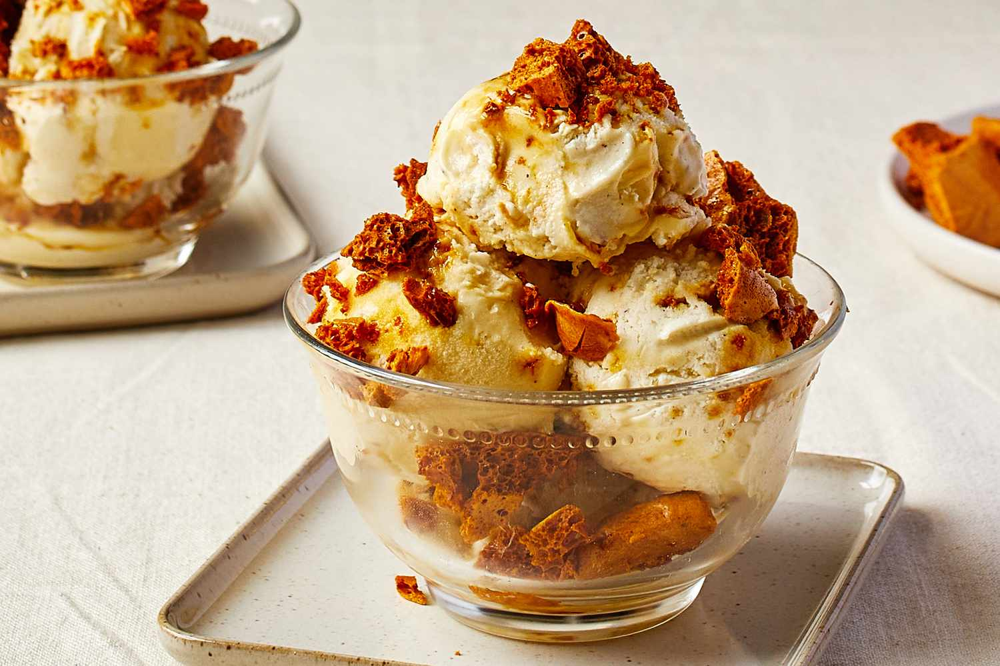

# Hokey Pokey Ice Cream

*New Zealand's most beloved ice cream: vanilla custard ice cream studded with shards of honeycomb toffee (hokey pokey). Crunchy gold sweet hits in a silky vanilla base. The flavour every Kiwi misses when they live abroad.*

**Serves:** 8

**Prep Time:** 30 minutes (plus 4 hours freezing)

**Cook Time:** 25 minutes

## Overview
Hokey pokey ice cream is the flavour that defines New Zealand ice cream culture - vanilla ice cream studded with shards of honeycomb (called hokey pokey in NZ, cinder toffee in the UK, sponge candy in the US). The honeycomb is a simple sugar-syrup-and-baking-soda foam that sets brittle and golden, broken into shards that get folded into the freezing ice cream. Tip Top, the major NZ ice cream brand, has made it the country's bestselling flavour for decades; the home version is better - fresher honeycomb, denser ice cream, and the satisfaction of breaking glassy sheets of golden toffee with a rolling pin. Made in a domestic ice cream churner, it's not difficult, just timed.

## Ingredients

### Hokey pokey (honeycomb)
- 200 g caster sugar
- 60 g golden syrup (UK) or light corn syrup
- 2 tsp baking soda (bicarbonate of soda)

### Vanilla ice cream base
- 300 ml whole milk
- 600 ml double cream
- 5 large egg yolks
- 150 g caster sugar
- 2 tsp vanilla extract (or seeds of 1 vanilla pod)
- A pinch of fine salt

## Method

### Stage 1 - Make the hokey pokey first
1. Line a 25 cm baking tray with greaseproof paper.
2. In a medium heavy-based saucepan (use one larger than you think - the mixture quadruples in size), combine the sugar and golden syrup.
3. Heat over medium heat without stirring; swirl the pan occasionally.
4. Cook 5-8 minutes until the mixture is a deep amber colour (caramel stage, about 170°C).
5. Off the heat, sift the baking soda over the top.
6. Whisk briskly for 5 seconds - the mixture foams up dramatically (this is the chemical reaction creating the bubbles).
7. Immediately pour onto the lined tray; don't spread or press - let it puff freely.
8. Cool completely (about 30 minutes) - it sets crisp and brittle.

### Stage 2 - Break the hokey pokey
1. Once cold and hard, transfer to a plastic bag.
2. Break into rough shards with a rolling pin - you want a mix of pea-sized pieces and larger 2 cm shards.
3. Don't reduce to powder.

### Stage 3 - Ice cream base - heat the dairy
1. Combine the milk and 300 ml of the cream in a medium saucepan.
2. Heat over medium heat until just below a simmer (steam rising, small bubbles at the edge).

### Stage 4 - Egg yolks
1. In a large bowl, whisk the egg yolks with the sugar until thick and pale.

### Stage 5 - Temper
1. Whisking constantly, pour the hot milk mixture slowly into the yolks - thin stream, mix as you go (so the yolks don't scramble).
2. Return the mixture to the saucepan.
3. Cook over low heat, stirring constantly with a wooden spoon, until thickened enough to coat the back of the spoon and leave a clear trail when you draw a finger across (about 5-7 minutes, 82°C if using a thermometer).
4. Don't boil - it'll curdle.

### Stage 6 - Strain and cool
1. Strain the custard through a fine sieve into a clean bowl.
2. Stir in the remaining 300 ml cold cream, the vanilla and salt.
3. Cover; refrigerate at least 4 hours, or overnight (cold base churns better).

### Stage 7 - Churn
1. Churn in an ice cream maker according to the manufacturer's instructions until thick and soft-scoop, about 25-30 minutes.

### Stage 8 - Fold in the hokey pokey
1. As soon as the ice cream is churned (still soft), tip into a chilled container.
2. Quickly fold through three-quarters of the hokey pokey shards.
3. Smooth the top; scatter the remaining hokey pokey over.
4. Press a sheet of greaseproof paper directly on the surface.
5. Freeze 4 hours minimum to firm up.

### Stage 9 - Serve
1. Let soften 5 minutes at room temperature before scooping (it's quite firm from the freezer).
2. Scoop into bowls; sprinkle extra hokey pokey shards on top if you saved some.

## Notes
- **Big saucepan for the honeycomb:** The baking soda makes the mixture foam to four times its original volume in seconds. A small pot overflows; a deep one contains the foam beautifully.
- **Don't stir the foam:** Whisking once dispenses the soda, then leave it alone. Stirring knocks the bubbles out and you get hard caramel instead of crisp honeycomb.
- **Hokey pokey absorbs moisture:** Stir it into the ice cream as late as possible; longer in the soft ice cream and it softens too. Best is to fold it in just as the ice cream finishes churning.

## Serving
- The summer treat - in cones at the beach, in bowls after BBQ, as the Christmas day dessert alongside (or instead of) pavlova. Drizzle with hot fudge sauce for an over-the-top sundae.

## Storage
- Freezes 1 month sealed tightly; the hokey pokey softens but is still pleasantly chewy.
- Plain hokey pokey shards keep 2 weeks in an airtight jar; eat as a sweet, crumble over yoghurt or porridge.
- The custard base alone freezes 1 month un-churned; thaw in the fridge, then churn.
