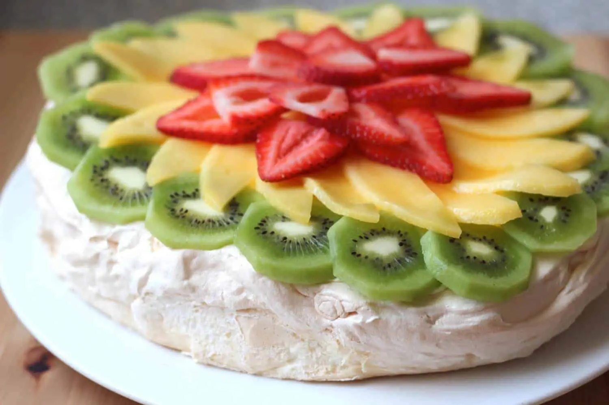

# Pavlova

*The trans-Tasman dispute and Christmas centrepiece: a crisp meringue shell with a marshmallow centre, topped with whipped cream and a tumble of fresh seasonal fruit. Strawberries, kiwifruit, passionfruit.*

**Serves:** 8-10

**Prep Time:** 20 minutes

**Cook Time:** 1 hour 30 minutes (plus 2 hours cool)

## Overview
Pavlova is the dessert that New Zealand and Australia have argued over since the 1920s - both claim it; both serve it at Christmas dinner; the contemporary food-historian view is that the New Zealand claim is slightly older. Either way, the dish is the southern hemisphere's December centrepiece: a large soft meringue shell baked low and slow until crisp outside and marshmallow soft inside, topped with whipped cream and a riot of fresh summer fruit. The classic Kiwi topping is kiwifruit and strawberries with passionfruit pulp spooned over - the green-red-yellow palette is unmistakable. The technique is straightforward once you understand it: stable meringue, low oven, never open the door, cool inside the turned-off oven.

## Ingredients

### Meringue
- 6 large egg whites (about 210 g), at room temperature
- A pinch of fine salt
- 350 g caster sugar
- 1 tsp white wine vinegar
- 1 tbsp cornflour
- 1 tsp vanilla extract

### Topping
- 500 ml double cream, very cold
- 2 tbsp icing sugar
- 1 tsp vanilla extract

### Fruit (whatever's in season; this is the Kiwi classic)
- 4 kiwifruit, peeled and sliced
- 300 g strawberries, hulled and halved
- 4 passionfruit, pulp scooped out
- A handful of fresh mint leaves
- Optional: 100 g raspberries, blueberries

## Method

### Stage 1 - Prep
1. Preheat the oven to 150°C (not fan, conventional).
2. Line a large baking tray with greaseproof paper.
3. Draw a 22 cm circle on the paper as a guide; flip the paper over (so the pencil isn't on the food side).
4. The oven must be at full temperature before the meringue goes in.

### Stage 2 - Whisk the whites
1. Place the egg whites and salt in the bowl of a stand mixer (the bowl and whisk must be scrupulously clean and grease-free - any fat prevents proper whipping).
2. Whisk on medium speed until soft peaks form, about 2-3 minutes.
3. Increase to medium-high; add the sugar one tablespoon at a time, allowing each addition to fully dissolve (about 15-20 seconds) before the next.
4. Continue until all the sugar is in and the meringue is thick, glossy, and forms stiff peaks - about 8-10 minutes total.
5. Test by rubbing a small amount between thumb and finger; if it feels gritty, keep whisking until smooth.

### Stage 3 - Fold in the stabilisers
1. With the mixer on low, add the vinegar, cornflour and vanilla.
2. Whisk briefly to combine, no more than 30 seconds.
3. These three ingredients are what give pavlova its marshmallow centre - skip them and you get hard meringue.

### Stage 4 - Shape
1. Tip the meringue onto the paper inside the circle.
2. Using a spatula, shape into a round 22 cm wide and about 6 cm tall.
3. Smooth the top into a shallow well (this is where the cream and fruit go).
4. Use the back of a spoon to create attractive swirls and peaks on the sides; they crisp into the characteristic pavlova ridges.

### Stage 5 - Bake low and slow
1. Reduce the oven to 120°C (immediately).
2. Bake 1 hour 30 minutes.
3. Don't open the oven during baking.
4. The pavlova should be a very pale cream colour - if it's browning, your oven is too hot.

### Stage 6 - Cool inside the oven
1. Turn off the oven.
2. Let the pavlova cool completely inside the closed oven (2 hours minimum, or overnight).
3. This slow cool stops the meringue cracking dramatically.
4. Small cracks are inevitable and traditional.

### Stage 7 - Whip the cream and top
1. Whip the double cream with the icing sugar and vanilla to soft peaks - not stiff (stiff cream is grainy and won't drape attractively).
2. Just before serving, transfer the pavlova to a serving plate.
3. Spoon the cream into the well on top.
4. Arrange the fruit on top of the cream.
5. Spoon the passionfruit pulp over.
6. Scatter mint leaves.

## Notes
- **Sugar must dissolve fully:** Undissolved sugar leaks out during baking and creates the "weeping" caramel beads on a pav. Add slowly; rub-test before stopping the whisk.
- **No opening the oven:** Temperature shock causes catastrophic cracking. Trust the timer.
- **Top just before serving:** Once cream and fruit are on, the pavlova softens fast - 2 hours at most in the fridge. Best is to bake the meringue the day before, top within the hour of serving.

## Serving
Serve as the Christmas dinner finale, the BBQ pud, or the centrepiece of a summer afternoon tea. Slice through with a serrated knife - it'll crack, that's fine, that's the dish.

## Storage
- Unfilled meringue keeps 3 days in a sealed tin in a dry place (humidity wilts meringue).
- Filled pavlova: best eaten same day; the cream weeps into the meringue after 4 hours and the texture goes from crisp/marshmallow to wet/marshmallow.
- Don't freeze.
