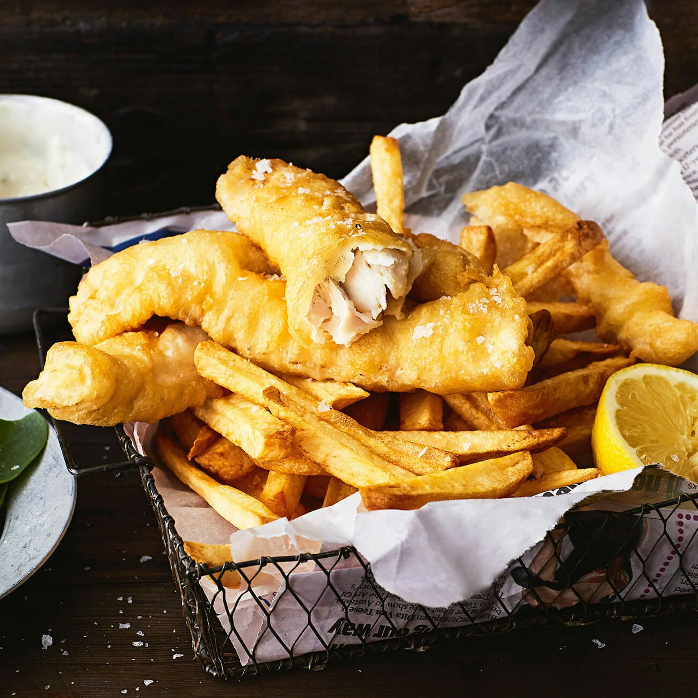

# Kiwi Fish and Chips

*The New Zealand take on the British dish: snapper or hoki in light beer batter, hand-cut chips fried in beef dripping or vegetable oil, served out of paper at the beach with a wedge of lemon and a sprinkle of salt.*

**Serves:** 4

**Prep Time:** 20 minutes

**Cook Time:** 25 minutes

## Overview
Fish and chips is the New Zealand summer holiday meal, ordered from a small takeaway in any coastal town, wrapped in paper, taken to the sand with seagulls hovering. The Kiwi tradition uses local white fish: snapper (the most common), hoki, terakihi, or gurnard - any flaky, mild white fish works. The batter is a light beer batter, the chips are hand-cut from floury potatoes, and both are fried in clean oil to a deep golden crisp. The accompaniments are simple: a wedge of lemon, salt, malt vinegar, and occasionally tartare sauce or mushy peas. This is the home version: deeper-flavoured than a takeaway because you control everything, and you can use any fish your fishmonger has fresh.

## Ingredients

### Chips
- 1 kg floury potatoes (Agria or Maris Piper), peeled
- Vegetable oil for deep frying (about 2 L)
- Sea salt

### Batter
- 200 g plain flour
- 50 g cornflour
- 1 tsp baking powder
- 1 tsp fine salt
- 300 ml cold beer (lager or pale ale)
- An extra 50 g plain flour for dusting

### Fish
- 4 fillets of firm white fish (snapper, hoki, gurnard, terakihi - or substitute cod, haddock, hake), about 180 g each, skinned

### To serve
- 1 lemon, cut into wedges
- Malt vinegar
- Sea salt
- Tartare sauce (recipe below) or mushy peas

### Tartare sauce
- 4 tbsp mayonnaise
- 1 tbsp finely chopped cornichons
- 1 tbsp finely chopped capers
- 1 tsp Dijon mustard
- 1 tbsp finely chopped parsley
- A squeeze of lemon juice
- Black pepper

## Method

### Stage 1 - Chips, first fry
1. Cut the potatoes into thick chips (1.5 x 1.5 cm cross-section).
2. Rinse under cold water to wash off excess starch.
3. Pat dry on a clean tea towel - dry potato fries crisp; wet potato spits dangerously and steams.
4. Heat the oil in a deep, heavy pot to 140°C (or until a chip dropped in sizzles gently).
5. Fry the chips in 2 batches for 6-8 minutes each - they should be soft and just starting to colour, not crisp.
6. Lift out with a slotted spoon onto kitchen paper.
7. Rest at least 10 minutes.

### Stage 2 - Tartare sauce
1. Combine all the tartare ingredients in a small bowl.
2. Stir; taste; chill until serving.

### Stage 3 - Batter
1. In a large bowl, sift together the flour, cornflour, baking powder and salt.
2. Pour in the cold beer; whisk briefly until just combined.
3. Don't overmix - small lumps are fine; overmixing develops gluten and gives heavy batter.
4. The batter should coat a spoon thickly. Rest 5 minutes.

### Stage 4 - Chips, second fry
1. Heat the oil to 190°C.
2. Fry the par-fried chips in 2 batches 3-4 minutes each, until deeply golden and crisp.
3. Drain on kitchen paper; season immediately with salt.
4. Keep warm in a low oven (90°C) while you fry the fish.

### Stage 5 - Fry the fish
1. Pat the fish fillets dry.
2. Dredge in the extra plain flour; shake off excess.
3. Dip each fillet into the batter; let excess drip off.
4. Lower carefully into the 190°C oil; fry 4-5 minutes, depending on thickness, until deeply golden and crisp.
5. Don't overcrowd - fry in 2 batches if your pot is small.
6. Lift out; drain on kitchen paper; season with salt.

### Stage 6 - Plate (or paper)
1. Pile the chips onto a sheet of greaseproof paper (or newspaper) or a warmed plate.
2. Lay the fish alongside.
3. Add a lemon wedge, a small bowl of tartare sauce, and the malt vinegar bottle.
4. Eat immediately, while crisp.

## Notes
- **Cold beer batter:** The cold beer + flour combo means CO2 bubbles + minimal gluten = lightness. Use the beer straight from the fridge.
- **Twice-cooked chips:** The lower-temperature first fry cooks the inside; the higher-temperature second fry crisps the outside. Skip the first fry and you get soft chips with a hard crust; skip the second and you get pale soggy chips.
- **Right oil temperature:** A kitchen thermometer is the only reliable way. Too cold and batter absorbs oil and gets greasy; too hot and the outside burns before the inside cooks.

## Serving
The beach picnic plate: fish and chips on greaseproof paper, lemon wedge, malt vinegar, salt. A glass of Kiwi pale ale or cold sparkling water. Eat with your fingers.

## Storage
- Best fresh and crispy. Soggy leftover fish and chips are a disappointment.
- Chips reheat OK in a 200°C oven for 10 minutes; the fish doesn't reheat well.
- The batter mix doesn't keep; make fresh per cook.
