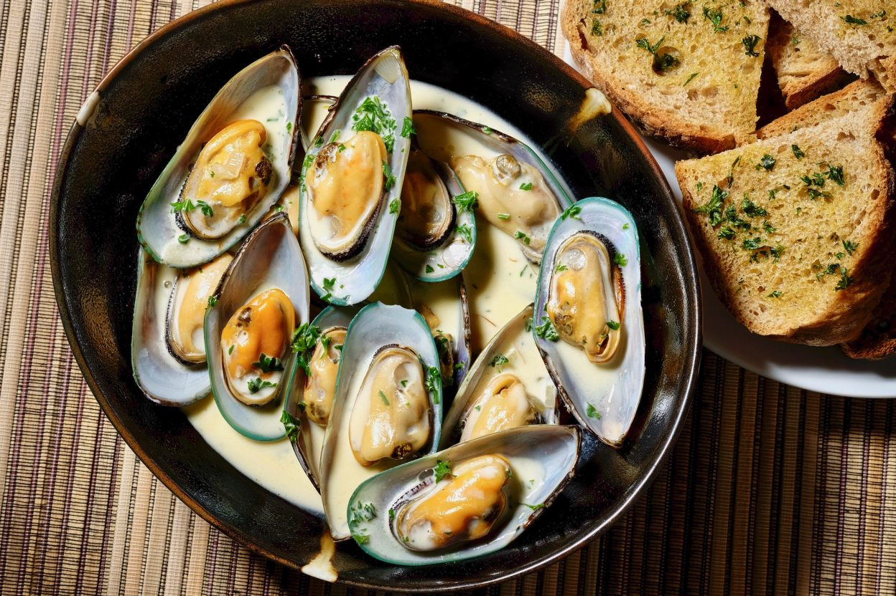

# Green-Lipped Mussels

*New Zealand's famous green-lipped mussels steamed open in white wine, garlic and herbs, served in their bright shells with crusty bread to soak up the broth. Sweet, plump, distinctively flavoured.*

**Serves:** 4

**Prep Time:** 15 minutes

**Cook Time:** 10 minutes

## Overview
The green-lipped mussel (Perna canaliculus) is endemic to New Zealand - a large, plump mussel with a distinctive green-tinged shell rim. Farmed mostly in the Marlborough Sounds at the top of the South Island, they're sweeter and meatier than European Mytilus mussels, with a faintly buttery flavour. The Kiwi home preparation is the classic moules marinière method: steam the mussels open in a pot with white wine, garlic, shallots and parsley, finish with butter, and serve in deep bowls with the broth pooled around them and bread for dipping. A bowl of fries on the side turns it into the Belgian-style moules-frites that's a Wellington restaurant favourite.

## Ingredients
- 2 kg fresh live green-lipped mussels (or substitute regular blue mussels)
- 60 g unsalted butter
- 2 shallots, finely diced
- 1 small leek, white part only, finely sliced
- 6 cloves garlic, minced
- 1 tsp fennel seeds
- 1 small red chilli, finely chopped (optional)
- 350 ml dry white wine (Marlborough Sauvignon Blanc, or any dry white)
- 200 ml chicken stock (or extra wine)
- 200 ml double cream (optional, for a richer broth)
- A small handful of fresh thyme sprigs
- 2 bay leaves
- A large handful of flat-leaf parsley, finely chopped
- Juice of half a lemon
- Crusty bread, to serve

## Method

### Stage 1 - Clean the mussels
1. Tip the mussels into a sink of cold water; scrub the shells with a stiff brush to remove grit and barnacles.
2. Pull off the "beards" (the wiry tuft that pokes out of the closed shell).
3. Discard any mussels with broken shells or any that are gaping open and don't close when tapped sharply on the counter - they're dead.
4. Drain.

### Stage 2 - Build the aromatic base
1. In a large heavy pot (with a tight lid) over medium heat, melt half the butter.
2. Add the shallots, leek and fennel seeds; sweat 4-5 minutes until soft.
3. Add the garlic and chilli (if using); cook 1 minute.

### Stage 3 - The wine and stock
1. Pour in the white wine and stock; add the thyme and bay leaves.
2. Turn the heat to high; bring to a vigorous boil.
3. Let it boil 1 minute to cook off the harshness of the alcohol.

### Stage 4 - Steam the mussels
1. Tip in the mussels in one go.
2. Cover with the lid immediately.
3. Cook over high heat 4-5 minutes, shaking the pot occasionally to redistribute the mussels.
4. After 4 minutes, check: the shells should be open.
5. Remove from heat as soon as most have opened; over-cooking toughens the meat.

### Stage 5 - Finish the broth
1. Lift the mussels out with a slotted spoon into a large warm serving bowl, leaving the broth in the pot.
2. Discard any mussels that haven't opened (they were already dead).
3. Bring the broth back to a boil; let it reduce by a third (about 2 minutes).
4. Off the heat, stir in the cream (if using), the remaining butter, the parsley and the lemon juice.
5. Taste; you probably won't need salt as the mussels are naturally briny.

### Stage 6 - Pour and serve
1. Pour the broth over the mussels in the bowl.
2. Bring to the table immediately.
3. Each diner gets a deep plate, a fork or empty mussel shell as a pincer, and a slice of crusty bread.

## Notes
- **Buy alive, eat the same day:** Mussels are alive until they go in the pot. Buy from a fishmonger that day; refrigerate uncovered in the carton; cook the same evening. The fishmonger should be selling them out of an ice-bed, not pre-packed in plastic.
- **Tap test:** Any mussel that's gaping open should close when you tap it sharply on the counter. If it doesn't close, it's dead - discard.
- **Cook open, eat closed:** After cooking, the shells should be open. Any that remained closed during cooking should be discarded - they were dead going in.

## Serving
Serve as a starter or main with crusty bread to mop the broth, and a glass of the same Marlborough Sauvignon Blanc you cooked with. For moules-frites, add a bowl of hot crisp chips on the side and a mayonnaise dipping bowl.

## Storage
- Best eaten fresh; mussels go bad fast.
- Leftover meat can be picked out of shells and tossed cold into pasta or rice salad the next day.
- The leftover broth refrigerates 2 days; use as a base for fish stew.
