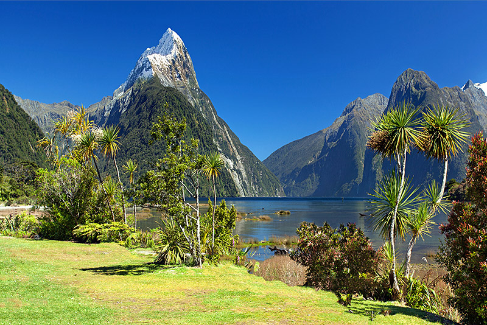

# New Zealand Cuisine

A cuisine shaped by isolation and abundance: the Māori traditions of hāngī (earth-oven cooking), kūmara (sweet potato), seafood, and pikopiko fern shoots; the Pākehā (European-descent) inheritance of British roast dinners, baking and tea; and the modern Kiwi additions of Pacific Rim flavours, exceptional lamb and dairy, the great pavlova rivalry with Australia, and a national love of the outdoor BBQ. New Zealand cooking is plain in its ambition - good ingredients treated simply - and quietly distinctive once you taste it.
