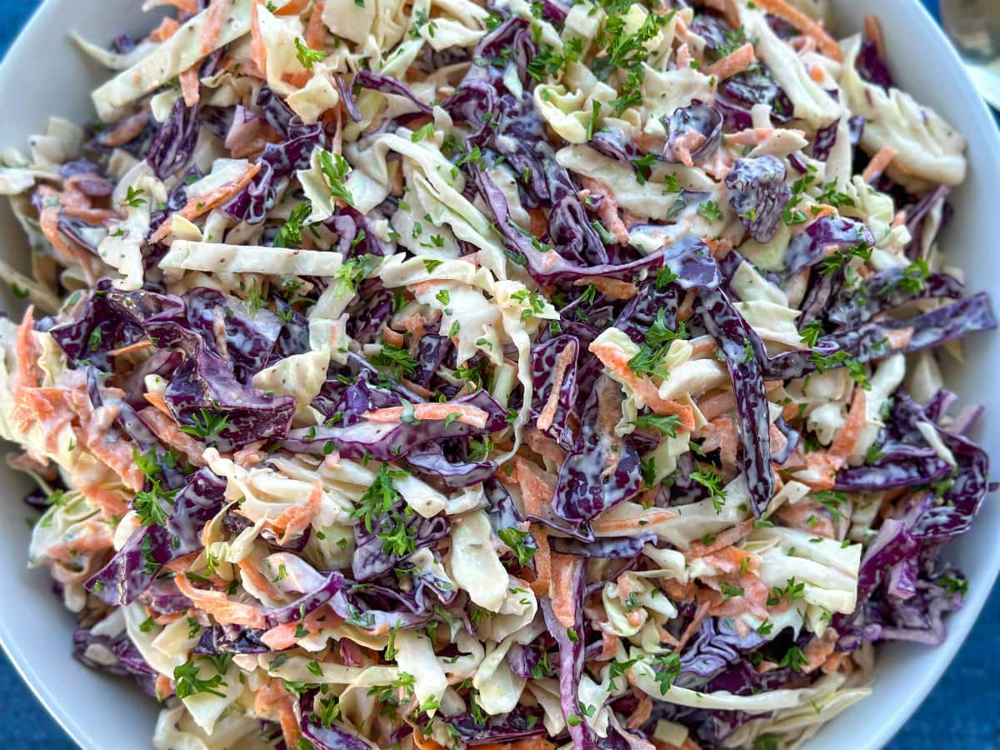

# Kiwi Coleslaw

*The New Zealand coleslaw: shredded cabbage, grated carrot and apple in a tangy creamy dressing, sometimes with crunchy noodles or fried onions on top. The default BBQ side, never absent from a Christmas table.*

**Serves:** 8

**Prep Time:** 20 minutes (plus 30 minutes chill)

**Cook Time:** None

## Overview
Coleslaw turns up at every New Zealand summer BBQ, Christmas table and picnic - the cabbage-carrot-mayo-vinegar slaw that's both side dish and shared salad. The Kiwi version distinguishes itself from American versions in two ways: a generous grated apple for sweetness and acidity, and (often) a topping of fried crispy noodles, fried onions or croutons added at serving time for crunch. The dressing is mayo-based but lifted with vinegar, mustard and a touch of honey - never as cloyingly sweet as the deli-counter American style. Made well, it's a bowl that always disappears; made badly (limp dressing, no acid, wet cabbage), it's the salad-bar bowl no one touches.

## Ingredients

### Slaw
- 500 g green cabbage, very finely shredded (about half a medium cabbage)
- 200 g red cabbage, very finely shredded (or more green)
- 2 large carrots, coarsely grated
- 2 large apples (Granny Smith or Braeburn), grated with skin on (or chopped fine)
- 4 spring onions, finely sliced
- 1 small fennel bulb, very finely sliced (optional)
- A handful of fresh parsley, finely chopped
- A handful of fresh mint, finely chopped

### Dressing
- 150 g mayonnaise (good quality - Hellmann's, Best Foods, or homemade)
- 4 tbsp plain Greek yoghurt or sour cream
- 2 tbsp apple cider vinegar (or white wine vinegar)
- 1 tbsp Dijon mustard
- 1 tbsp honey
- 1 tbsp lemon juice
- A pinch of salt
- Plenty of black pepper

### Optional toppings (add at serving)
- 80 g crispy fried noodles (Chinese chow mein style)
- 60 g toasted sunflower seeds or pumpkin seeds
- 50 g crispy fried onions (the Asian shallot-fried kind)

## Method

### Stage 1 - Shred the cabbage finely
1. Halve and core the cabbages.
2. Use the largest knife you have, or a mandoline, to shred into very thin slivers (2-3 mm). The thinner the better - thick chunks make the slaw chewy.
3. Tip into a very large bowl.

### Stage 2 - Add the other vegetables
1. Add the grated carrot, grated apple, spring onions, fennel (if using), parsley and mint to the cabbage.
2. Toss with your hands to combine.

### Stage 3 - Dressing
1. In a small bowl, whisk together the mayonnaise, yoghurt, vinegar, mustard, honey, lemon juice, salt and pepper into a smooth emulsion.
2. Taste; adjust the balance - it should be tangy first, creamy second, sweet barely.

### Stage 4 - Combine and chill
1. Pour the dressing over the vegetables.
2. Toss with your hands or two big spoons until every shred is coated.
3. Cover; refrigerate at least 30 minutes (the salt and acid soften the cabbage slightly and the flavours marry).
4. Best made 1-2 hours ahead.

### Stage 5 - Serve
1. Tip into a serving bowl.
2. Scatter the crispy noodles, seeds and fried onions over the top (if using).
3. Serve.

## Notes
- **Slice the cabbage thin:** This is the single biggest difference between good coleslaw and bad. Thick shreds are chewy and don't take dressing; paper-thin shreds wilt slightly into a tender, juicy slaw.
- **Apple gives the lift:** The grated apple adds both sweetness and acidity that cuts the mayo. Don't skip it. Granny Smith for sharp, Braeburn for sweet.
- **Toppings at the end:** Crispy elements go soggy in dressing. Scatter them just before serving and they stay crunchy.

## Serving
Serve as a side with anything off the BBQ: steak, sausages, burgers, fish. Also a sandwich filler with cold cuts or roast leftovers. Always present at a Christmas spread alongside the cold meats and pavlova.

## Storage
- Refrigerates 3 days; the cabbage wilts further but the flavour deepens.
- Doesn't freeze; the cabbage goes mushy.
- Keep crunchy toppings separate; add per serving.
