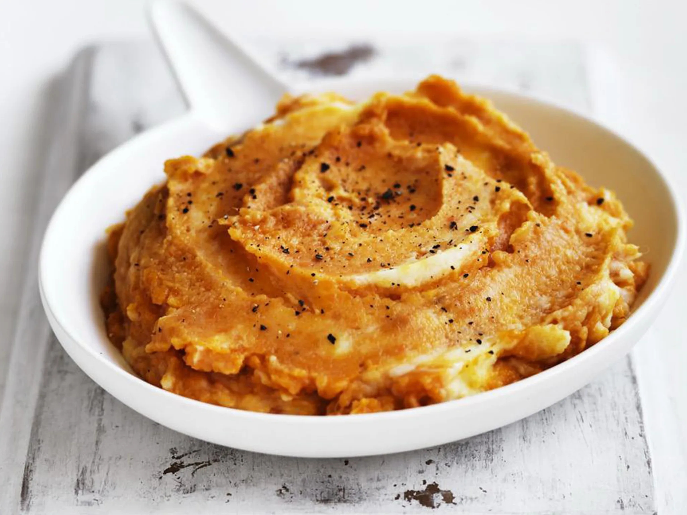

# Kūmara Mash

*Mashed New Zealand kūmara (orange sweet potato): boiled till tender, mashed with butter, a splash of cream and a pinch of nutmeg. The orange counterpart to the white potato mash on a Kiwi dinner plate.*

**Serves:** 4

**Prep Time:** 10 minutes

**Cook Time:** 20 minutes

## Overview
Kūmara is the sweet potato Māori brought from the Pacific - a key staple of pre-European New Zealand cooking and still the country's preferred sweet potato variety. Three main types are grown: red kūmara (purple skin, white flesh, drier and less sweet), orange kūmara (orange skin and flesh, sweet and moist - the type most often called for in modern recipes), and gold kūmara (yellow flesh, somewhere in between). Boiled and mashed with butter and a little cream, kūmara mash is the orange foil to white potato mash on a New Zealand Sunday plate. A pinch of nutmeg or a drizzle of brown butter at the end lifts it; over-spicing covers up what makes kūmara distinctive.

## Ingredients
- 1 kg kūmara (orange variety preferred), peeled, cut into 4 cm chunks
- 1 tsp salt
- 50 g unsalted butter
- 100 ml double cream (or whole milk for a lighter version)
- A pinch of grated nutmeg
- Freshly ground black pepper
- Sea salt to taste

### Optional finishing
- 1 tbsp maple syrup or honey (for a sweeter version)
- A handful of toasted pumpkin seeds, for crunch
- A few sprigs of fresh thyme

## Method

### Stage 1 - Boil
1. Place the kūmara chunks in a large pot.
2. Cover with cold water; add the salt.
3. Bring to a boil; reduce to a simmer.
4. Cook 15-18 minutes until a knife slides through cleanly.

### Stage 2 - Drain and dry
1. Drain in a colander.
2. Return to the empty pot over low heat for 30 seconds to dry off any residual water (essential for fluffy mash - wet kūmara makes gluey mash).

### Stage 3 - Mash
1. Add the butter to the warm pot; let it melt over the kūmara.
2. Mash with a potato masher until mostly smooth (a few small lumps are fine).
3. Don't use a food processor or stick blender - they overwork the kūmara and turn it gluey.

### Stage 4 - Loosen
1. Pour in the cream gradually, stirring with a wooden spoon, until the mash reaches a creamy spoon-falls-from-the-spoon consistency.
2. Add the nutmeg and a generous twist of black pepper.
3. Taste for salt; add to taste.

### Stage 5 - Finish
1. Tip into a warm serving bowl.
2. Optional: drizzle a teaspoon of melted brown butter over the top, or scatter toasted pumpkin seeds and thyme leaves.

## Notes
- **Orange kūmara is the most familiar:** Sweeter, moister, and the type most often pictured. Red kūmara is drier and gives a less sticky mash; gold is in between. All three work; just don't try to mix them in one mash - each is best on its own.
- **Don't over-mash:** Hand masher only. Food processors turn kūmara into glue. The texture should be smooth with a little body, not whipped to paste.
- **Sweetness is enough:** Resist adding sugar or syrup; kūmara is already sweet. Save those for desserts.

## Serving
- The orange mash that goes alongside white potato mash on a New Zealand Sunday roast. Also good with sausages, grilled fish, or scattered over a salad of bitter leaves with a balsamic dressing.

## Storage
- Refrigerates 3 days in a sealed container.
- Reheat in a saucepan with a splash of milk or cream, stirring; microwave is OK for one portion.
- Freezes 2 months; thaw in the fridge before reheating.
