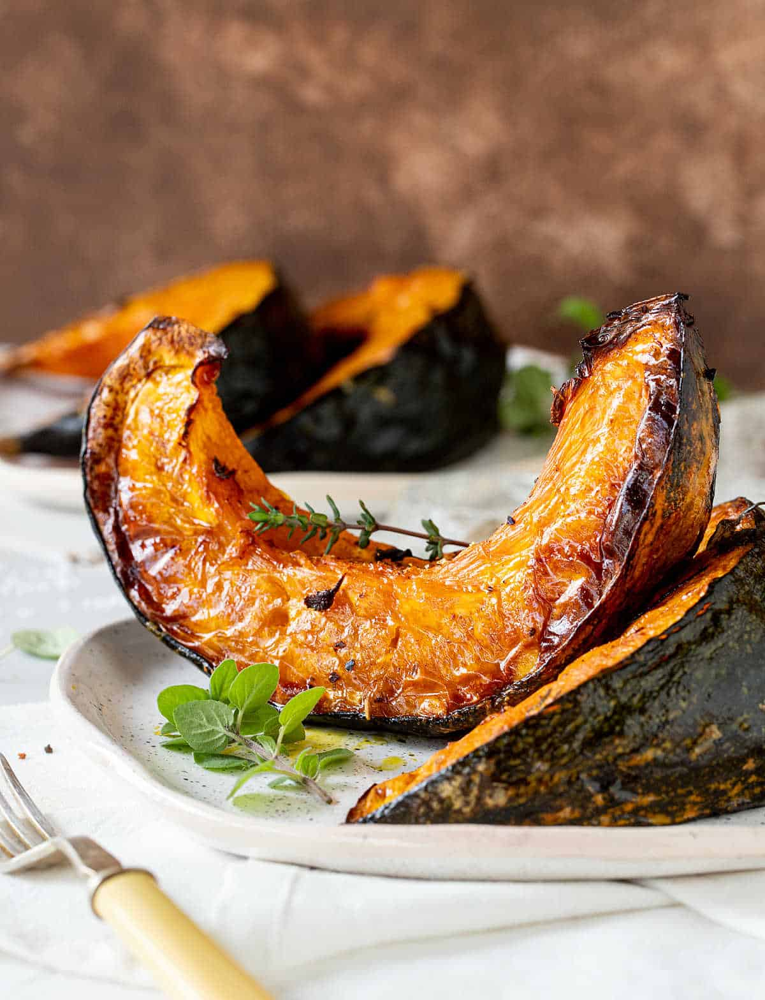

# Roast Pumpkin with Honey and Feta

*Sweet roast pumpkin wedges tossed with manuka honey, crumbled with salty feta, scattered with toasted pumpkin seeds and fresh mint. A standard New Zealand side, also a meal in itself with bread.*

**Serves:** 4

**Prep Time:** 10 minutes

**Cook Time:** 35 minutes

## Overview
Pumpkin (the British/Kiwi name for what Americans call winter squash) grows happily in New Zealand summer-autumn, and roast pumpkin shows up at every weekend BBQ as a vegetable side. The Kiwi version layers manuka honey (the famous New Zealand single-flower honey, distinctively tasted with a medicinal note) over wedges of pumpkin that have been roasted until caramelised at the edges, then finishes with salty feta cheese and crunchy pumpkin seeds. Mint or rocket adds the green note. The sweet-savoury-salty-crunchy combination is the kind of recipe that gets stolen by anyone who eats it and added to their permanent rotation. Outside New Zealand, substitute regular honey for the manuka.

## Ingredients
- 1.2 kg pumpkin or butternut squash (skin on), cut into 4 cm wedges
- 3 tbsp olive oil
- 2 tbsp manuka honey (or any runny honey)
- 1 tsp sea salt
- Freshly ground black pepper
- 1 tsp dried chilli flakes (optional)
- 1 tsp ground cinnamon (optional - Middle Eastern-inflected version)

### To finish
- 150 g feta cheese, crumbled (or goat's cheese)
- 60 g pumpkin seeds (pepitas), toasted in a dry pan
- A handful of fresh mint leaves, torn
- A handful of rocket leaves
- 1 tbsp extra honey for drizzling
- 1 tbsp balsamic vinegar (or pomegranate molasses)
- A squeeze of lemon juice

## Method

### Stage 1 - Prep the pumpkin
1. Preheat the oven to 200°C.
2. Wash the pumpkin (skin stays on - it softens enough to eat).
3. Halve, scoop out seeds.
4. Cut into wedges 4 cm thick at the widest part.

### Stage 2 - Toss and roast
1. In a large bowl, toss the pumpkin wedges with the olive oil, honey, salt, pepper, chilli flakes and cinnamon (if using).
2. Spread on a large roasting tray, skin side down, in a single layer (use 2 trays if needed - don't crowd).
3. Roast 30-35 minutes, turning halfway, until tender when pierced with a knife and caramelised dark at the edges.

### Stage 3 - Toast the seeds
1. While the pumpkin roasts, heat a dry frying pan over medium heat.
2. Add the pumpkin seeds; toast 3-4 minutes, shaking the pan, until they pop and turn golden.
3. Tip onto a plate to cool.

### Stage 4 - Plate
1. Lift the warm roast pumpkin onto a serving platter, slightly overlapping.
2. Scatter the crumbled feta over.
3. Scatter the toasted pumpkin seeds.
4. Scatter the torn mint leaves and rocket.

### Stage 5 - Finish
1. Drizzle with the extra honey and the balsamic vinegar.
2. Squeeze the lemon juice over the top.
3. Serve immediately while still warm.

## Notes
- **Skin on:** Pumpkin and butternut skin softens enough to eat after a long roast. Don't peel - it's a chore for no benefit.
- **Manuka honey:** The famous NZ honey has a distinctive medicinal taste; if you can find it (often sold for its alleged health benefits), use it. Outside NZ, any decent runny honey works; the dish doesn't fall apart.
- **Cinnamon optional:** The base version is just honey + chilli + salt; adding cinnamon takes it in a more Middle Eastern direction. Both are valid; choose one or the other, not both maximally.

## Serving
Serve warm or at room temperature as a side with grilled lamb, BBQ steak, or roast chicken. Or piled on a slice of toasted sourdough as a starter or vegetarian main.

## Storage
- Refrigerates 3 days in a sealed container.
- The crunchy elements (seeds, rocket) go soft on storage - add fresh per serving.
- Reheats well in a 180°C oven 8 minutes; eat cold straight from the fridge is also fine.
