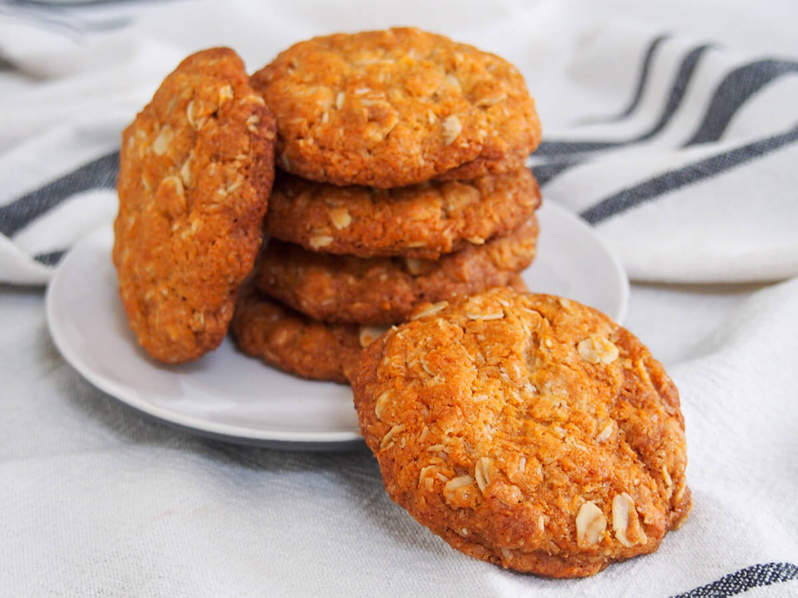

# ANZAC Biscuits

*The biscuit shared with Australia: oats, coconut, golden syrup and butter, no eggs, baked until chewy in the middle and crisp at the edges. Originally posted to ANZAC soldiers in WWI; now an everyday tea-time biscuit.*

**Serves:** Makes about 30 biscuits

**Prep Time:** 15 minutes

**Cook Time:** 15 minutes

## Overview
ANZAC biscuits get their name from the Australian and New Zealand Army Corps - the formation whose 1915 landing at Gallipoli is commemorated as Anzac Day on April 25th. The biscuits were sent to soldiers because they kept well in the post (no eggs, no perishable dairy, no fragile structure). The recipe is a quietly clever bit of baking: rolled oats and desiccated coconut for body, golden syrup for sweetness and chew, baking soda dissolved in boiling water (so it reacts with the syrup), and butter melted in. The result is chewy in the centre, crisp at the edges, with the distinctive caramel-syrup flavour. Both New Zealand and Australia bake them; the recipes are nearly identical. The protocol on Anzac Day is that they should not be called "ANZAC cookies" - the word "biscuit" is mandatory.

## Ingredients
- 100 g rolled oats (porridge oats, not instant)
- 75 g desiccated coconut
- 150 g plain flour
- 100 g caster sugar
- 100 g soft brown sugar
- 125 g unsalted butter
- 4 tbsp golden syrup (or treacle if no golden syrup; honey works but changes the flavour)
- 1 tsp baking soda (bicarbonate of soda)
- 2 tbsp boiling water
- A pinch of fine salt

## Method

### Stage 1 - Combine the dry
1. Preheat the oven to 160°C.
2. Line two baking trays with greaseproof paper.
3. In a large bowl, combine the oats, coconut, flour, both sugars and the salt.
4. Stir thoroughly to distribute.

### Stage 2 - Melt the wet
1. In a small saucepan, melt the butter and golden syrup together over low heat.
2. Stir until smooth.
3. Don't boil; just melt.

### Stage 3 - The bicarbonate reaction
1. In a small bowl, dissolve the baking soda in the boiling water.
2. Immediately pour this into the warm butter-syrup mixture; it froths up dramatically as the soda meets the acidic syrup - the foam is what gives the biscuits their texture.
4. Stir to combine; the mixture lightens in colour.

### Stage 4 - Combine wet and dry
1. Pour the warm bubbling syrup mixture into the bowl of dry ingredients.
2. Stir with a wooden spoon until evenly combined.
3. The dough is sticky and quite loose.

### Stage 5 - Shape
1. Take a heaped tablespoon of dough; squeeze in your hand to form a rough ball (about 30 g each).
2. Place on the lined trays, leaving plenty of space - they spread to about 7-8 cm.
3. Flatten gently with the palm of your hand.

### Stage 6 - Bake
1. Bake 12-15 minutes until deeply golden.
2. They look soft when they come out of the oven - that's correct; they crisp as they cool.
3. Leave on the trays 5 minutes (they're fragile while hot).
4. Transfer to a wire rack with a spatula.

### Stage 7 - Cool
1. Cool completely on the rack.
2. The texture sets as they cool: chewy centres, crisp edges.

## Notes
- **Golden syrup is essential:** It's the key flavour. Treacle is a substitute but darker; corn syrup is too neutral; honey changes the character. Outside the UK / Australia / NZ, golden syrup (Lyle's) is sold in international supermarkets.
- **Rolled oats, not instant:** Instant oats go gummy and the texture is wrong. Rolled (porridge) oats stay distinct, even in baked form.
- **Bake at 160°C, not higher:** The high sugar content scorches at 180°C. Low and slow gives the deep caramel colour without burning.

## Serving
- Serve with tea or coffee at afternoon tea, or as the lunchbox biscuit of choice. Around Anzac Day (April 25), they appear in greater numbers; some Kiwis bake them annually as a remembrance ritual.

## Storage
- Room temperature in an airtight tin: 1-2 weeks (they keep brilliantly - the whole point of their original purpose).
- They go gradually crisper over a few days; some prefer them after 2-3 days when fully crisp.
- Freezes 3 months; thaws in 30 minutes.
