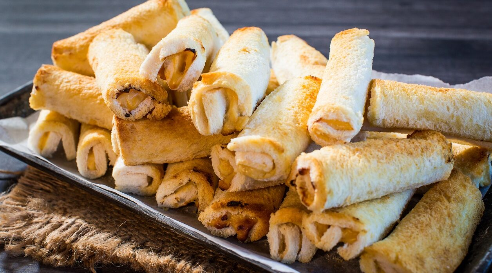

# Southland Cheese Rolls

*The South Island sandwich: white bread spread with a savoury onion-and-cheese paste, rolled into a log, buttered, grilled until crisp. The South Island Sunday-afternoon staple, fund-raising favourite, lunch-box hero.*

**Serves:** 4 (makes 12 rolls)

**Prep Time:** 15 minutes

**Cook Time:** 15 minutes

## Overview
Cheese rolls are the South Island of New Zealand's contribution to the country's snack canon - a sandwich-roll hybrid from Southland and Otago, originally a fundraising staple at school fairs and church functions, now a regional comfort food. White bread is spread with a thick savoury paste of grated cheese, evaporated milk, onion and a savoury seasoning (often soup powder for shortcut umami), rolled into a tube, brushed with butter, and grilled or toasted until the outside is crisp and the inside is molten. They're known affectionately as "Southland sushi" outside the region - all the structural inspiration of a sandwich rolled into a cylinder. Quick, very cheesy, and unapologetically about cheese-and-onion.

## Ingredients

### Cheese filling
- 250 g mature cheddar cheese, grated (the most mature you can find)
- 1 small onion, very finely grated (use a microplane or box grater)
- 150 ml evaporated milk (the tinned kind)
- 1 tbsp Worcestershire sauce
- 1 tbsp Dijon mustard
- 1 tbsp packet onion soup mix (the original Southland short-cut; or substitute 1 tsp onion powder + 1 tsp garlic powder + 1 tsp dried herbs + a pinch of salt)
- Freshly ground black pepper
- A pinch of cayenne pepper (optional)

### Bread
- 12 slices soft white sandwich bread, crusts trimmed
- 80 g unsalted butter, softened
- Extra grated cheese for sprinkling on top (about 50 g)

## Method

### Stage 1 - Cheese paste
1. In a small saucepan, combine the grated cheese, finely grated onion, evaporated milk, Worcestershire, mustard, soup mix (or substitute) and pepper.
2. Heat over low-medium heat, stirring constantly, until the cheese has just melted and the mixture is thick and spreadable, about 3-4 minutes.
3. Don't overheat - the mixture should be a thick paste, not a runny sauce.
4. Cool 5 minutes.

### Stage 2 - Prep the bread
1. Trim the crusts off the bread slices.
2. Lay flat on a board.
3. Roll each slice lightly with a rolling pin to flatten and compress (makes them easier to roll).

### Stage 3 - Spread and roll
1. Spread a thick layer of the cheese paste over each slice of bread (about 2 tablespoons per slice).
2. Roll up tightly from one short edge into a cylinder (like a Swiss roll).
3. Place seam-side down on a baking tray lined with greaseproof paper.

### Stage 4 - Butter and bake
1. Preheat the oven to 200°C, or heat the grill to high.
2. Brush the rolls all over with melted butter (or rub with softened butter).
3. Scatter the extra grated cheese over the top.

### Stage 5 - Cook
**Oven method (better for batches):**
1. Bake at 200°C 12-15 minutes until the outside is golden and crisp.

**Grill/broiler method (faster but easier to burn):**
1. Grill under a hot grill 3-4 minutes a side, turning, until evenly golden.

**Sandwich press / panini grill:**
1. Press each roll in a hot sandwich press 3-4 minutes until crisp and golden on the ridged sides.

### Stage 6 - Serve
1. Lift onto a serving plate.
2. Eat hot while the cheese is still molten.
3. Tomato sauce (Kiwi for ketchup) or HP sauce on the side, as a Southland-pub tradition.

## Notes
- **Mature cheddar:** A really mature, sharp cheese (Heritage, Mainland Tasty, Cathedral City Vintage) is what gives the filling its punch. Mild cheese gives a bland roll.
- **The soup mix substitute:** Outside New Zealand, dehydrated onion soup mix may not be sold. The substitute (onion powder + garlic powder + herbs + salt) is what's in the soup mix anyway.
- **Roll seam down:** They unroll in the oven if seam-side-up. Place flap-down and they hold their shape.

## Serving
Serve hot as an afternoon snack with tea, or as a quick lunch with a side of pickles. The Southland tradition is at the rugby club after the game, or at a fundraising stall outside a church.

## Storage
- Best fresh out of the oven, while crisp.
- Refrigerates 2 days; reheats well under a grill or in a sandwich press; microwave makes them soggy.
- Freezes well unbaked: assemble, wrap individually in cling film, freeze 3 months; bake from frozen, adding 5 minutes to the time.
