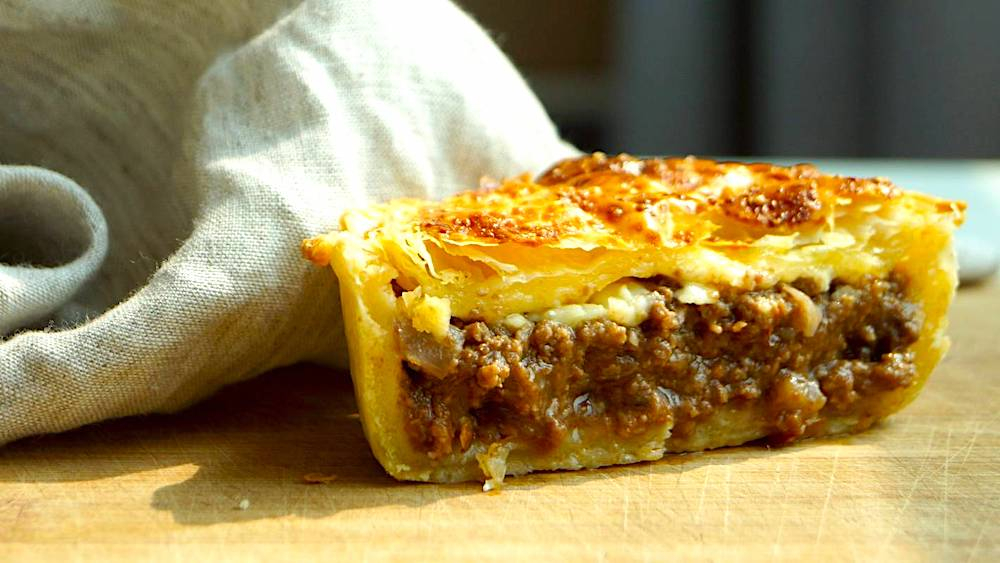

# New Zealand Meat Pie

*The Kiwi savoury pie: minced beef in a thick gravy under a flaky puff-pastry lid, baked golden in a pie tin. Squeeze tomato sauce into one corner and eat out of a paper bag, or from a service-station warmer at 11am. The national hand-held meal.*

**Serves:** 6 individual pies

**Prep Time:** 25 minutes

**Cook Time:** 45 minutes (plus 30 minutes cool)

## Overview
The meat pie is the New Zealand and Australian common-currency hand-food: a small individual pie with shortcrust pastry sides, a puff-pastry top, and a filling of minced beef in thick rich gravy. They're sold at every petrol station, dairy (corner shop), bakery and rugby ground. The home version is significantly better than the commercial - the meat is real chunks rather than emulsified paste, the gravy is genuinely thick, and the pastry can be made or bought (bought puff pastry is entirely respectable). The classic eat: lift hot from the warmer, sit on the bonnet of the car in a service station car park, squeeze tomato sauce into one corner, eat in big bites with the pastry catching the dripping gravy.

## Ingredients

### Filling
- 700 g beef mince (20% fat)
- 2 tbsp olive oil
- 1 large onion, finely diced
- 2 cloves garlic, minced
- 3 tbsp plain flour
- 500 ml beef stock
- 2 tbsp tomato paste
- 2 tbsp Worcestershire sauce
- 2 tbsp soy sauce
- 1 tbsp Dijon mustard
- 1 tsp dried thyme
- 1 bay leaf
- Salt
- Freshly ground black pepper

### Pastry
- 500 g shortcrust pastry (homemade or bought)
- 500 g puff pastry (homemade or bought - frozen pre-rolled puff is the standard shortcut)
- 1 egg, beaten (for glazing)

## Method

### Stage 1 - Brown the mince
1. Heat the oil in a heavy pot over medium-high heat.
2. Add the mince; break up with a wooden spoon as it cooks.
3. Cook 8-10 minutes until the meat is well-browned and any liquid has cooked off.
4. Tip the meat into a sieve over a bowl; the fat drains off (discard or save for chips).

### Stage 2 - Onions and aromatics
1. Return the pot to medium heat; the residual fat should be enough.
2. Add the onion; cook 5 minutes until soft.
3. Add the garlic; cook 1 minute.

### Stage 3 - Build the gravy
1. Return the drained mince to the pot.
2. Stir in the flour; cook 1 minute, coating the meat.
3. Gradually pour in the stock, stirring continuously - the mixture thickens.
4. Add the tomato paste, Worcestershire, soy, mustard, thyme and bay.
5. Bring to a simmer.
6. Reduce heat to low; cook 30 minutes, stirring occasionally, until thick and rich.
7. Taste; salt cautiously (the soy and Worcestershire add salt); plenty of black pepper.
8. Cool fully (essential - hot filling soaks the pastry and steams the puff lid).

### Stage 4 - Cool the filling
1. Tip into a wide dish to speed cooling.
2. Refrigerate 30 minutes minimum. The filling sets to a thick paste-like consistency, perfect for spooning into pastry.

### Stage 5 - Prep the pies
1. Preheat the oven to 200°C.
2. Lightly grease 6 individual pie tins (about 10 cm diameter) or a 6-hole Yorkshire pudding tin.
3. Roll the shortcrust pastry on a floured surface to 3 mm thick.
4. Cut into 6 rounds that overhang the tins by 2 cm.
5. Press into the tins.
6. Spoon the cold filling into each, mounded slightly.
7. Roll the puff pastry to 3 mm; cut into 6 lids slightly larger than the tops.
8. Brush the shortcrust rim with egg.
9. Lay a puff lid on each; press around the edge to seal.
10. Trim excess.

### Stage 6 - Glaze and pierce
1. Brush the tops with beaten egg.
2. Cut a small steam-vent slit in the centre of each lid.
3. Optionally decorate with pastry trimmings (the classic Kiwi pie has a small star or initials on top).

### Stage 7 - Bake
1. Bake at 200°C for 20 minutes.
2. Reduce to 180°C; continue 15 minutes more until the puff is deeply golden and risen, and the shortcrust base is cooked through (lift one out and peek under).

### Stage 8 - Rest and serve
1. Cool in the tins 10 minutes (the filling is molten lava straight from the oven).
2. Lift out; serve warm.
3. Tomato sauce (Wattie's brand if you're being authentic).

## Notes
- **Cool the filling fully:** Hot filling steams the puff pastry into a sad limp lid. Cold filling lets the pastry crisp.
- **Egg-wash the rim:** This is the glue between shortcrust and puff. Skip it and they separate during baking.
- **Steam vent matters:** Without it, the pies puff like balloons and burst. A small slit is all that's needed.

## Serving
- The Kiwi handheld meal. Eat hot at any time of day from breakfast onwards. The standard accessory is a small bottle of Wattie's tomato sauce.

## Storage
- Refrigerates 3 days; reheat in a 180°C oven 15 minutes (microwave makes the pastry soggy).
- Freezes 2 months unbaked: assemble, freeze, bake from frozen adding 15 minutes to the time.
- Baked frozen pies refrigerate 3 days, reheat 15 minutes in a 180°C oven.
