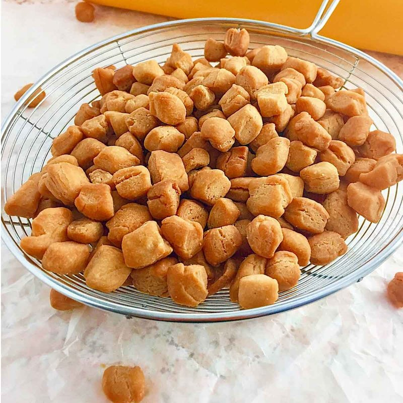

# Chin-Chin

*Nigeria's eternal snack: small nutmeg-spiced dough nibbles deep-fried crisp gold. Sold in plastic bags everywhere, made by the kilo at Christmas.*

**Serves:** Makes about 800 g

**Prep Time:** 45 minutes (plus 30 minutes resting)

**Cook Time:** 25 minutes (in batches)

## Overview
A simple dough: flour, butter, sugar, eggs, milk, ground nutmeg, baking powder. Kneads to a smooth firm dough; rests for 30 minutes. Rolls to 5 mm thick on a floured surface; cuts into tiny 1.5 × 1.5 cm squares (or 1 × 2 cm rectangles) with a knife or pasta-cutter wheel. Deep-fries in batches at 160°C for 4-5 minutes till deep amber. Drains; cools fully (chin-chin crisps as it cools).

## Ingredients
- 500 g plain flour
- 120 g caster sugar
- 1 teaspoon baking powder
- 1 ½ teaspoons ground nutmeg (yes, that much - the iconic chin-chin flavour)
- ½ teaspoon ground cinnamon
- ½ teaspoon salt
- Zest of 1 lemon (optional)
- 100 g unsalted butter (cold, cubed)
- 2 large eggs
- 100 ml whole milk (more as needed)

### Frying
- 1 litre neutral oil

### Optional dusting
- 2 tablespoons icing sugar (for sweet variation)

## Method

### Stage 1 - Dough
1. In a wide bowl, whisk flour, sugar, baking powder, nutmeg, cinnamon, salt and optional lemon zest.
1. Rub in the cold butter with fingertips till breadcrumb-textured.
1. Beat the eggs and milk in a jug.
1. Pour into the flour mixture; mix to a smooth firm dough.
1. Add more milk a tablespoon at a time if too dry, more flour if too sticky.
1. Knead 4 minutes till smooth.
1. Rest 30 minutes covered.

### Stage 2 - Roll and cut
1. Divide the dough into 3 portions (easier to handle).
1. Roll each on a lightly floured surface to 5 mm thick.
1. Cut into long strips 1.5 cm wide.
1. Cut the strips crossways into 1.5 × 1.5 cm squares (or 1 × 2 cm rectangles for the traditional shape).
1. Separate the cut pieces so they don't stick together.

### Stage 3 - Fry
1. Heat the oil to 160°C (lower than typical fry - chin-chin needs to cook through before browning).
1. Lower a handful of pieces at a time (about 1 large coffee mug's worth).
1. Fry 4-5 minutes, stirring occasionally with a slotted spoon, until deep amber-gold all over.
1. Lift onto a wire rack to drain.

### Stage 4 - Cool
1. Spread the fried chin-chin in a single layer to cool completely.
1. Crispness develops as they cool - straight from the fryer they're still slightly soft.

### Stage 5 - Optional dusting
1. For a sweeter variant, toss in icing sugar once fully cool.
1. Traditional chin-chin is undusted.

### Stage 6 - Serve
1. Eat by the handful with cold drinks, tea, or just as a snack.

## Notes
- **Generous nutmeg is the signature:** 1 ½ teaspoons sounds like a lot but it's the iconic flavour. Reducing makes chin-chin taste of nothing.
- **160°C, not 180°C:** the small pieces would brown black before the inside cooked at a higher temperature. Slower and gentler is correct.
- **Small pieces, dense dough = long shelf life:** properly fried chin-chin keeps for a month in a tin.
- **Crispness develops on cooling:** straight from the fryer = chewy. Let cool fully before judging.

## Storage
- Keeps 4-6 weeks in an airtight container at room temperature.
- The flavour intensifies over the first week.
- Don't refrigerate - humidity kills the crisp.
