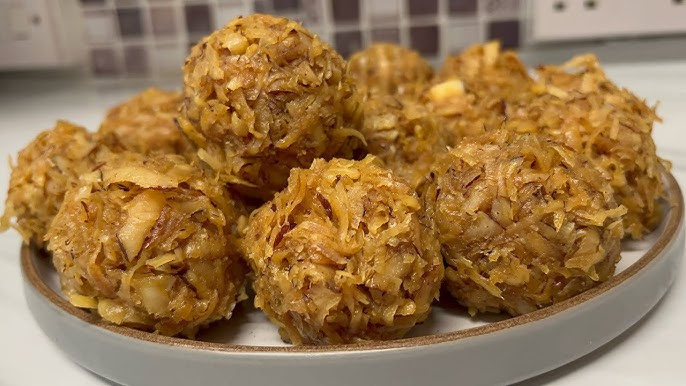

# Nigerian Coconut Candy

*Nigeria's childhood sweet: grated coconut cooked with brown sugar and nutmeg until the sugar caramelises around it into a chewy, golden slab.*

**Serves:** Makes about 400 g

**Prep Time:** 15 minutes

**Cook Time:** 25 minutes

## Overview
Nigeria's childhood sweet: the candy you'd buy in folded paper at the school gate or get pressed into your hand at Aunty's house: fresh grated coconut cooked with dark brown sugar and nutmeg till the sugar caramelises around it into a chewy, golden slab. Fresh coconut is non-negotiable: the moisture in fresh flesh is what allows the candy to bind; dry desiccated coconut won't caramelise correctly. Dark brown sugar matters too: the molasses gives the iconic deep colour; white sugar gives a pale uninteresting result. The coconut and brown sugar cook in stages: wet and bubbly, thick syrup, caramelising amber, deep brown sugar-coated coconut: over about twenty minutes. Stopping while still pourable is the trick; waiting too long turns it rock-hard in the pan. Tipped onto a parchment-lined tray and spread to a 1 cm layer, irregular rather than smooth (irregular is the traditional look), and broken into pieces by hand once cool.

## Ingredients
- 300 g fresh coconut (peeled, grated coarsely OR cut into 5 mm cubes for chunkier candy)
- 250 g dark brown sugar (or muscovado for deeper flavour)
- 80 ml water
- ½ teaspoon ground nutmeg
- A pinch of salt
- ½ teaspoon vanilla extract (added at the end)

### Optional flavours
- ½ teaspoon ground ginger
- 1 tablespoon honey (for shine)

## Method

### Stage 1 - Prep coconut
1. If using whole coconut: crack open; remove the white flesh; peel off the brown skin; grate coarsely on a box grater OR dice into 5 mm cubes.
1. If using packaged coconut: use fresh-frozen grated coconut (not dried desiccated, desiccated coconut is too dry and gives chalky candy).

### Stage 2 - Cook
1. In a heavy wide pan, combine the brown sugar, water, nutmeg and salt.
1. Heat over medium; stir until the sugar dissolves.
1. Add the coconut; stir to coat.
1. Cook over medium heat, stirring frequently, for 18-22 minutes.
1. The mixture transforms in stages: wet and bubbly → thick syrup → caramelising amber → deep brown sugar-coated coconut.
1. When the syrup has reduced to a thick coating and the coconut has turned deep gold-brown, remove from heat.

### Stage 3 - Finish
1. Off heat, stir in the vanilla.

### Stage 4 - Set
1. Tip immediately onto a parchment-lined tray (lightly greased with oil to prevent sticking).
1. Spread with a greased spatula to a single layer about 1 cm thick.
1. Don't try to smooth perfectly, irregular is the traditional look.
1. Cool 30 minutes to set hard.

### Stage 5 - Break
1. Once fully cool and crisp, break into irregular pieces with your hands or a sharp knife.

## Notes
- **Fresh coconut, not desiccated:** the moisture in fresh coconut is what allows the candy to bind. Dry desiccated coconut won't caramelise correctly.
- **Brown sugar (not white):** the molasses in brown sugar gives the iconic deep colour and flavour. White sugar gives a paler, less interesting result.
- **Stir frequently:** sugar burns easily at the end. Constant stirring prevents scorching.
- **Stop while still pourable:** wait too long and the mixture turns rock-hard in the pan and can't be tipped out. Pull when it's thick but still flowing.

## Storage
- Keeps 2 weeks in an airtight container at room temperature.
- Don't refrigerate, sugar absorbs moisture and the candy goes sticky.
- Doesn't freeze.
