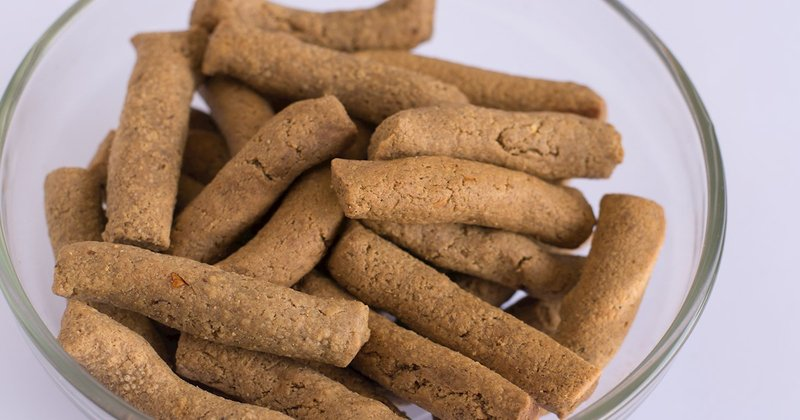

# Kuli-Kuli (Roasted Peanut Sticks)

*Northern Nigeria's peanut snack: roasted peanuts ground to a paste, pressed of their oil, shaped into sticks and deep-fried golden and crunchy.*

**Serves:** Makes about 400 g

**Prep Time:** 1 hour (mostly hands-on grinding and pressing)

**Cook Time:** 15 minutes

## Overview
Northern Nigeria's Hausa peanut snack, sold across markets and roadside stalls from Kano to Kaduna: roasted peanuts ground to a paste, the oil pressed out, the de-oiled paste shaped into thin sticks or rings and deep-fried till crunchy. The oil press is the technique that defines the dish: kuli-kuli's signature dry, slightly chalky texture depends on extracting the peanut oil; skipping the press gives peanut paste cookies rather than the real thing. The pressed-out oil (manshanu) is a Hausa cooking staple in its own right and worth saving for fried plantain, stews or anywhere you'd use oil. Toasted peanuts grind in a food processor till they release their oil and become a thick wet paste, then a fine-weave cloth twisted hard over a bowl extracts the golden oil and leaves a clay-like dough. Seasoned with salt, ground chilli (cayenne or African pepper), ginger and optional onion powder, then rolled into thin sticks, rings or coins and deep-fried at 170 °C till deep gold. Cooled completely before eating: kuli-kuli crisps as it cools.

## Ingredients
- 500 g raw peanuts (red-skin or blanched both work)
- 1 teaspoon salt
- 1 ½ teaspoons ground chilli powder (cayenne or African pepper)
- 1 teaspoon ground ginger
- 1 teaspoon onion powder (optional)
- 500 ml neutral oil (for frying)

## Method

### Stage 1 - Roast
1. Spread the peanuts in a dry skillet over medium heat.
1. Toast 8-10 minutes, stirring frequently, until deep gold and fragrant.
1. Tip onto a clean tea towel; rub vigorously to remove most of the skins.
1. Pick out the peanuts; discard the skins.

### Stage 2 - Grind
1. Pulse the warm peanuts in a food processor 1 minute to a coarse meal.
1. Continue pulsing in long bursts (1-2 minutes) until the peanuts release their oil and the mixture becomes a thick wet paste.
1. You'll hear the motor strain as it transitions from dry meal to oily paste, keep going.
1. Total grinding time: 4-6 minutes.

### Stage 3 - Press out oil
1. Place the peanut paste in the centre of a clean fine-weave cloth (a flour-sack tea towel works).
1. Gather the corners; twist hard over a bowl.
1. Press and squeeze for 5-7 minutes, golden oil will run out into the bowl.
1. Continue until very little oil emerges and the paste tightens to a clay-like dough.
1. Save the pressed-out peanut oil (manshanu): it's great for cooking.

### Stage 4 - Season and shape
1. Transfer the de-oiled paste to a bowl.
1. Knead in the salt, chilli powder, ground ginger and optional onion powder.
1. The dough should be pliable but not greasy.
1. Roll small portions between palms into:
   - Thin sticks (15 cm long, 1 cm diameter), OR
   - Small rings (5 cm across, made by rolling a sausage and joining the ends), OR
   - Small coins (3 cm round, 1 cm thick).

### Stage 5 - Fry
1. Heat the oil to 170°C.
1. Lower 6-8 pieces in at a time.
1. Fry 3-4 minutes, turning once, until deep gold all over.
1. Lift onto a wire rack lined with kitchen paper.

### Stage 6 - Cool
1. Cool completely before eating, kuli-kuli crisps as it cools.

## Notes
- **The oil press is the technique:** kuli-kuli's signature dry, slightly chalky texture depends on extracting the peanut oil. Skip the press and you've made peanut paste cookies, not kuli-kuli.
- **Save the oil (manshanu):** the pressed-out oil is a Hausa cooking staple, flavour-rich and golden. Use it in stews, fried plantain, anywhere you'd use oil.
- **Spice level adjusts:** classic kuli-kuli is mildly spicy. Northern Nigerians prefer it hotter; reduce chilli for southern Nigerian / international palates.
- **Use a fine-weave cloth:** loose-weave cloths let peanut paste through with the oil. A flour-sack towel or several layers of cheesecloth tied tight work.

## Storage
- Keeps 3 weeks in an airtight container at room temperature.
- Crisp deteriorates with humidity, store with a silica packet for longer life.
- Don't refrigerate.
