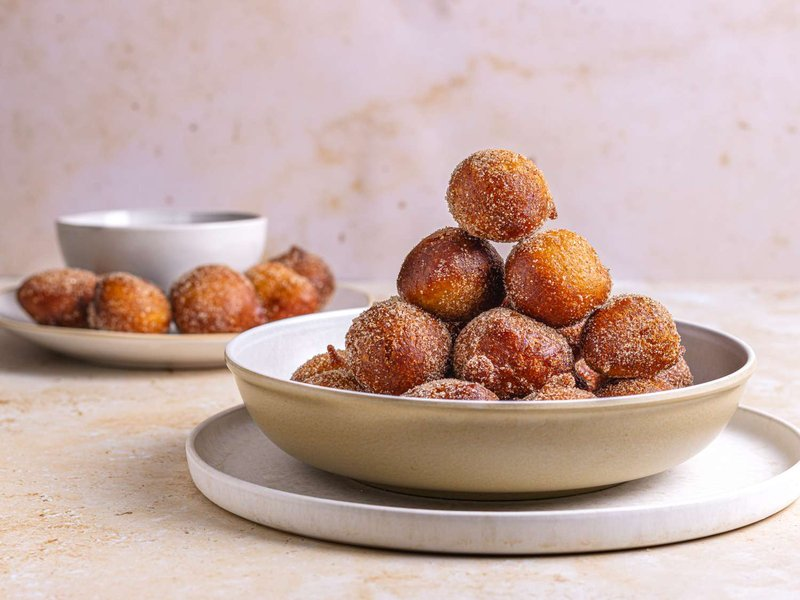

# Puff Puff

*West Africa's fried dough ball: sweet, fluffy, slightly stretchy yeasted batter deep-fried golden. Eaten warm at children's parties and naming ceremonies.*

**Makes:** 25-30 puff puff (serves 6)

**Prep Time:** 10 minutes (plus 1 hour rising)

**Cook Time:** 20 minutes

## Overview
A loose, slightly slack yeasted batter (no kneading) rises until bubbly. Hot vegetable oil receives small balls scooped with wet hands or a spoon, they puff and turn themselves over as they fry, golden in 3-4 minutes. Drained briefly; eaten warm. The classic Nigerian version is faintly nutmeggy.

## Ingredients

- 500 g plain flour
- 2 tablespoons caster sugar (more for sweet teeth)
- 1 sachet (7 g) fast-action yeast
- 1 teaspoon salt
- ½ teaspoon ground nutmeg
- 350 ml warm water (approximately)
- Vegetable oil for deep-frying (about 1 litre)

### To finish (optional)
- Caster sugar, for rolling
- Or: spiced sugar (caster sugar + ground cinnamon + nutmeg)

## Method

### Stage 1 - Batter
1. Whisk the flour, sugar, yeast, salt and nutmeg in a wide bowl.
1. Add the warm water gradually, mixing with a wooden spoon to a thick, sticky batter - looser than dough, thicker than pancake batter. Stop before it becomes runny.

### Stage 2 - Rise
1. Cover with cling film or a clean damp tea towel.
1. Rest in a warm spot 1-1 ½ hours until visibly bubbly and almost doubled.

### Stage 3 - Heat the oil
1. Heat 5 cm of vegetable oil in a wide deep pan to 175°C.
1. A small drop of batter should bubble vigorously and float without browning instantly.

### Stage 4 - Fry
1. Wet your hand (the batter won't stick).
1. Scoop a generous tablespoon of batter; squeeze through your thumb-and-forefinger fist into the hot oil - the squeeze releases a roughly round ball.
1. Or: use a spoon, dipped in water between scoops.
1. Fry 6-8 puff puff at a time; they should puff and turn themselves in the oil.
1. Cook 3-4 minutes total, turning if needed, until deep golden all around.
1. Lift onto kitchen paper.

### Stage 5 - Finish
1. While still hot, roll in caster sugar (or spiced sugar) if using. Or eat plain.

### Stage 6 - Serve
1. Eat warm.
1. Pass at the table with sweet tea or hot chocolate.

## Notes
- **Sticky batter is correct:** Stiffer batter gives dense, dry puff puff. The looseness is what creates the airy interior.
- **Hand-squeeze technique:** Takes practice but gives the most uniform shape. Two-spoon scooping works fine - wet the spoons.
- **175°C oil:** Hotter and they brown before cooking through; cooler and they soak up oil. A thermometer or a digital probe takes the guesswork out.

## Storage
- Best fresh. Refrigerate 2 days at most; re-crisp at 180°C for 4 minutes - but they're never as good as fresh.
- Don't freeze (the texture goes spongy).
