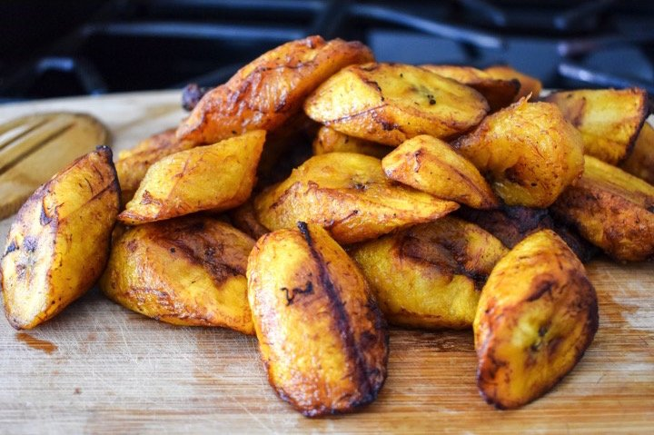

# Dodo

*Nigeria's everyday side: ripe plantains sliced and shallow-fried till the edges caramelise to deep mahogany and the centres turn jammy.*

**Serves:** 4

**Prep Time:** 5 minutes

**Cook Time:** 10 minutes

## Overview
Nigeria's everyday side, the dish that lands beside jollof, beans, eggs, fried fish or any stew: very ripe plantains sliced on the diagonal and shallow-fried till the edges caramelise to deep mahogany and the centres turn jammy and sweet. Ripeness is everything; yellow plantains with no spots are too starchy and bland, while heavily-spotted to nearly-black skins give the proper caramelisation. The riper the better. A salt pinch while hot brings the sweetness into focus; too much and the dish gets confused. Cook in batches; crowding the pan steams instead of caramelising.

## Ingredients

- 4 very ripe plantains (skins should be heavily black-spotted to mostly black)
- 4 tablespoons vegetable oil
- ½ teaspoon salt

## Method

### Stage 1 - Slice
1. Trim the ends of the plantains.
1. Score the skins lengthwise with a knife; peel away.
1. Slice on a 45-degree diagonal into 1 ½ cm thick pieces.

### Stage 2 - Heat the oil
1. Heat the oil in a wide heavy frying pan over medium-high heat.
1. The oil should shimmer and a small piece of plantain should sizzle vigorously when dropped in (around 175°C).

### Stage 3 - Fry
1. Lay the plantain slices flat in a single layer; don't crowd.
1. Fry 2-3 minutes per side until deep mahogany, almost burnt-looking, and the edges have crispy caramelised patches.
1. Lower the heat slightly if they brown too fast (the inside needs to soften before the outside burns).
1. Lift onto kitchen paper to drain briefly; salt while hot.

### Stage 4 - Serve
1. Cook in batches if needed; eat straight away.
1. Serve alongside jollof, beans, eggs, fried fish, or stews.

## Notes
- **Ripeness is everything:** Yellow plantains with no spots are too starchy and bland; the dish needs heavily-spotted to almost-fully-black plantains for caramelisation. The riper the better.
- **Don't crowd:** Steam-fries instead of caramelising. Cook in 2-3 batches if needed.
- **Salt lightly, but salt:** Plantain is sweet; a pinch of salt brings the flavours into focus. Too much and the dish becomes confused.

## Storage
- Best eaten immediately. Leftovers refrigerate 2 days; re-crisp in a hot dry pan or oven (don't microwave; goes soggy).
