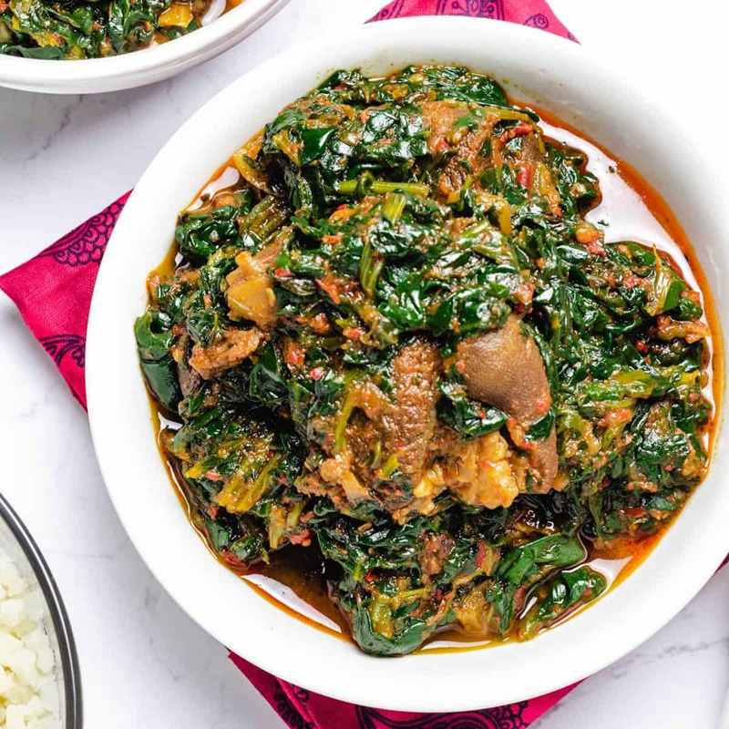

# Efo Riro

*The Yoruba 'stirred greens' stew: spinach wilted into a rich palm-oil, smoked-fish and red-pepper sauce. Served with rice or pounded yam.*

**Serves:** 4

**Prep Time:** 20 minutes

**Cook Time:** 45 minutes

## Overview
The Yoruba "stirred greens" stew that anchors a Lagos Sunday lunch: spinach wilted into a rich palm-oil, smoked-fish and red-pepper sauce, eaten with rice, eba, fufu or pounded yam. Three flavour bombs give Nigerian stews their depth here: iru (fermented locust beans), ground crayfish and smoked fish; skip them and you have a tomato-and-pepper sauce, not efo riro. The spinach should also stay vibrant green and not soggy; common mistake is to overcook it, so add at the very end and pull off the heat as soon as it wilts. You parboil bone-in beef shin (or goat shoulder) with onion, stock cube and salt till tender, reserve the meat and 250 ml of the stock. Blitz red bell peppers with onion, tomatoes, Scotch bonnets, garlic and ginger to a smooth paste in a blender (no added water; the vegetables release plenty). Heat real red palm oil (West African, the deep red kind, not the refined yellow stuff) in a wide pot over medium-high till shimmering, carefully tip in the pepper paste, drop the heat and cook 12 to 15 minutes stirring till the paste has reduced by a third and the oil pools shiny at the edges. Pour in the reserved stock, add the cooked meat, flaked smoked fish, ground crayfish and iru, simmer 12 to 15 minutes. Add raw prawns for three minutes if using. Stir spinach in handfuls for three to five minutes till just wilted and vibrant. Spoon over rice, eba, fufu or pounded yam.

## Ingredients

### Meat
- 400 g beef shin (or goat shoulder, cut into 3 cm chunks)
- 1 teaspoon salt
- 1 onion (small, halved)
- 1 stock cube
- 400 ml water

### Pepper paste
- 3 red bell peppers (large, deseeded, rough chunks)
- 1 red onion (large, rough chunks)
- 2 tomatoes (medium, rough chunks)
- 1-2 Scotch bonnet chillies (to taste)
- 4 garlic cloves
- 3 cm fresh ginger

### To finish
- 120 ml red palm oil (proper West African - the deep red type)
- 150 g smoked fish (smoked mackerel or smoked herring; bones removed, flaked)
- 2 tablespoons ground crayfish
- 1 tablespoon iru (fermented locust beans)
- 200 g large raw prawns (shelled - optional, for the prawn version)
- 1 teaspoon salt (to taste)
- 1 teaspoon black pepper
- 400 g fresh spinach (washed, rough chopped) - or 250 g frozen spinach (defrosted, drained)

### To serve
- White rice, eba, fufu, pounded yam (or boiled yam)

## Method

### Stage 1 - Parboil the meat
1. Place meat in a pot with the salt, halved onion, stock cube and water.
1. Bring to a boil; skim.
1. Simmer 25 minutes until tender.
1. Reserve the meat and the stock separately (you'll want about 250-300 ml stock).

### Stage 2 - Blend the pepper paste
1. Blitz red peppers, onion, tomatoes, Scotch bonnets, garlic and ginger in a blender to a smooth paste. Don't add water - the vegetables will release enough.

### Stage 3 - Fry the pepper paste
1. Heat the palm oil in a wide heavy pot over medium-high until it shimmers (don't let it smoke too hard).
1. Carefully tip in the pepper paste - it will spit.
1. Reduce heat to medium; cook 12-15 minutes, stirring, until the paste has reduced by about a third and the oil has risen to the surface in shiny pools at the edges.

### Stage 4 - Stock, meat and depth
1. Pour in 250 ml of the reserved stock.
1. Add the cooked meat, flaked smoked fish, ground crayfish and iru.
1. Stir; simmer 12-15 minutes - the sauce should be thick and intensely flavoured.

### Stage 5 - Prawns (if using)
1. Add the raw prawns; cook 3 minutes until just pink.

### Stage 6 - Season
1. Add salt and black pepper to taste. The dish should be well-seasoned - adjust before adding the greens.

### Stage 7 - Greens
1. Stir in the spinach in handfuls.
1. Cook 3-5 minutes - the spinach should be just wilted and vibrant, not stewed. (If using frozen spinach, the timing is the same; just squeeze out the excess water before adding.)

### Stage 8 - Serve
1. Spoon over rice, or alongside a mound of eba/fufu/pounded yam.

## Notes
- **Spinach should not be soggy:** A common mistake is overcooking the greens. Add them right at the end and pull off the heat as soon as they wilt. The vibrant green is part of the dish's appeal.
- **Iru, ground crayfish, smoked fish:** These three flavour bombs give Nigerian stews their depth. Skip them and you have a tomato-and-pepper sauce, not efo riro.
- **Stockfish (panla):** Many cooks add a piece of stockfish (dried unsalted cod) for additional depth. Soak overnight, remove the central bone, break into chunks; add with the meat in Stage 4.

## Storage
- Refrigerate 4 days; reheats well; flavour develops.
- Freezes 2 months; the spinach softens further on thaw.
