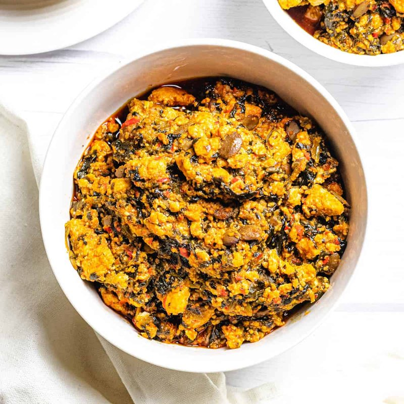

# Egusi Soup

*Nigeria's defining stew: ground melon seeds simmered with palm oil, smoked fish, meat and greens. Eaten with fufu by the fingers.*

**Serves:** 6

**Prep Time:** 25 minutes

**Cook Time:** 1 hour 15 minutes

## Overview
Nigeria's defining stew and the dish that gets argued over with as much passion as jollof: ground melon seeds (egusi) cooked in palm oil with smoked fish, meat and greens, eaten with fufu by the fingers. The technique of cooking the egusi in clumps rather than dissolving it gives the dish its characteristic granular texture; let it sit undisturbed for three minutes after dropping spoonfuls into the hot oil so the bottom sets, then break up and fry. Real red palm oil is non-negotiable; the refined yellow stuff or vegetable oil won't make egusi. You parboil bone-in beef shin (or goat shoulder) with onion, stock cube, salt and water for 45 minutes till tender, strain and reserve the stock. Blitz onion, red peppers, Scotch bonnets, garlic and ginger to a smooth pepper paste. Mix ground egusi with warm water to a thick paste the texture of peanut butter. Heat palm oil in a wide heavy pot till it just begins to smoke (the colour shifts to a more orange-red), drop the heat, add the pepper paste carefully (it spits), fry five to seven minutes till reduced and the oil rises. Drop spoonfuls of egusi paste into the pot in clumps, don't stir for three minutes, then gently break up and fry 10 minutes till the egusi looks granular like couscous and the oil is visible at the edges. Pour in 400 to 500 ml of the reserved stock, add the cooked meat, simmer 10 minutes. Add flaked smoked fish, ground crayfish and iru (fermented locust beans), simmer another 10 minutes. Stir in chopped leafy greens (bitter leaf, spinach or ugu) for three to five minutes till just wilted. Spoon onto plates alongside fufu, pounded yam, eba or rice, eat with the right hand by pinching off fufu and dipping into the egusi.

## Ingredients

### Meat and base
- 500 g beef shin (or goat shoulder, cut into 3 cm chunks)
- 1 onion (large, halved; one half left whole, the other chopped finely)
- 1 stock cube (Maggi or chicken)
- 1 teaspoon salt
- 700 ml water

### Pepper paste
- 1 onion (large, the chopped half, plus another if you like it onion-forward)
- 2 red bell peppers (deseeded, rough chunks)
- 1-2 Scotch bonnet chillies (deseeded for less heat - leave seeds if you can take it)
- 4 garlic cloves
- 2 cm fresh ginger

### Egusi paste
- 200 g ground egusi seeds (white melon seeds; sold ground at African shops, OR whole egusi seeds ground to a powder in a spice grinder)
- 100 ml warm water

### To finish
- 150 ml red palm oil (proper West African palm oil - the deep red kind, not refined "palm oil" which is yellow)
- 150 g smoked fish (smoked mackerel, smoked catfish or smoked herring, bones removed, flaked)
- 2 tablespoons ground crayfish (sold dried at African shops)
- 1 tablespoon iru (or dawadawa, fermented locust beans, optional but traditional)
- 1 teaspoon salt (to taste)
- 200 g leafy greens - bitter leaf (cleaned, repeatedly washed to debitter) OR spinach OR ugu (fluted pumpkin leaves)

### To serve
- [Fufu](side-dishes/fufu.md), pounded yam, eba (cassava semolina) or rice

## Method

### Stage 1 - Parboil the meat
1. Place the beef or goat in a pot with the whole half-onion, stock cube, salt and water.
1. Bring to a boil; skim.
1. Reduce to a simmer; cover; cook 45 minutes until tender.
1. Strain - reserve the meat and the stock separately.

### Stage 2 - Pepper paste
1. In a blender, blitz the chopped onion, red peppers, Scotch bonnets, garlic and ginger to a smooth paste. Don't add water - the peppers will release enough.

### Stage 3 - Egusi paste
1. In a bowl, combine the ground egusi with the 100 ml warm water and stir to a thick paste - the texture of peanut butter. Set aside.

### Stage 4 - Hot palm oil and pepper
1. Heat the palm oil in a large heavy pot over medium-high heat until it just begins to smoke (the colour shifts from deep red to a slightly more orange-red).
1. Reduce heat to medium; carefully add the pepper paste - it will spit. Stand back.
1. Fry 5-7 minutes, stirring, until the paste has reduced and the oil starts to rise to the surface (a sign the moisture has cooked off).

### Stage 5 - Egusi
1. Drop spoonfuls of the egusi paste into the pot, spaced out, so it sits in clumps rather than dissolving in.
1. Don't stir for 3 minutes - let the bottom set.
1. Then gently turn and break up the clumps. Fry 10 minutes - the egusi will look slightly granular, like couscous, and the oil will be visible at the edges.

### Stage 6 - Stock and meat
1. Pour in 400-500 ml of the reserved meat stock - enough to bring the mixture to a thick stew consistency.
1. Add the cooked meat.
1. Simmer 10 minutes.

### Stage 7 - Smoked fish and seasoning
1. Add the flaked smoked fish, ground crayfish and locust beans (if using).
1. Stir; simmer 10 minutes.
1. Taste; adjust salt.

### Stage 8 - Greens
1. Add the leafy greens.
1. Cook 3-5 minutes until just wilted (don't overcook - the greens should be vibrant).

### Stage 9 - Serve
1. Spoon onto plates alongside a mound of fufu, pounded yam, eba or rice.
1. Eat with the right hand: pinch off a piece of fufu, dip in the egusi, mouth.

## Notes
- **Palm oil is non-negotiable:** Real red palm oil is what gives the dish its colour and that unique earthy flavour. Refined yellow palm oil or vegetable oil won't make egusi.
- **Egusi must be ground:** Whole seeds don't release their thickening starch. Buy ground or grind in a spice grinder. Already-ground egusi has a shorter shelf life so use within 6 months.
- **Don't stir the egusi too early:** Letting it sit in clumps for 3 minutes before stirring is what gives the dish its characteristic granular texture. Stir too soon and it dissolves into a uniform paste.

## Storage
- Refrigerate 4 days; reheats brilliantly and is arguably better on day 2.
- Freezes 3 months.
