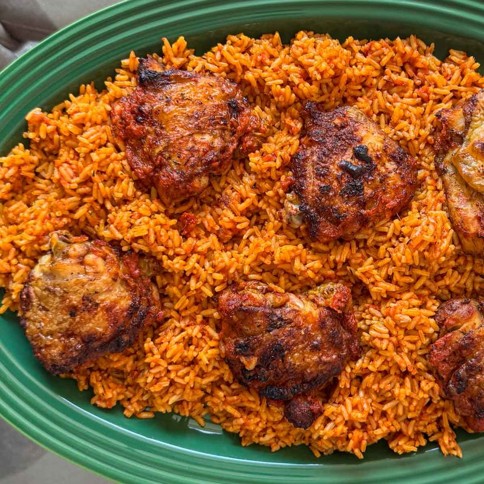

# Jollof Rice with Chicken

*West Africa's most-argued-over party rice: long-grain cooked in a deep red tomato-and-scotch-bonnet base, with crisp-skinned chicken.*

**Serves:** 6

**Prep Time:** 25 minutes

**Cook Time:** 1 ¼ hours

## Overview
West Africa's most-argued-over party rice and the dish that fires up cross-border banter from Lagos to Accra to Dakar: whose jollof is best is a question with no agreed answer. Long-grain rice cooks in a deep red tomato-and-Scotch-bonnet base with crispy-skinned chicken on top, the slightly-burnt "burn-burn" layer at the bottom of the pot celebrated rather than avoided. It's what makes party jollof party jollof. The chicken parboils first; the strained stock is what later cooks the rice. A blended pepper sauce of ripe tomatoes, red bell peppers, Scotch bonnets (one for mild, three for proper Nigerian heat), onion, ginger and garlic fries with tomato paste till the colour deepens to brick red and oil pools at the edges. Foil pressed onto the rice surface under the lid, lowest heat for thirty minutes without peeking. The parboiled chicken finishes under a hot grill till crispy and charred in spots. Plated with spring onions and basil; eaten with dodo, a green salad or stewed beans.

## Ingredients

### Chicken
- 1.4 kg chicken pieces (drumsticks, thighs, breasts cut in half, bone-in, skin-on)
- 2 tablespoons [Curry Powder](../indian/Spice-Mixes/curry-powder.md) (Nigerian-style if possible)
- 2 teaspoons dried thyme
- 2 stock cubes (Maggi or knorr)
- 1 onion (large, chopped)
- 6 garlic cloves (crushed)
- 4 cm ginger (grated)
- 1 teaspoon salt
- 1 litre water

### Pepper sauce (the base)
- 4 ripe tomatoes (large, around 600 g)
- 2 red bell peppers (large, deseeded)
- 2-3 scotch bonnet peppers (deseeded; 1 for mild, 3 for proper Nigerian heat)
- 1 onion (medium, quartered)
- 2 cm ginger
- 4 garlic cloves

### Pot
- 100 ml vegetable oil (palm oil for a more traditional flavour, vegetable oil for a lighter version)
- 1 onion (large, sliced)
- 4 tablespoons tomato paste
- 1 tablespoon [Curry Powder](../indian/Spice-Mixes/curry-powder.md)
- 1 tablespoon dried thyme
- 4 bay leaves
- 1 teaspoon dried oregano
- 1 stock cube (crumbled)
- 1 teaspoon salt
- 600 g long-grain rice (rinsed until the water runs clear)

### Topping
- A small handful of fresh basil (or curry leaves, optional)
- 4 spring onions (sliced)

## Method

### Stage 1 - Cook the chicken
1. Place the chicken in a large pot with the curry powder, thyme, stock cubes, onion, garlic, ginger, salt and water.
1. Bring to a simmer; cook 25-30 minutes until tender.
1. Lift the chicken onto a tray; reserve at least 1 litre of the strained stock.

### Stage 2 - Pepper sauce
1. Blend the tomatoes, red peppers, scotch bonnets, onion, ginger and garlic to a smooth, fine purée.

### Stage 3 - Cook the base
1. Heat the oil in a large heavy pot over medium heat.
1. Add the sliced onion; cook 6-8 minutes until soft.
1. Stir in the tomato paste; cook 4-5 minutes until much darker.
1. Pour in the blended pepper sauce; cook 15-20 minutes, stirring often, until reduced by about a third and the colour has deepened to a brick red. The oil will pool around the edges, this is correct.

### Stage 4 - Bloom
1. Stir in the curry powder, thyme, bay leaves, oregano, crumbled stock cube and salt.
1. Cook 1 minute.

### Stage 5 - Rice
1. Add the rinsed rice; toss to coat in the pepper sauce.
1. Pour in the reserved chicken stock, the liquid should be 2 cm above the rice (top up with hot water if not).
1. Bring to a steady simmer.

### Stage 6 - Cover and cook
1. Cover with foil first (pressed onto the rice surface), then the lid, the foil traps steam and stops the rice drying out.
1. Reduce to lowest heat; cook 30-35 minutes.
1. Don't lift the lid for the first 25 minutes.

### Stage 7 - Crisp the chicken
1. While the rice steams, heat the oven grill (broiler) on high.
1. Brush the cooked chicken with vegetable oil; salt and pepper.
1. Grill 8-10 minutes, turning, until deeply crispy and charred in spots.

### Stage 8 - Serve
1. When the rice is done, take it off the heat; rest covered 5 more minutes.
1. Stir gently to fluff (the bottom layer should be slightly crispy, the prized "party rice" texture).
1. Pile rice on plates; arrange chicken on top.
1. Top with sliced spring onions and basil if using.
1. Eat with fried plantain (dodo), a green salad, or stewed beans alongside.

## Notes
- **Smoky bottom = party jollof:** The slightly-burnt bottom layer (called "burn-burn") is celebrated, not avoided. Don't lift the lid early, let the steam-cook do its work.
- **Scotch bonnet adjustable:** Three peppers gives proper Lagos heat. Reduce to one or none for mild palates; the dish still works.
- **Stock cubes:** Nigerian cooking uses bouillon cubes generously; this isn't shame, they're a deliberate flavour layer. Maggi or Knorr; substitute extra salt + a teaspoon of yeast extract if you avoid them.

## Storage
- Keeps 4 days refrigerated; reheats well in a covered pan with a splash of water. The bottom-of-pot crispness is best fresh.
- Freezes 3 months.
