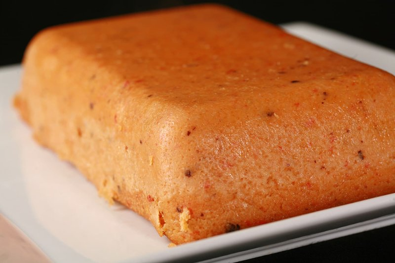

# Moin Moin

*Nigeria's steamed bean pudding: peeled black-eyed beans blended with pepper, palm oil and crayfish, ladled into ramekins and steamed soft.*

**Serves:** 4-6 (makes 6 ramekins)

**Prep Time:** 30 minutes (plus 1 hour bean-soaking)

**Cook Time:** 1 hour

## Overview
Dried black-eyed beans soak briefly to loosen the skins. The skins rub off; the beans soak more to soften. They blend smooth with red pepper, onion, Scotch bonnet and a little water into a thick batter. Palm oil whisks in. Ground crayfish, a stock cube, salt and ground egusi (or breadcrumbs) bind. The batter portions into oiled ramekins (or banana leaf parcels). A hard-boiled egg half, a piece of smoked fish or a spoon of cooked beef goes into each. They steam in a wide pot 50-60 minutes until firm and set.

## Ingredients

### Bean base
- 300 g dried black-eyed beans (also called black-eyed peas)
- 250 ml warm water (for soaking)

### Blender
- 1 red bell pepper (large, deseeded, chunked)
- 1 red onion (large, chunked)
- 1-2 Scotch bonnet chillies (to taste)
- 4 garlic cloves
- 2 cm fresh ginger
- 250 ml water

### To finish the batter
- 100 ml red palm oil
- 2 tablespoons ground crayfish
- 1 stock cube (Maggi), crumbled
- 1 ½ teaspoons salt
- 1 teaspoon ground nutmeg
- 2 tablespoons fine breadcrumbs (helps the binding)

### Embellishments (one per ramekin)
- 3 hard-boiled eggs (peeled, halved)
- 100 g cooked smoked fish (flaked) OR 100 g cooked minced beef
- Or a mix

### To steam
- A wide deep pot
- 6 ramekins (small, 180 ml each) - OR cleaned banana leaves
- A round of foil to seal the pot

## Method

### Stage 1 - Peel the beans
1. Place dried beans in a wide bowl; cover with hot water; soak 30 minutes.
1. Drain. Working in batches, rub the beans firmly between your palms in fresh cool water - the skins lift off and float. Tip off the water with the skins.
1. Repeat until most skins are gone (some persistent ones are fine).
1. Soak the peeled beans in fresh water 30 more minutes; drain.

### Stage 2 - Blend
1. In a powerful blender, combine peeled beans, red pepper, red onion, Scotch bonnet, garlic, ginger and 250 ml water.
1. Blend on high until completely smooth - 2-3 minutes (the texture should be like a thick pancake batter; no grit).

### Stage 3 - Mix the batter
1. Tip the batter into a wide bowl.
1. Whisk in the palm oil - keep whisking until fully incorporated (the colour shifts to a glowing red-orange).
1. Add ground crayfish, crumbled stock cube, salt, nutmeg and breadcrumbs.
1. Stir to combine.

### Stage 4 - Assemble
1. Grease 6 small ramekins (or 180 ml heatproof tea cups, or banana leaf parcels).
1. Pour the batter into each, leaving 1 cm of space at the top.
1. Press an egg half (cut side down), a piece of smoked fish or a spoon of beef into the centre of each.

### Stage 5 - Steam
1. In a wide deep pot, set up a steamer rack (or place a folded tea towel in the bottom).
1. Add 5 cm of water; bring to a simmer.
1. Cover each ramekin with a small piece of foil.
1. Place ramekins on the rack; the water should not touch them.
1. Cover with a tight lid (an old saucer on top of foil makes a good seal).
1. Steam 50-60 minutes - the moin moin is done when set firm, no jiggle in the centre.
1. Top up the water as needed every 20 minutes.

### Stage 6 - Cool and serve
1. Lift out the ramekins; cool 10 minutes.
1. Run a knife around the edge; invert onto a plate.
1. Serve warm - with jollof rice, plain rice, ogi (corn porridge), or just bread.

## Notes
- **Skin removal is essential:** Black-eyed bean skins make moin moin gritty and slightly bitter. The rubbing-and-floating-off method works; food processors with a pulse function also help. Skip this step at your peril.
- **Banana leaves are the traditional vessel:** They impart a faint grassy aroma. Frozen banana leaves are sold at African and Asian shops; pass briefly over a flame to make them pliable, then fold into envelopes.
- **Palm oil emulsion:** Whisking the palm oil thoroughly into the cold batter gives moin moin its smooth texture. Pouring it in unmixed at the end gives a separated oily layer.

## Storage
- Refrigerate 4 days; reheat steamed for 10 minutes or in the microwave 1-2 minutes.
- Freezes 2 months; defrost overnight before reheating.
