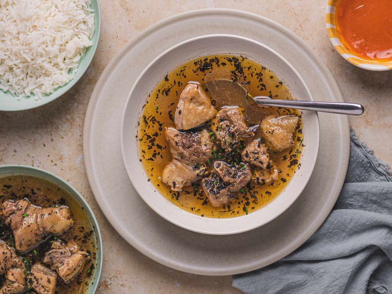

# Pepper Soup

*Nigeria's peppery clear broth: goat or chicken simmered with onion, garlic, Scotch bonnet, ginger and aromatic pepper-soup spices. The head-cold cure.*

**Serves:** 4

**Prep Time:** 15 minutes

**Cook Time:** 1 hour 30 minutes

## Overview
Nigeria's peppery clear broth: the dish that turns up as a head-cold cure, a Friday-night party opener and a Saturday-morning hangover restorative. Goat (or chicken, or catfish) simmers in lightly salted water with onion, garlic, ginger, pierced whole Scotch bonnets and the aromatic pepper-soup spice mix till the meat falls off the bone. Pepper soup is meant to be properly peppery: two Scotch bonnets is the baseline, four is common. The spice mix is the soul of the dish: traditionally uda (calabash nutmeg), uziza pepper, ehuru and grains of paradise, sold pre-made at Nigerian grocers, or substituted with nutmeg, allspice, black pepper, white pepper, thyme and cloves. Ground crayfish and stock cubes go in late for depth; scent leaf (Nigerian basil) tears into the pot at the very end with sliced spring onions. The whole Scotch bonnets fish out before serving, unless you want everyone biting into them. Ladled into wide bowls with white rice on the side.

## Ingredients

- 1 kg goat meat (bone-in, cut into 4 cm chunks, or 1 whole chicken, jointed)
- 1 onion (large, chopped)
- 6 garlic cloves (crushed)
- 1 large thumb fresh ginger (grated)
- 2 scotch bonnet chillies (whole, pierced, or chopped for extra heat)
- 2 tablespoons pepper-soup spice mix (or substitute: 1 tsp ground nutmeg + 1 tsp ground allspice + 1 tsp ground black pepper + 1 tsp ground white pepper + 1 tsp dried thyme + ½ tsp ground cloves)
- 2 tablespoons crayfish (ground dried shrimp)
- 1 tablespoon palm oil (optional but traditional)
- 2 Maggi chicken stock cubes
- 1 ½ teaspoons salt (to taste)
- 1.8 litres water
- 1 small bunch scent leaf (or fresh basil + a sprig of mint)
- 2 spring onions (sliced, to finish)

### To serve
- White rice (optional)
- Sliced raw onion
- Lime wedges
- Sliced scotch bonnet (for those who want more heat)

## Method

### Stage 1 - Brown the meat
1. Place goat (or chicken) in a wide pot.
1. Add onion, garlic, ginger, scotch bonnet (whole pierced), spice mix.
1. Cover with water (1.8 litres); bring to a simmer.

### Stage 2 - Simmer
1. Skim any foam.
1. Simmer covered:
   1. Goat: 1 hour 15 minutes
   1. Chicken: 30-40 minutes
   1. Catfish: 12-15 minutes (add at the end)

### Stage 3 - Season
1. Stir in crayfish, palm oil (if using), stock cubes and salt.
1. Simmer 10 more minutes.

### Stage 4 - Adjust
1. Taste. The soup should be peppery, savoury, slightly oily on top, very flavourful. Adjust salt.
1. Fish out the whole scotch bonnets if you don't want everyone to bite into them.

### Stage 5 - Herbs
1. Tear scent leaf (or basil + mint) and add to the pot.
1. Simmer 2 minutes.
1. Add sliced spring onions.

### Stage 6 - Serve
1. Ladle into wide bowls.
1. Set out white rice, sliced raw onion, lime wedges and extra sliced scotch bonnet on the side.

## Notes
- **Pepper-soup spice mix:** Available pre-made at Nigerian / African shops as "pepper soup spice" or "ofe nsala spice". The traditional individual spices (uda calabash nutmeg, uziza pepper, ehuru, grains of paradise) are hard to find outside Africa. The substitute mix is a fair stand-in.
- **Scent leaf:** Nigerian basil (efinrin / nchanwu). The closest UK / US substitute is regular basil with a sprig of mint added.
- **Heat level:** Pepper soup is meant to be peppery. Two scotch bonnets in a pot is the baseline; many Nigerian cooks add four.

## Storage
- Refrigerate 3 days; flavour deepens.
- Freezes 3 months.
