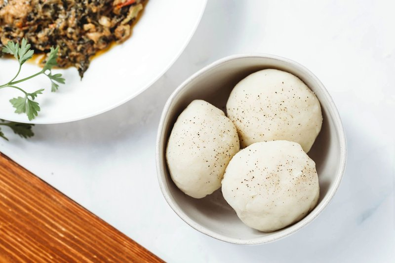

# Fufu

*Nigeria's swallow: fermented cassava flour stirred into hot water with a wooden stick until a soft, sticky dough comes together.*

**Serves:** 4

**Prep Time:** 2 minutes

**Cook Time:** 12 minutes

## Overview
Water comes to a hard simmer. Akpu (fermented cassava) flour is added in stages, stirring vigorously after each addition with a stout wooden turning stick (omoge). The flour absorbs the water and forms a thick, smooth, slightly sticky dough that pulls cleanly from the pan walls. Smoothed into a ball, served in a covered bowl. Best made just before eating.

## Ingredients

- 400 g akpu (fermented cassava) flour
- 700 ml water
- ½ teaspoon salt (optional, modern)

## Method

### Stage 1 - Heat the water
1. Bring the water to a hard simmer in a heavy non-stick pot.

### Stage 2 - First addition
1. Reduce heat to medium-low.
1. Add a third of the flour while stirring quickly with a wooden turning stick (omoge).
1. Beat hard for 30 seconds until the flour absorbs the water and a lumpy mass forms.

### Stage 3 - Second addition
1. Add another third of the flour; beat 30 more seconds.
1. The mass thickens further.

### Stage 4 - Final addition
1. Add the rest of the flour; beat hard for 1-2 minutes - the dough should pull cleanly from the sides of the pan and form a single elastic mass.
1. If the dough is too dry (cracking apart) add 2 tablespoons hot water; beat in.
1. If too wet (sticking heavily), cook 1 more minute, beating, to evaporate.

### Stage 5 - Cook through
1. Reduce heat to low.
1. Cover the pot.
1. Steam-cook 3-4 minutes - the dough firms slightly.

### Stage 6 - Smooth and serve
1. Uncover; beat the dough once more for 30 seconds.
1. Wet your hands; gather the dough into a single ball.
1. Transfer to a wide bowl or covered pot.

### Stage 7 - Eat
1. To eat: pinch off a small ball with the right hand, make a depression with your thumb, scoop up a piece of stew (egusi, okra, pepper soup), and swallow - don't chew. The fufu is meant to glide down with the stew.

## Notes
- **Fufu varieties:** Akpu (fermented cassava - the Igbo style, mildly tangy) is one of several fufus. Plantain fufu (yellowish, slightly sweet) is made the same way with plantain flour. Yam fufu (white, denser) uses yam flour. Pounded yam - the prestige version - uses fresh boiled yam beaten in a giant mortar. All play the same role: a starchy swallow-base for soup.
- **The pan matters:** A heavy non-stick pot is essential. Stainless steel makes fufu stick badly. The traditional pot is a thick aluminium one.
- **Made fresh, eaten fresh:** Fufu is meant to be eaten warm within an hour. Microwaved-from-cold fufu loses the elasticity. Cooked fufu does refrigerate (3 days) but the texture suffers; reheat covered in a microwave with a sprinkle of water.

## Storage
- Best fresh, served within an hour.
- Refrigerate 3 days; reheat covered with 1 tablespoon water added per portion, microwave 1-2 minutes.
- Frozen fufu loses its texture entirely - don't bother.
