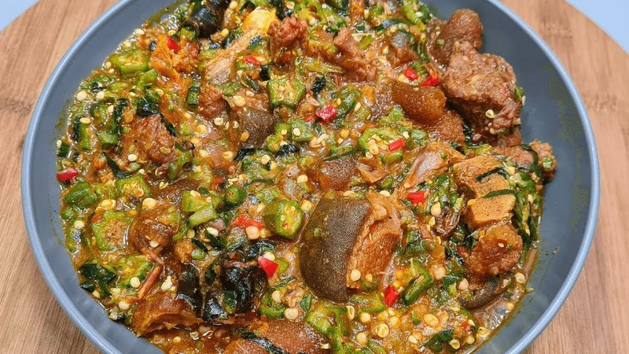

# Okra Soup

*Nigeria's glossy, draw-thick soup: chopped okra briefly simmered with palm oil, smoked fish, beef, crayfish and Scotch bonnet. Eaten with fufu by the fingers.*

**Serves:** 4

**Prep Time:** 15 minutes

**Cook Time:** 35 minutes

## Overview
Nigeria's glossy draw-thick soup, the side-stew that anchors every fufu plate: chopped okra briefly simmered in red palm oil with smoked fish, beef, ground crayfish, iru and Scotch bonnet, eaten with fufu by the fingers. The draw (the slippery mucilage that okra releases) is the point, not the problem; first-time eaters from outside the culture often try to "fix" it, but it's what helps the fufu slide down. Don't overcook the okra either; beyond six minutes, it loses its bright green colour and goes dull khaki, with the slipperiness replaced by mushiness. You parboil bone-in beef shin (or shaki tripe, or a mix) with halved onion, stock cube and salt for 30 minutes till tender, reserve the meat and 500 ml of the strained stock. Chop fresh okra into very small rounds 2 mm thick, or grate on the coarse side of a box grater; the finer the chop, the more draw released. Heat real red palm oil in a wide pot till shimmering, soften finely diced onion for four minutes, add garlic and finely chopped Scotch bonnet for one. Pour in the reserved stock with the cooked meat, flaked smoked fish, ground crayfish and iru, simmer eight minutes; taste for salt. Tip in the chopped okra, stir for four or five minutes only till the okra is tender and bright green and the soup has thickened to a glossy ribboned texture. Spoon alongside a mound of fufu, eba or pounded yam, eat with the right hand; or over rice for the modern easier serve.

## Ingredients

### Meat and stock
- 400 g beef shin (or shaki, tripe), or a mix (cut into 2-3 cm chunks)
- 1 onion (small, halved)
- 1 stock cube
- 1 teaspoon salt
- 700 ml water

### To finish
- 80 ml red palm oil
- 1 onion (small, finely diced)
- 3 garlic cloves (crushed)
- 1 Scotch bonnet (deseeded and finely chopped)
- 150 g smoked fish (smoked mackerel; bones removed, flaked)
- 2 tablespoons ground crayfish
- 1 tablespoon iru (locust beans, optional)
- 1 teaspoon salt (to taste)
- 500 g fresh okra (washed, dried thoroughly)

### To serve
- Pounded yam, fufu, eba (or rice)

## Method

### Stage 1 - Parboil the meat
1. Place meat in a pot with halved onion, stock cube, salt and water.
1. Bring to a boil; skim.
1. Simmer 30 minutes until tender.
1. Reserve meat; keep about 500 ml of the strained stock.

### Stage 2 - Chop the okra
1. Trim the stem ends.
1. Chop the okra into very small rounds - 2 mm thick - OR grate on the coarse side of a box grater. The finer the chop, the more "draw" (mucilage) is released.

### Stage 3 - Cook the base
1. Heat palm oil in a wide pot over medium-high until it shimmers.
1. Reduce to medium; add the diced onion; cook 4 minutes.
1. Add garlic and Scotch bonnet; cook 1 minute.

### Stage 4 - Stock and aromatics
1. Pour in the reserved stock.
1. Add the cooked meat, flaked smoked fish, ground crayfish and iru.
1. Simmer 8 minutes.
1. Taste; adjust salt.

### Stage 5 - Okra
1. Tip in the chopped okra.
1. Stir; cook just 4-5 minutes - the okra should be tender and bright green. The soup will thicken visibly into a glossy ribboned texture.

### Stage 6 - Serve
1. Spoon the soup alongside a mound of fufu, eba or pounded yam.
1. Eat with the right hand: pinch fufu, dip, swallow.
1. Or spoon over rice (the easier modern presentation).

## Notes
- **Don't overcook the okra:** Beyond 6 minutes, okra loses its bright green colour and goes dull khaki, and the slipperiness is replaced by mushiness. 5 minutes is the rule.
- **The draw is the point:** First-time Nigerian okra-soup eaters from outside the culture often struggle with the slipperiness. The slipperiness is the dish - it's what helps the fufu slide down. Embrace it; don't try to fix it.
- **Variations:** Okazi okra soup adds shredded okazi (afang) leaves; ogbono can be added for extra body; some recipes use seafood (prawn, periwinkle, snail) in place of beef.

## Storage
- Refrigerate 3 days; reheats well - the okra loses some vibrancy but the flavour holds.
- Freezes 2 months; texture suffers slightly.
