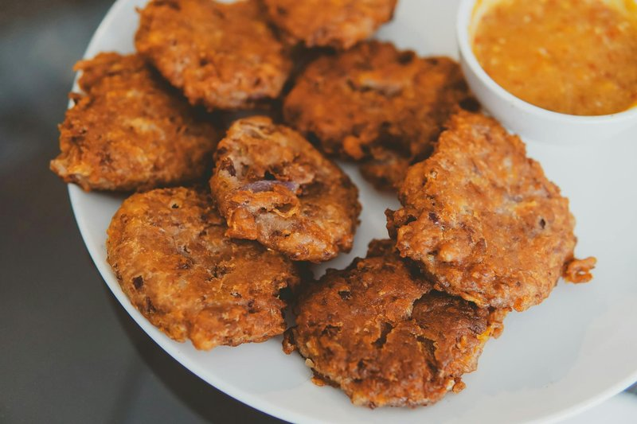

# Akara

*Nigerian black-eyed bean fritters: peeled black-eyed beans blended with onion and Scotch bonnet into a smooth fluffy batter, whipped until light, then deep-fried in spoonfuls into golden-brown nuggets that are crisp outside and steamy-savoury inside. A street-corner breakfast staple across West Africa (where they're also called acarajé in Brazil, brought there by enslaved Yoruba people); eaten with akamu (corn porridge), bread, or just on their own with a sprinkle of salt and a side of fresh pepper sauce.*

**Serves:** 4 (makes 16 fritters)

**Prep Time:** 25 minutes (plus 30 min bean-soaking)

**Cook Time:** 15 minutes

## Overview
Dried black-eyed beans soak briefly to loosen the skins; the skins rub off (this is the key step - skin-on akara is bitter and grey). The peeled beans go into a blender with onion, Scotch bonnet and just enough water to make a thick batter (NOT a paste). The batter is whipped by hand or with a wooden spoon for 5 minutes until light and aerated - this is what makes akara fluffy rather than dense. Spoonfuls drop into 175°C oil and fry 3-4 minutes per side until golden. Drained on paper. Eaten hot.

## Ingredients

- 300 g dried black-eyed beans
- 1 small red onion (rough chunks)
- 1 Scotch bonnet chilli (to taste - deseeded for less heat)
- 80-120 ml water (to blend, used sparingly)
- 1 teaspoon salt
- ½ teaspoon ground white pepper (optional - traditional in some regions)
- 1 litre vegetable oil (for deep-frying)

### To serve (optional)
- Pinch of flaky salt
- Pepper sauce or chilli oil

## Method

### Stage 1 - Soak and peel
1. Place beans in a bowl; cover with hot water; soak 30 minutes.
1. Drain. Working in batches in a large bowl of cool water, rub the beans firmly between your palms - the skins lift off and float.
1. Pour off the water with the skins. Add fresh water and repeat 2-3 times until most skins are gone.
1. Drain.

### Stage 2 - Blend
1. In a powerful blender, combine the peeled beans, onion chunks, Scotch bonnet and 80 ml of water.
1. Blend on high until completely smooth - 2-3 minutes. The batter should be the consistency of thick pancake batter - not runny, not stiff. Add 1-2 tablespoons more water if needed.

### Stage 3 - Whip
1. Tip the batter into a wide bowl.
1. Add salt and white pepper (if using).
1. Whip with a wooden spoon (or stand mixer paddle) for 5 minutes - the batter visibly lightens in colour and increases slightly in volume. This air is what gives akara its fluff.

### Stage 4 - Test the batter
1. Drop a small spoonful into a glass of cold water. If it floats, the batter has enough air. If it sinks, whip another 2 minutes and re-test.

### Stage 5 - Fry
1. Heat the oil in a wide deep pan to 175°C.
1. Working in batches of 6-8, scoop heaped tablespoons of batter and gently drop into the oil. Use a second spoon to slide them off cleanly.
1. Fry 3-4 minutes per side, turning once, until deep golden brown.
1. Lift onto kitchen paper.
1. Don't crowd - the oil temperature drops too far.

### Stage 6 - Serve
1. Eat warm, while still crisp.
1. A pinch of flaky salt; a small bowl of pepper sauce for dipping.
1. The classic Nigerian breakfast pairing is akara with akamu (a slightly sour corn porridge) or with hot fluffy bread.

## Notes
- **Skinned beans are essential:** Skin-on beans make a grey, bitter, dense akara. The peeling step is non-negotiable. Pre-peeled black-eyed beans are sold at some African shops if you want to skip this stage.
- **Air, not water:** The fluff comes from whipping air into the batter, not from adding water. The float-test in cold water tells you when there's enough air.
- **Don't overload with onion:** A small amount of onion adds sweetness. Too much makes the batter watery and the fritters greasy.

## Storage
- Best within 30 minutes of frying.
- Refrigerate cooked akara 2 days; reheat in a 180°C oven 5 minutes (microwaving makes them rubbery).
- Freeze raw batter? No - the air is lost. Freeze cooked fritters and reheat in the oven.
