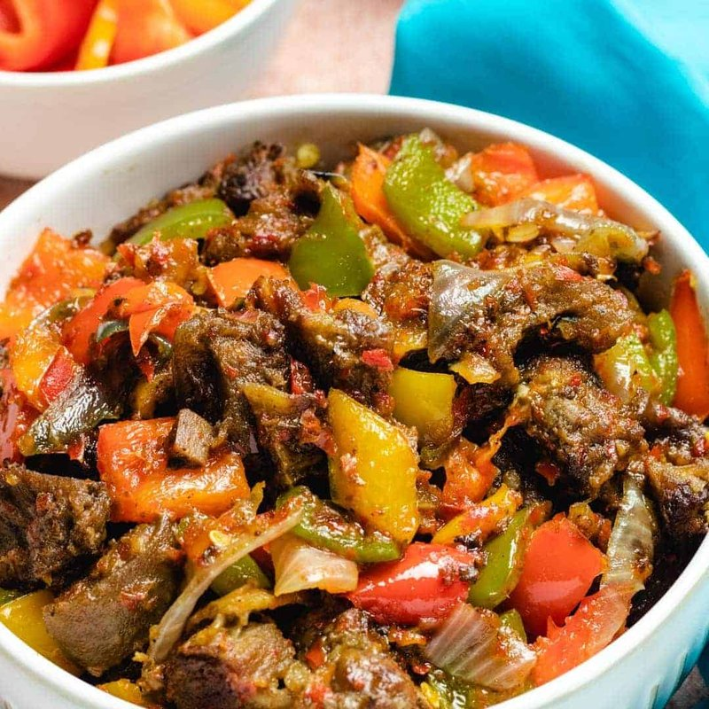

# Asun (Spicy Smoky Goat Meat)

*Yoruba party snack: charred goat tossed hot in a fiery pepper sauce of Scotch bonnet, red pepper and onion. Eaten with toothpicks and cold beer.*

**Serves:** 4 as a snack

**Prep Time:** 20 minutes

**Cook Time:** 1 hour 15 minutes

## Overview
Goat meat (bone-in pieces, ideally) simmers in water with onion, garlic, bay, salt and bouillon till tender (45 min). Lifts out; pats dry; grills over high heat (or under a hot grill / on a griddle pan) till charred (8-10 min). Pepper base: scotch bonnet, red pepper, onion, garlic blitz to paste; sautés in oil with curry powder, thyme, ginger till fragrant. Charred meat tosses in the pepper paste; cooks for 5 minutes more; tops with fresh chopped onion. Eats hot.

## Ingredients

### Goat
- 1 kg bone-in goat meat (cut into 4 cm pieces; substitute lamb shoulder if goat unavailable)
- 1 medium onion (chopped)
- 4 garlic cloves
- 1 bay leaf
- 1 ½ teaspoons salt
- 1 stock cube (Maggi or chicken)
- 800 ml water

### Pepper base
- 2 fresh scotch bonnet chillies (deseeded for less heat; whole if brave)
- 1 large red bell pepper (deseeded, chopped)
- 1 small onion (chopped)
- 3 garlic cloves
- 25 g fresh ginger (peeled)
- 4 tablespoons neutral oil (or red palm oil for traditional flavour)
- 2 teaspoons curry powder
- 1 teaspoon dried thyme
- 1 teaspoon ground crayfish (optional but traditional - sold at African grocers)
- 1 teaspoon salt
- ½ teaspoon ground black pepper

### Garnish
- ½ small onion (very finely sliced)
- 2 spring onions (sliced thin)
- 1 fresh red chilli (sliced thin)

## Method

### Stage 1 - Simmer goat
1. In a heavy pot, combine the goat, chopped onion, garlic, bay, salt, stock cube and water.
1. Bring to a simmer; reduce heat; cook 45 minutes till the meat is fork-tender but not falling off the bone.
1. Drain (reserve a small cup of the cooking broth for later).
1. Pat the meat dry with kitchen paper.

### Stage 2 - Char
1. Heat a griddle pan, grill or barbecue to maximum.
1. Lay the pre-cooked goat pieces on the hot surface.
1. Char 4-5 minutes per side until deeply blackened in spots and dry on the surface.
1. Set aside.

### Stage 3 - Pepper paste
1. Blitz the scotch bonnets, red pepper, onion, garlic and ginger in a food processor to a smooth paste.

### Stage 4 - Sauté
1. Heat the oil in a wide pan or wok over medium-high heat.
1. Add the pepper paste; sauté 6-8 minutes, stirring, until the moisture cooks off and the paste thickens to a glossy red sauce.
1. Stir in the curry powder, thyme, ground crayfish (if using), salt and pepper.
1. Add 3-4 tablespoons of the reserved goat broth.

### Stage 5 - Combine
1. Tip the charred goat pieces into the pepper paste.
1. Toss to coat thoroughly.
1. Cook 3-4 minutes more so the meat absorbs the sauce.

### Stage 6 - Garnish and serve
1. Tip onto a serving plate.
1. Scatter the thinly sliced onion, spring onion and fresh chilli on top.
1. Serve hot with toothpicks and cold beer.

## Notes
- **Bone-in goat for the flavour:** boneless goat works but the marrow and connective tissue give asun its iconic depth.
- **Char hard:** the smoky black-spotted exterior is the signature flavour. Skip the char and you have generic stewed goat in pepper sauce.
- **Scotch bonnet adjustable:** asun is famously hot. Deseed for milder; leave whole for traditional. Beginners: start with one.
- **Crayfish powder is iconic:** the Nigerian shrimp-paste-like umami booster. Found at any African grocer. Substitute: ½ teaspoon shrimp paste or fish sauce.

## Storage
- Keeps 3 days refrigerated.
- Reheats well in a covered pan with a splash of water.
- Freezes 2 months; thaw overnight; reheat.
