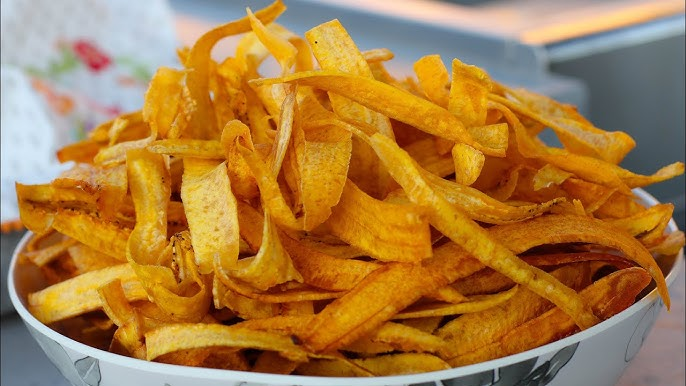

# Kpekere (Plantain Chips)

*Nigeria's plantain crisps: thin slices of green plantain deep-fried into salted wafer-thin chips. Sold in cellophane bags at bus stations.*

**Serves:** 4

**Prep Time:** 15 minutes

**Cook Time:** 15 minutes

## Overview
Green plantains peel, the trick is scoring lengthways down the ridges and then prying the skin off in strips (very different from a banana). The peeled plantain slices on a mandoline or with a sharp knife into 2 mm rounds. Fries in hot oil (180°C) 2-3 minutes till deep gold and crisp. Drains; salts while hot. Optional: tosses with chilli powder.

## Ingredients
- 4 green (unripe) plantains
- 1 litre neutral oil (or red palm oil for traditional Nigerian flavour)
- 2 teaspoons fine salt
- 1 teaspoon chilli powder (optional)
- ½ teaspoon onion powder (optional)

## Method

### Stage 1 - Peel
1. Plantain skin is thick and tough. With a sharp knife, score 3-4 lengthways cuts down the ridges of the plantain (don't cut into the flesh - just the skin).
1. Pry up a strip of skin at one end; pull off in strips.
1. Repeat for all 4 plantains.

### Stage 2 - Slice
1. With a mandoline or a very sharp knife, slice each plantain into 2 mm thick rounds.
1. Uniform thickness is essential for even frying.

### Stage 3 - Fry
1. Heat the oil to 180°C in a wide pan.
1. Lower a handful of slices in (don't crowd - fry in 4-5 batches).
1. The oil will bubble vigorously.
1. Fry 2-3 minutes per batch, stirring once or twice with a slotted spoon, until the chips turn deep golden and stop bubbling vigorously.
1. Lift onto a wire rack lined with kitchen paper.

### Stage 4 - Season
1. While the chips are hot, sprinkle with salt.
1. For spiced version, also dust with chilli powder and onion powder; toss gently.

### Stage 5 - Cool and serve
1. Cool completely before storing - hot chips trap steam.
1. Serve in bowls as a snack with cold drinks.

## Notes
- **Green plantains, not ripe:** ripe plantains turn to caramel mush in the fryer. Green plantains are starchy like potatoes and give crisp chips.
- **Mandoline if you have one:** uniform thinness means uniform frying. Hand-cut works but takes practice.
- **180°C, not hotter:** at 200°C the chips burn before they crisp through. 180 gives 2-3 minutes of even cooking.
- **Salt HOT:** salt sticks only when the oil-slick surface is still warm. Cold chips just shed the salt.

## Storage
- Keeps 3 days in an airtight container at room temperature.
- The chips re-crisp briefly in a 200°C oven 2 minutes if they soften.
- Don't refrigerate - humidity kills the crisp.
