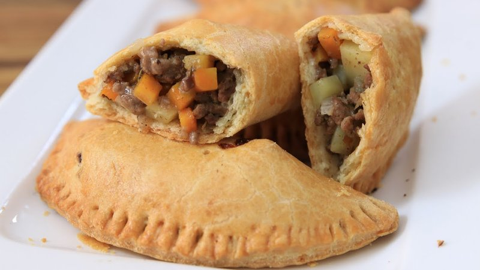

# Nigerian Meat Pie

*Nigeria's bus-stop pasty: a sturdy shortcrust filled with spiced beef mince, potato and carrot in a thick, stock-cube-rich gravy.*

**Serves:** 6 (makes 6 large pies)

**Prep Time:** 40 minutes (plus 30 min pastry rest)

**Cook Time:** 35 minutes

## Overview
Nigeria's bus-stop pasty, sold from every roadside cart and snack shop across the country: a sturdy shortcrust filled with spiced beef mince, potato and carrot in a thick stock-cube-rich gravy. The pastry is its own thing here; neither traditional shortcrust nor American flaky, it's built with a mix of butter and block margarine that gives Nigerian pies their distinctive slightly chewy-flaky texture (the butter for flavour, the margarine for the chew). You whisk flour with baking powder and salt, rub in cold cubed butter and margarine to rough breadcrumbs with some pea-sized lumps. Whisk an egg into ice water, pour in and bring together with a fork to a shaggy dough, knead briefly (five squeezes) to a smooth ball. Don't overwork. Refrigerate 30 minutes. For the filling, soften finely diced onion for five minutes, add garlic, then beef mince broken up and browned for five minutes more, stir in curry powder, thyme, stock cube, salt and pepper. Add finely diced carrot and potato, pour in stock, simmer covered 12 to 15 minutes till the vegetables are tender. Stir in a cornflour slurry to thicken to a glossy gravy, cool completely (warm filling makes soggy pastry). Roll the pastry to 4 mm, cut into 15 cm rounds with a saucer, spoon a heaped two tablespoons of cool filling on half of each round leaving a 1 cm border, brush the border with egg-wash, fold over into a half-moon and crimp with a fork or pinch firmly. Egg-wash the tops, cut two small steam slits in each (without slits the pies puff up like balloons and burst). Bake at 200°C for 30 to 35 minutes till deep golden brown, cool 10 minutes (the filling is volcanic straight from the oven), eat warm or at room temperature.

## Ingredients

### Pastry
- 500 g plain flour
- ½ teaspoon baking powder
- 1 teaspoon salt
- 100 g unsalted butter (cold, cubed)
- 150 g block margarine (cold, cubed)
- 1 egg (large)
- 100-120 ml ice water

### Filling
- 2 tablespoons sunflower oil
- 1 onion (large, finely diced)
- 3 garlic cloves (crushed)
- 400 g beef mince
- 1 tablespoon [Curry Powder](../../indian/Spice-Mixes/curry-powder.md) (Nigerian-style yellow)
- 1 teaspoon dried thyme
- 1 stock cube (Maggi)
- ½ teaspoon salt
- ½ teaspoon black pepper
- 1 carrot (medium, diced 5 mm)
- 1 potato (large, diced 5 mm - about 200 g)
- 200 ml beef (or chicken stock)
- 1 tablespoon cornflour (mixed with 2 tablespoons cold water)

### To finish
- 1 egg (beaten - for egg-wash)

## Method

### Stage 1 - Pastry
1. Whisk flour, baking powder and salt in a wide bowl.
1. Rub in the cold butter and margarine with your fingertips until the mixture looks like rough breadcrumbs with some pea-sized lumps. (Or pulse in a food processor.)
1. Whisk the egg into 100 ml of ice water.
1. Pour into the flour mixture; bring together with a fork until a shaggy dough forms. Add more water 1 tablespoon at a time if dry.
1. Knead briefly (5 squeezes) to a smooth ball. Don't overwork.
1. Wrap in cling film; refrigerate 30 minutes.

### Stage 2 - Filling
1. Heat oil in a wide pan over medium heat.
1. Add onion; cook 5 minutes until soft.
1. Add garlic; cook 1 minute.
1. Add beef mince; break up; brown 5 minutes.
1. Stir in curry powder, thyme, stock cube, salt and pepper; cook 1 minute.
1. Add diced carrot and potato; stir.
1. Pour in the stock; bring to a simmer.
1. Cover; cook 12-15 minutes until the potato and carrot are tender.
1. Stir in the cornflour slurry; cook 1 minute until the filling is thick and glossy.
1. Off heat; cool completely (warm filling makes soggy pastry).

### Stage 3 - Roll and cut
1. Heat oven to 200°C (180°C fan).
1. Line two baking trays with paper.
1. Divide the pastry in half; roll each half on a floured surface to 4 mm thick.
1. Cut out 15 cm rounds using a saucer as a guide. Re-roll scraps once.

### Stage 4 - Fill and shape
1. Place a heaped 2 tablespoons of cooled filling on half of each pastry round, leaving a 1 cm border.
1. Brush the border with egg-wash.
1. Fold the empty half over the filling; press the edges together; crimp with a fork or by pinching to form a tight seal.
1. Transfer to lined trays.

### Stage 5 - Bake
1. Brush the tops with egg-wash.
1. Cut 2 small steam slits in each pie top.
1. Bake 30-35 minutes until deep golden brown.

### Stage 6 - Cool and serve
1. Cool on a rack 10 minutes (the filling is volcanic straight from the oven).
1. Eat warm or at room temperature.

## Notes
- **Butter AND margarine:** Nigerian meat pie crust is its own thing - neither traditional shortcrust nor American flaky. The butter gives flavour; the margarine gives that distinctive slightly chewy-flaky texture. Don't substitute one for the other.
- **Cool the filling fully:** Warm filling melts the fats in the pastry and you get a soft, soggy base. Let it cool right down.
- **Steam slits matter:** Without slits, the pies puff up like balloons and burst. Two small cuts on top let steam escape.

## Storage
- Refrigerate cooked pies 4 days; reheat in a 180°C oven 8 minutes (microwave makes the pastry soft).
- Freeze cooked pies 2 months; reheat from frozen at 180°C 20 minutes.
- Unbaked filled pies freeze too - bake from frozen at 200°C 40 minutes.
