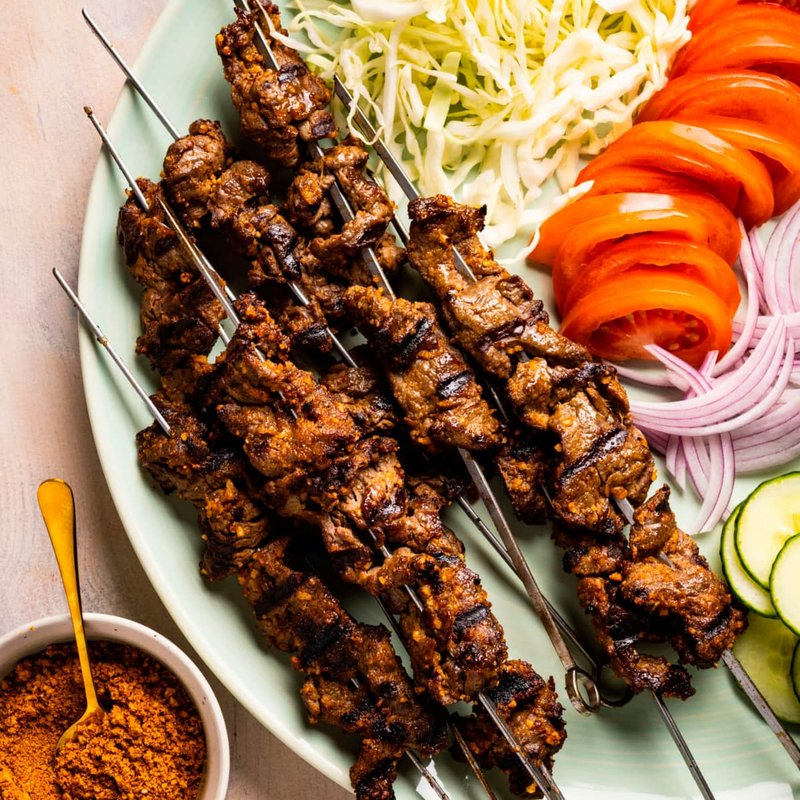

# Suya

*Nigeria's open-fire skewer: thin strips of marbled beef coated in a peanutty-spicy yaji rub and charred hard over embers.*

**Serves:** 4

**Prep Time:** 25 minutes (plus 1 hour marinating)

**Cook Time:** 12 minutes

## Overview
Nigeria's open-fire street skewer and the Hausa contribution to the national snack table: thin strips of marbled beef coated in a peanutty-spicy yaji rub and charred hard over embers, eaten with fingers from a wooden board with raw onion, tomato and shredded cabbage on the side. The peanut in the yaji is what makes suya suya; the ground peanut acts as the carrier for the spices and gives the dish its unique nutty edge. Don't substitute peanut butter (too oily, makes the yaji clumpy and prevents the dry-crust char); ground dry-roasted unsalted peanuts is the technique. You freeze beef sirloin or rump for 30 minutes to firm it up, slice across the grain into thin strips 5 mm thick. Make the yaji: toast peanuts in a dry pan till golden, blot on paper towel to remove oils, grind in a spice grinder to a coarse powder (not a paste; blot between pulses if they release oil). Mix the ground peanut with ground ginger, cayenne, paprika, garlic and onion powder, cloves, salt and a crumbled stock cube. Split the yaji into two: half for the marinade, half for finishing. Toss the beef with half the yaji, oil and salt, marinate at room temperature an hour. Thread onto pre-soaked bamboo skewers in a tight accordion fold (pierce, fold, pierce, fold) so each holds about three strips packed close. Grill over very hot charcoal embers (or under a smoking-hot grill pan) four or five minutes per side till heavily charred at the edges. While still hot, roll each skewer in the reserved dry yaji for a fresh outer coat. Pile on a wooden board with sliced red onion, tomato and shredded cabbage, lime wedge alongside, eat with the fingers off the skewer.

## Ingredients

### Beef
- 800 g beef sirloin (or rump, well-marbled, NOT lean - this is the dish)
- 2 tablespoons sunflower oil
- 1 teaspoon salt

### Yaji (suya spice)
- 100 g dry-roasted unsalted peanuts (kuli-kuli, the Nigerian groundnut cake, is also commonly used)
- 2 tablespoons ground ginger
- 2 tablespoons cayenne pepper (or hot chilli powder, adjust for heat - full whack is traditional)
- 1 tablespoon sweet paprika
- 1 tablespoon garlic powder
- 1 tablespoon onion powder
- 1 teaspoon ground cloves
- 2 teaspoons salt
- 1 stock cube (Maggi), crumbled (optional but traditional)

### To serve
- 1 red onion (medium, sliced very thin)
- 2 tomatoes (diced)
- ¼ small cabbage (shredded)
- 1 lime (cut into wedges)

### Equipment
- 8 bamboo skewers (soaked in water for 30 minutes)

## Method

### Stage 1 - Slice the beef
1. Place the beef in the freezer 30 minutes to firm it up (makes slicing easier).
1. Slice across the grain into thin strips 5 mm thick, 3 cm wide, 10 cm long.

### Stage 2 - Yaji
1. In a dry pan, toast the peanuts (if not already roasted) 4 minutes over medium heat until golden. Cool.
1. Place the peanuts on a paper towel and crush gently - you want to remove most of the oils.
1. Tip into a spice grinder (or mortar). Grind to a coarse powder - NOT a paste. If the peanuts release oil, blot the powder on paper towel between pulses.
1. Mix the ground peanut with ginger, cayenne, paprika, garlic powder, onion powder, cloves, salt and crumbled stock cube.
1. Split into two halves - one for the marinade, one for finishing.

### Stage 3 - Marinate
1. In a wide bowl, toss the beef strips with half the yaji, sunflower oil and 1 teaspoon salt.
1. Mix thoroughly with your hands; let sit 1 hour at room temperature (or up to 4 hours refrigerated).

### Stage 4 - Skewer
1. Thread the beef strips onto the soaked skewers in a tight accordion fold - pierce, fold, pierce, fold - so each skewer holds about 3 strips packed close.

### Stage 5 - Cook
1. **Best:** Grill over very hot charcoal embers 4-5 minutes per side until heavily charred at the edges.
1. **Alternative:** Heat a grill pan to smoking; cook 4 minutes per side.
1. **Indoor:** Heat the grill (broiler) to maximum; place the skewers on a foil-lined tray on the top rack; grill 4 minutes per side.
1. The beef should be cooked through, the spice crust deeply charred.

### Stage 6 - Finish
1. While still hot, roll each skewer in the reserved dry yaji - it should coat the beef in a fresh layer of spice.

### Stage 7 - Serve
1. Pile the skewers on a wooden board.
1. Scatter sliced red onion, tomato and cabbage around.
1. Wedge of lime alongside.
1. Eat with the fingers, off the skewer.

## Notes
- **Peanut oil management:** When you grind the peanuts, they release oil. The yaji needs to be a dry powder, not a paste. Pulse, then blot on paper towel, then pulse again. Ground commercial peanut butter is the wrong texture entirely.
- **Slice thin, marinate well:** Suya is about the spice : meat ratio. Thick chunks of beef have too little surface to spice. Thin strips covered in yaji is the dish.
- **Don't substitute peanut butter for ground peanuts:** Peanut butter is too oily; it makes the yaji clumpy and prevents the dry-crust char.

## Storage
- Best within 30 minutes of cooking; suya does not keep well.
- Reserved yaji powder keeps 3 months in a sealed jar - make a double batch.
