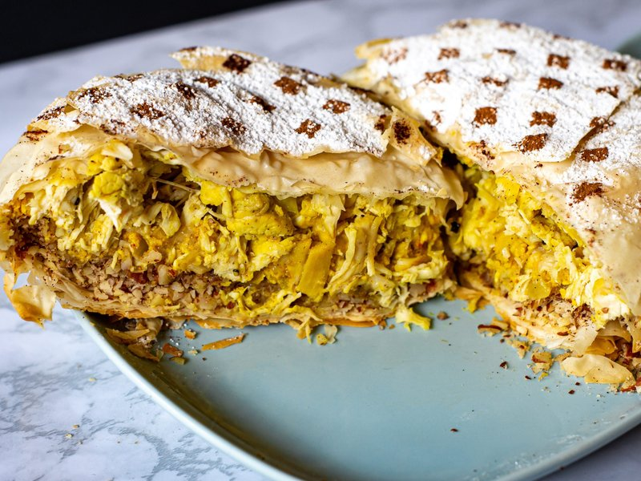

# Chicken Bastilla

*Morocco's celebration pie: shredded slow-cooked chicken, almonds and eggs wrapped in crisp filo, dusted with sugar and cinnamon.*

**Serves:** 6

**Prep Time:** 50 minutes

**Cook Time:** 1 hour

## Overview
Morocco's celebration pie and the centrepiece at any wedding or Eid feast: shredded slow-cooked chicken, almonds and saffron-lemon eggs encased in crisp filo, dusted in icing sugar and cinnamon. The trinity of sweet, savoury and crisp is the dish's defining trick; the icing sugar offsets the saffron-and-chicken savouriness, the cinnamon perfumes both, and the filo provides crisp contrast to the soft filling. Don't be tempted to skip the sugar dusting just because it sounds odd. You poach chicken thighs in butter and olive oil with sliced onion, saffron, ginger, cinnamon, turmeric, salt, parsley, coriander and orange-flower water for 40 minutes till tender. Lift the chicken out and shred, reduce the cooking liquid uncovered for 10 to 12 minutes till about 200 ml of thick saucy gravy. Pour beaten eggs into the reduced sauce whisking constantly, cook gently for three minutes till the eggs form soft scrambled curds suspended in the gravy. Stir the shredded chicken back in, cool to room temperature (warm filling melts the filo butter and gives a soggy base). Toast blanched almonds till pale gold, pulse with sugar and cinnamon to a coarse rubble (not powder), stir in orange-flower water and melted butter. Brush a 26 cm springform tin with butter, layer 8 filo sheets rotating 60° each with butter between, overhanging the edge. Spread the chicken-and-egg mixture across, top with the almond rubble, lay four more filo sheets on top with butter, fold the overhang up and over to seal. Brush the top with butter, bake at 200°C for 30 to 35 minutes till deep golden brown. Cool 10 minutes, release from the springform, dust the top with icing sugar in a thick sift then narrow stripes of ground cinnamon. Cut with a serrated knife and a sawing motion.

## Ingredients

### Chicken
- 800 g boneless skinless chicken thighs
- 1 onion (large, sliced)
- 50 g unsalted butter
- 2 tablespoons olive oil
- 1 large pinch saffron threads
- 1 teaspoon ground ginger
- 1 teaspoon ground cinnamon
- 1 teaspoon ground turmeric
- 1 teaspoon salt
- ½ teaspoon white pepper
- 1 small bunch flat-leaf parsley (chopped)
- 1 small bunch coriander (chopped)
- 1 tablespoon orange-flower water
- 300 ml water

### Egg layer
- 4 eggs (large, beaten)

### Almond layer
- 200 g blanched whole almonds
- 60 g caster sugar
- 1 teaspoon ground cinnamon
- 1 tablespoon orange-flower water
- 30 g unsalted butter (melted, for binding)

### Pastry
- 12 sheets of filo pastry
- 100 g unsalted butter (melted, for brushing)

### To finish
- 3 tablespoons icing sugar
- 1 teaspoon ground cinnamon

## Method

### Stage 1 - Cook the chicken
1. Melt butter with olive oil in a heavy lidded pot over medium heat.
1. Add the sliced onion; cook 8 minutes until soft.
1. Add saffron, ginger, cinnamon, turmeric, salt and white pepper; stir 30 seconds.
1. Add the chicken thighs, parsley, coriander, orange-flower water and 300 ml water.
1. Bring to a simmer; cover; cook 40 minutes until the chicken is very tender.
1. Lift out the chicken; shred with two forks.
1. Increase heat under the cooking liquid; reduce uncovered 10-12 minutes until thick and saucy (about 200 ml left).

### Stage 2 - Eggs into the sauce
1. Reduce heat to medium-low.
1. Pour the beaten eggs into the reduced sauce, whisking constantly.
1. Cook 3 minutes, stirring, until the eggs form soft scrambled curds suspended in a thick yellow gravy.
1. Stir in the shredded chicken.
1. Off heat; cool to room temperature.

### Stage 3 - Almonds
1. Toast the almonds in a dry pan over medium 5 minutes until pale gold and fragrant.
1. Cool.
1. Pulse in a food processor with sugar and cinnamon to a coarse rubble (NOT a powder).
1. Stir in the orange-flower water and melted butter; the mixture should be slightly clumpy.

### Stage 4 - Assemble
1. Heat oven to 200°C (180°C fan).
1. Brush a 26 cm springform tin (or oven-safe round dish) generously with melted butter.
1. Lay one filo sheet across, overhanging the edge by 8 cm; brush with butter.
1. Continue, rotating each subsequent sheet 60° around the tin, until you have 8 sheets laid down with overhang all around.
1. Spread the chicken-and-egg mixture evenly over the filo base.
1. Top with the almond rubble.
1. Lay the remaining 4 filo sheets on top, brushing each with butter, tucking them into the tin.
1. Fold the overhanging filo up and over the top to seal - the parcel should look like a domed round pie.
1. Brush the entire top thoroughly with butter.

### Stage 5 - Bake
1. Bake 30-35 minutes until deep golden brown and crisp.

### Stage 6 - Decorate
1. Cool 10 minutes in the tin.
1. Carefully release from the springform; transfer to a serving plate.
1. Sift icing sugar evenly across the top.
1. Sprinkle the cinnamon in narrow stripes or a lattice pattern.

### Stage 7 - Serve
1. Cut into wedges with a serrated knife (sawing motion - the filo is crisp).
1. Eat warm; small portions are usual because it's rich.

## Notes
- **The trinity of sweet, savoury, crisp:** Bastilla works because the icing sugar offsets the saffron-and-chicken savouriness, the cinnamon perfumes both, and the filo provides crisp contrast to the soft filling. Don't be tempted to skip the sugar dusting because it sounds odd; it's the dish.
- **Warqa vs filo:** Real Moroccan warqa is a very thin pancake-style sheet, painstakingly made. Filo is the universally accepted substitute and works perfectly well. Use the thinnest filo you can find.
- **Cool the filling before assembly:** Warm filling melts the butter on the filo sheets and you get a soggy base. Let the chicken-and-egg cool to room temperature before layering.

## Storage
- Best within 2 hours of baking. The filo softens with time.
- Refrigerate 2 days; reheat in a 180°C oven 10 minutes (microwave makes it floppy).
- Freezes well unbaked - assemble, freeze, then bake from frozen at 180°C 45 minutes.
