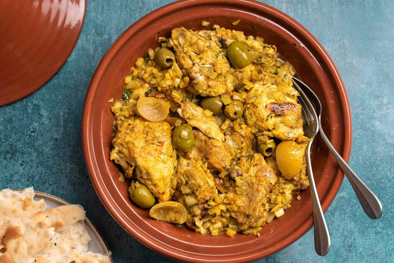

# Chicken Tagine with Preserved Lemons

*Morocco's defining tagine: bone-in chicken slow-braised with onion, ginger and saffron, finished with strips of preserved lemon and green olives.*

**Serves:** 4

**Prep Time:** 20 minutes

**Cook Time:** 1 hour 15 minutes

## Overview
Chicken pieces are rubbed with a spice paste of garlic, ginger, saffron, turmeric, paprika, cumin, salt and olive oil; rest for 30 minutes. Onion sweats slowly in olive oil in a heavy tagine or casserole; the chicken nestles in skin-side-up; just enough water goes in to come halfway up the chicken. Lid on; gentle simmer for 50 minutes. Preserved lemon strips and green olives go in for the last 10 minutes. Off heat, scattered with fresh coriander and parsley.

## Ingredients

### Chicken
- 1.4 kg chicken (a whole bird jointed into 8 pieces, OR 8 bone-in skin-on thighs)

### Spice paste
- 5 garlic cloves (crushed)
- 3 cm fresh ginger (grated)
- 1 large pinch saffron threads (about 20 strands, soaked in 2 tablespoons hot water)
- 1 ½ teaspoons ground turmeric
- 1 teaspoon sweet paprika
- 1 teaspoon ground cumin
- 1 teaspoon white pepper
- 1 ½ teaspoons salt
- 3 tablespoons olive oil
- ½ lemon (juice)

### Tagine
- 3 tablespoons olive oil
- 2 onions (large, sliced thin)
- 1 cinnamon stick
- 300 ml water (or light chicken stock)

### To finish
- 2 preserved lemons (rinsed; pulp scraped out and discarded; skin sliced into thin strips)
- 150 g green olives (Picholine or cracked Moroccan green; pitted or whole)
- 2 tablespoons fresh coriander (chopped)
- 2 tablespoons fresh flat-leaf parsley (chopped)

### To serve
- Khobz (Moroccan round bread), pita or crusty bread

## Method

### Stage 1 - Spice paste
1. In a wide bowl, whisk all the spice-paste ingredients to a thick golden paste.
1. Add the chicken pieces; rub the paste thoroughly into all sides and under the skin.
1. Cover; rest 30 minutes at room temperature (or up to 4 hours refrigerated).

### Stage 2 - Soften the onion
1. Heat the 3 tablespoons olive oil in a tagine or wide heavy lidded casserole over medium-low heat.
1. Add the sliced onion; cook 12 minutes, stirring, until very soft and just gold.

### Stage 3 - Nestle the chicken
1. Push the onion to make a base layer.
1. Place the chicken pieces skin-side-up on top of the onion.
1. Drop in the cinnamon stick.
1. Scrape any leftover spice paste from the bowl over the chicken.
1. Pour the water around (not over) the chicken - it should come halfway up the meat.

### Stage 4 - Simmer
1. Cover; bring to a very gentle simmer.
1. Cook 50 minutes over low heat. Don't peek too often. The chicken should be tender; the sauce should have reduced and emulsified with the chicken fat into a thick golden gravy.

### Stage 5 - Lemons and olives
1. Tuck the preserved lemon strips around the chicken.
1. Scatter the olives.
1. Cook uncovered 10 minutes - the sauce reduces a little further.

### Stage 6 - Serve
1. Taste the sauce; adjust salt if needed (preserved lemons and olives are salty so usually no adjustment).
1. Scatter fresh coriander and parsley.
1. Serve from the tagine with bread for mopping.

## Notes
- **Preserved lemon use:** Only the skin is used; the pulp is too salty and bitter for this dish. Rinse the skin under cold water before slicing to remove excess salt.
- **Saffron quality:** Use real Persian or Spanish saffron threads; not powdered colour. The soaking water is what gets added - that's where the colour and aroma live.
- **Don't brown the chicken first:** Moroccan tagines are not French braises. The chicken goes in raw onto the softened onion bed; it steam-poaches in its own juices and the spices coat it without searing. Browning gives a different (also good) dish but not a tagine.

## Storage
- Refrigerate 3 days; reheats brilliantly and the sauce thickens further.
- Freezes 2 months without the olives (add fresh on reheat).
