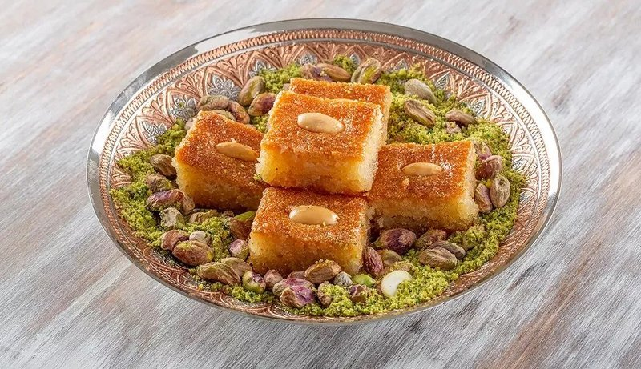

# Kalb el-Louz (Almond-Semolina Cake)

*Algeria's almond-semolina cake: studded with whole blanched almonds, baked in a wide tin and drenched in orange-flower syrup. A Ramadan institution.*

**Serves:** Makes 24 diamonds

**Prep Time:** 25 minutes (plus 1 hour resting + 4 hours steeping)

**Cook Time:** 40 minutes

## Overview
Semolina is mixed with melted butter and rested for 1 hour (hydrates fully). Sugar, eggs, ground almonds, baking powder and orange-flower water are blended in. Poured into a 30 × 22 cm tin; smoothed; scored into diamonds; an almond is pressed into each diamond. Baked for 35-40 minutes till deep gold. A syrup of sugar, water, lemon and orange-flower water simmers separately. Hot syrup is poured over the just-baked cake. Rested at least 4 hours so the syrup absorbs fully.

## Ingredients

### Cake
- 500 g fine semolina
- 200 g unsalted butter (melted, cooled slightly)
- 200 g caster sugar
- 200 g ground almonds
- 1 ½ teaspoons baking powder
- ½ teaspoon salt
- 2 large eggs
- 2 tablespoons orange-flower water
- 100 ml warm milk (as needed)
- 24 whole blanched almonds (for tops)

### Syrup
- 400 g caster sugar
- 350 ml water
- 2 tablespoons lemon juice
- 2 tablespoons orange-flower water

## Method

### Stage 1 - Semolina rest
1. In a wide bowl, combine the semolina and melted butter.
1. Rub through with fingertips until the semolina is uniformly coated.
1. Cover; rest 1 hour at room temperature (the semolina absorbs the butter).

### Stage 2 - Batter
1. To the rested semolina, add the sugar, ground almonds, baking powder and salt.
1. Whisk the eggs and orange-flower water in a jug.
1. Stir into the dry mixture.
1. Add warm milk a tablespoon at a time until you have a thick, slightly damp dough (not pourable, not crumbly - somewhere between).

### Stage 3 - Assemble
1. Heat the oven to 180°C (160°C fan).
1. Butter a 30 × 22 cm baking tin.
1. Press the mixture evenly into the tin, smoothing the top with a spatula.
1. With a sharp knife, score the surface into diamonds (parallel diagonal lines 4 cm apart, then crossing diagonals 4 cm apart) - score about halfway down, not all the way through.
1. Press a whole almond into the centre of each diamond.

### Stage 4 - Bake
1. Bake 35-40 minutes until the top is deep gold and a skewer comes out clean.

### Stage 5 - Syrup
1. While the cake bakes, combine sugar, water and lemon juice in a saucepan.
1. Bring to a simmer; cook 8 minutes.
1. Off heat; stir in orange-flower water.

### Stage 6 - Pour
1. As soon as the cake comes out of the oven, slowly pour the WARM syrup over the entire surface.
1. You'll be amazed how much it absorbs; pour gradually so it has time to soak in.
1. The cake will hiss; the syrup will pool briefly then disappear.

### Stage 7 - Rest
1. Cool fully in the tin.
1. Rest at room temperature at least 4 hours, ideally overnight, so the syrup distributes evenly through the cake.

### Stage 8 - Cut and serve
1. Re-trace the scored diamond lines all the way through with a sharp knife.
1. Lift each diamond out with a small palette knife.
1. Serve at room temperature with strong mint tea.

## Notes
- **Semolina rest is essential:** the hour after mixing butter into semolina hydrates the granules and gives kalb el-louz its characteristic dense-yielding crumb. Skip and the cake is gritty.
- **Score before baking, cut through after:** scoring sets the pattern and lets the syrup penetrate through the cuts. Don't cut all the way until after the syrup soak.
- **Warm syrup, hot cake:** the temperature gap is the secret to deep absorption. Cold syrup on cold cake sits on the surface.
- **Rest overnight if possible:** day 2 kalb el-louz is the peak - moist, fragrant, fully syruped. Day 1 is good but slightly drier.

## Storage
- Keeps 5 days at cool room temperature in a sealed tin.
- The texture improves on day 2-3 as the syrup fully distributes.
- Freezes 2 months pre-cut between parchment; thaw at room temperature 2 hours.
- Don't refrigerate - the texture goes hard and chalky.
