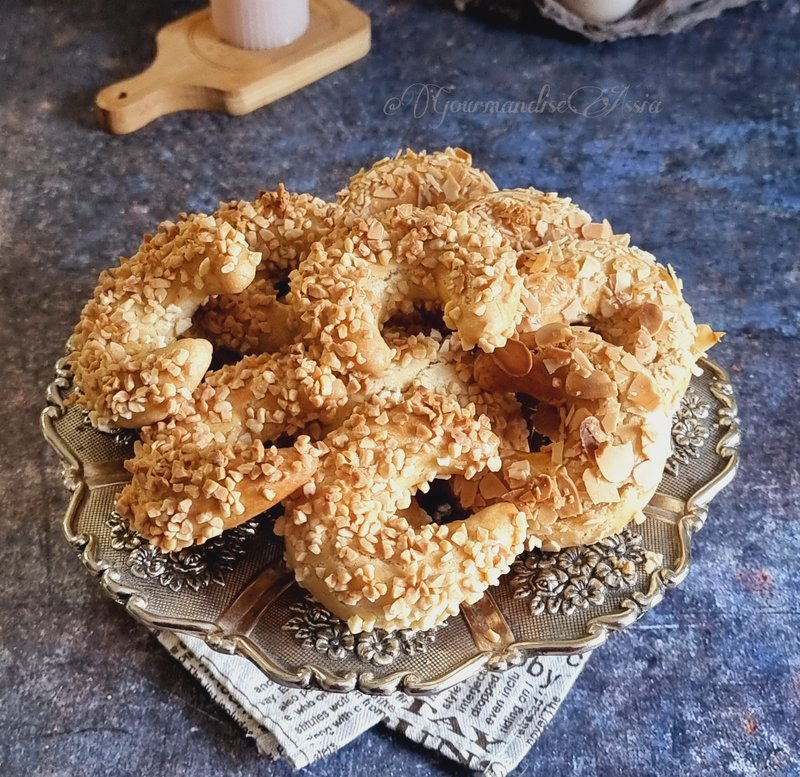

# Tcharek El-Ariane (Almond Crescents)

*The Maghreb's Eve's crescents: almond-paste filling wrapped in thin shortbread, baked pale, dipped in orange-flower syrup, rolled in icing sugar.*

**Serves:** Makes 24 crescents

**Prep Time:** 1 hour (plus 30 minutes resting)

**Cook Time:** 18 minutes

## Overview
The Maghreb's Eve's crescents, the small pale moons that turn up at every Eid tea trolley and family celebration from Algiers to Tunis: an almond-paste filling wrapped in thin shortbread, baked pale (not browned: tcharek should look creamy-white), dipped briefly in orange-flower syrup and rolled in a thick coat of icing sugar. Pale is the goal: browning means over-baked and the dough goes tough. The almond filling is ground almonds, icing sugar, melted butter, lemon zest, orange-flower water and optional cinnamon into a soft paste, rolled into small tapered logs. The shortbread is a cold-butter rub-in with flour, icing sugar and salt, brought together with an egg yolk and orange-flower water and rested before being wrapped around each almond log into a C-shaped crescent. Baked at 170 °C for sixteen to eighteen minutes till just-cooked but still pale, cooled slightly. A brief three-second dip into warm orange-flower syrup glazes (not soaks), then each crescent rolls in icing sugar to coat heavily before drying on a wire rack. Eaten with strong mint tea.

## Ingredients

### Almond filling
- 250 g ground almonds
- 100 g icing sugar
- 30 g unsalted butter (melted)
- 1 lemon (zest)
- 1 tablespoon orange-flower water
- ½ teaspoon ground cinnamon (optional)

### Dough
- 250 g plain flour
- 120 g unsalted butter (cold, cubed)
- 50 g icing sugar
- ½ teaspoon salt
- 1 egg yolk (large)
- 1 tablespoon orange-flower water
- 2-3 tablespoons cold water

### Syrup dip
- 100 ml water
- 80 g caster sugar
- 1 tablespoon orange-flower water
- 1 tablespoon lemon juice

### Coating
- 100 g icing sugar (for rolling)

## Method

### Stage 1 - Almond filling
1. In a bowl, combine ground almonds, icing sugar, melted butter, lemon zest, orange-flower water and cinnamon.
1. Mix to a soft pliable paste; rest 10 minutes.
1. Divide into 24 walnut-sized portions (~17 g each).
1. Roll each into a small log about 4 cm long, slightly tapered at the ends.

### Stage 2 - Dough
1. Rub the cold butter into the flour, icing sugar and salt until breadcrumb-like.
1. Beat the egg yolk with orange-flower water and 2 tablespoons cold water; pour into the flour.
1. Mix to a soft pliable dough; add more cold water a teaspoon at a time if too dry.
1. Wrap; rest 30 minutes.

### Stage 3 - Wrap
1. Heat the oven to 170°C (150°C fan).
1. Line two baking trays with parchment.
1. Divide the dough into 24 portions (~20 g each).
1. Take one portion; flatten with the palm to a disc about 6 cm across.
1. Place an almond log in the centre.
1. Wrap the dough around the almond log; pinch the ends to seal.
1. Gently shape into a crescent moon: roll between palms to smooth; bend slightly into a C-shape; taper the ends.
1. Place on the tray.

### Stage 4 - Bake
1. Bake 16-18 minutes until just-cooked but still pale (don't brown - tcharek should look creamy-white).
1. Cool on the tray 5 minutes.

### Stage 5 - Syrup
1. While baking, combine the syrup ingredients in a small pan.
1. Bring to a simmer; cook 3 minutes; off heat.
1. Cool to warm (not hot).

### Stage 6 - Dip and coat
1. Spread the 100 g icing sugar on a wide plate.
1. One at a time: lift a slightly-cooled tcharek; dip briefly into the warm syrup (just a 3-second dunk - the dough shouldn't soak through).
1. Lift out; let excess drip; immediately roll in the icing sugar to coat heavily.
1. Place on a wire rack to set.

### Stage 7 - Serve
1. Cool fully (the icing sugar coat sets to a slight crust).
1. Serve with strong mint tea.

## Notes
- **Pale, not browned:** tcharek should look almost white. Browning means over-baked and the dough goes tough.
- **Brief syrup dip:** the syrup-flavoured glaze coat is the point; soaking through to the centre is not. 3 seconds is the maximum.
- **Roll while sticky:** the icing sugar coats while the syrup is wet. Once dry, sugar won't adhere.
- **Crescent shape:** bend gently; don't crush. The shape signifies tcharek across the Maghreb.

## Storage
- Keeps 2 weeks at cool room temperature in a sealed tin.
- The sugar coat softens slightly on day 2 (still good).
- Don't refrigerate - the dough goes hard and the sugar weeps.
