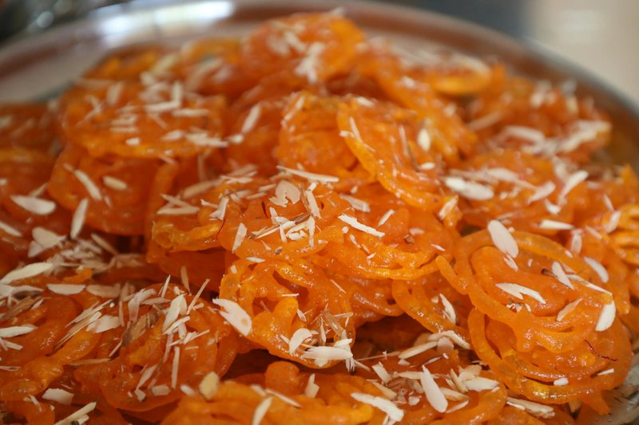

# Zlabia

*The Maghreb's iftar sweet: a thin yeasted batter piped into hot oil in lacy spirals, then drenched in honey-rose syrup till amber-glossy.*

**Serves:** Makes about 20 zlabia

**Prep Time:** 20 minutes (plus 6 hours batter fermenting)

**Cook Time:** 25 minutes

## Overview
A thin yeasted batter, flour, semolina, yogurt, yeast, sugar, water, ferments at room temperature 6+ hours till bubbly. Sugar syrup with rose water + lemon juice + saffron simmers for 5 minutes. Hot oil heats to 175°C. Batter pipes through a small bottle nozzle (or a piping bag fitted with a 5 mm round tip) into the oil in lacy spiral / pretzel shapes. Fries for 2 minutes till deep amber. Lifts directly into the warm syrup; soaks for 30 seconds. Drains.

## Ingredients

### Batter
- 200 g plain flour
- 100 g fine semolina
- 250 g full-fat yogurt
- 7 g instant yeast
- 1 tablespoon caster sugar
- ½ teaspoon salt
- 250 ml warm water (more as needed)
- 1 pinch saffron threads (steeped in 1 tablespoon hot water)

### Honey-rose syrup
- 400 g caster sugar
- 250 ml water
- 200 g clear honey
- 1 tablespoon rose water
- 1 tablespoon lemon juice
- 1 pinch saffron threads

### Frying
- 800 ml neutral oil

### Equipment
- A squeeze bottle with a 5 mm nozzle, OR a piping bag with a small round tip

## Method

### Stage 1 - Batter (start 6 hours ahead)
1. In a wide bowl, combine flour, semolina, yeast, sugar and salt.
1. Whisk in the yogurt, saffron infusion and warm water.
1. The batter should be thick-pourable - like a thin pancake batter.
1. Cover; rest at warm room temperature 6 hours (overnight is fine).
1. The surface should be bubbly and the batter slightly tangy.

### Stage 2 - Syrup
1. Combine sugar, water, honey and saffron in a saucepan.
1. Bring to a simmer; cook 5 minutes.
1. Off heat; stir in rose water and lemon juice.
1. Keep warm but not boiling.

### Stage 3 - Heat oil
1. Heat the oil to 175°C in a wide deep pan.

### Stage 4 - Pipe and fry
1. Transfer the fermented batter to a squeeze bottle or piping bag with a small nozzle.
1. Hovering 10 cm above the oil, pipe directly into the oil in spirals, loops, or pretzel shapes - about 8 cm across.
1. Pipe 3-4 zlabia at a time (don't crowd).
1. Fry 1 ½-2 minutes till deep amber and crisp.

### Stage 5 - Syrup soak
1. Lift each zlabia with a slotted spoon directly from oil to the warm syrup.
1. Soak 30 seconds (use a fork to flip).
1. Lift onto a wire rack lined with parchment to drain excess syrup.

### Stage 6 - Repeat
1. Continue piping, frying and soaking until the batter is used up.
1. Replenish oil between batches if it cools below 170°C.

### Stage 7 - Serve
1. Eat slightly warm - the crisp-meets-syrup contrast is at its best within an hour of finishing.

## Notes
- **Ferment the batter overnight:** the slight tang from yeast fermentation is what distinguishes zlabia from a plain fried-dough sweet. 6 hours is the minimum; overnight at cool room temperature is ideal.
- **Pipe steadily, not stop-start:** continuous loops give the iconic lacy zlabia. Hesitations create blobs.
- **Hot oil + warm syrup = absorption:** the temperature differential drives the syrup into the porous fried dough. Cold syrup just sits on the surface.
- **Rose water is iconic:** orange-flower water is a regional substitute (more Moroccan). Either works; both is too perfumey.

## Storage
- Best within 1 hour of finishing.
- Keep 24 hours at cool room temperature in a sealed tin (texture softens but flavour holds).
- Don't refrigerate - the syrup crystallises.
